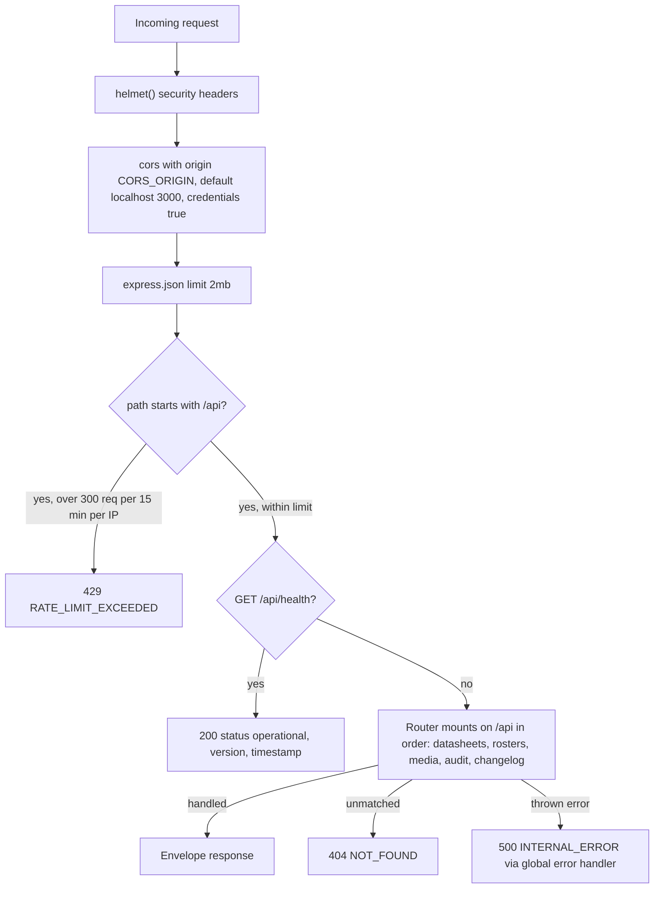

The ForceOrg-40k HTTP API is a single Express application bootstrapped in `apps/api/src/index.ts`. It listens on `process.env.PORT || 4000` and is the sole integration surface of the self-hosted stack: PostgreSQL and S3-compatible object storage are the only backing services, and the API itself holds no session state. Route handlers live in five router modules (`datasheets`, `rosters`, `media`, `audit`, `changelog`) that are all mounted flat on `/api`.

## Bootstrap and container lifecycle

The production image (`Dockerfile.api`) builds the workspace with `tsc` and sets `ENTRYPOINT ["/app/entrypoint.sh"]` with `ENV PORT=4000` and `EXPOSE 4000`. The entrypoint script:

1. If `DATABASE_URL` is set, defaults `DIRECT_URL` to `DATABASE_URL` (so the Prisma schema's `directUrl` validates on plain self-hosted Postgres) and runs `npx prisma migrate deploy --schema=packages/db-client/prisma/schema.prisma`.
2. If `DATABASE_URL` is unset, skips migrations and logs a "catalog-only mode" note.
3. `exec node apps/api/dist/index.js`.

This keeps a published image self-contained: `docker run` against a fresh database works without any compose-level command override. In `docker-compose.yml` the `api` service waits on `depends_on: postgres: condition: service_healthy` before the entrypoint runs.

The pull-based production composition (`docker-compose.prod.yml`) runs this same server from the published GHCR image (`forceorg-api:${FORCEORG_TAG:-latest}`) rather than a local build, again gated on a healthy Postgres — so migrations still happen inside the self-migrating entrypoint at container start. That composition is deliberately bootable with zero configuration: it injects `JWT_SECRET: ${JWT_SECRET:-please-change-me}` and defaults `AWS_ACCESS_KEY_ID` / `AWS_SECRET_ACCESS_KEY` to empty strings. Its own header warns these placeholder credentials are public in the repository, for test environments only, and MUST be overridden before any real deployment or network exposure. The full composition is covered on [Deployment & Compose](../operations/deployment-and-compose.md); the middleware's own fallback secret (`JWT_SECRET || 'dev-secret-change-in-production'`) is covered on [Authentication & Ownership](authentication-and-ownership.md).

## Middleware chain (in mount order)



*Caption: Request path through the middleware chain defined in `apps/api/src/index.ts`.*

In order, all registered as app-level `app.use`:

1. **`helmet()`** — default security headers.
2. **`cors({ origin: process.env.CORS_ORIGIN || 'http://localhost:3000', credentials: true })`** — browser callers are restricted to the configured web origin; server-to-server calls are unaffected (the same rule `docs/API.md` states under "Transport rules"). Compose files inject `CORS_ORIGIN` (e.g. `http://localhost:3000` in `docker-compose.yml`, `${CORS_ORIGIN:-http://localhost:3000}` in `docker-compose.prod.yml`). See [Configuration & Env Vars](../operations/configuration-and-env-vars.md).
3. **`express.json({ limit: '2mb' })`** — caps JSON body size (media uploads arrive as `multipart/form-data` handled by multer, not this parser).
4. **Rate limiter** — `express-rate-limit` with `windowMs: 15 * 60 * 1000`, `limit: 300`, `standardHeaders: 'draft-7'`, `legacyHeaders: false`, mounted with `app.use('/api', apiLimiter)`. This matches the documented transport rule in `docs/API.md` (300 requests per 15-minute window per IP on all `/api` routes) and the `docs/OPENAPI.yaml` description. Because the limiter is mounted on `/api` *before* the health route, the health probe is rate-limited too. On excess it returns the envelope-shaped 429 body `{ success: false, error: { code: 'RATE_LIMIT_EXCEEDED', message: ... } }`.
5. **`GET /api/health`** — liveness probe returning `{ success: true, data: { status: 'operational', version: '1.0.0', timestamp: <ISO now> } }`.
6. **Router mounts**, all on `/api`: `datasheetRoutes`, `rosterRoutes`, `mediaRoutes`, `auditRoutes`, `changelogRoutes`. Routers do not nest under path prefixes; each declares its full paths (`/datasheets`, `/rosters`, `/media/upload`, etc.), so mount order only matters for overlapping paths.
7. **404 handler** — any unmatched request gets `{ success: false, error: { code: 'NOT_FOUND', message: 'The requested endpoint does not exist.' } }` with HTTP 404.
8. **Global error handler** — the terminal 4-argument Express middleware: logs `[API Error]` plus message and stack to stdout, then responds 500 with `{ success: false, error: { code: 'INTERNAL_ERROR', message: 'An unexpected error occurred.' } }`. Internal error details never reach clients.

## The uniform error envelope

Every endpoint — success, client error, or server error — responds with the same envelope documented in `docs/API.md` ("Response envelope") and codified as `ApiSuccess` / `ApiError` in `docs/OPENAPI.yaml`:

```json
{ "success": true,  "data": { }, "meta": { } }
{ "success": false, "error": { "code": "…", "message": "…" } }
```

`docs/API.md`'s "Error codes" table maps each code to its HTTP status:

| Code | HTTP | Meaning (per `docs/API.md`) |
|---|---|---|
| `UNAUTHORIZED` | 401 | Missing `Authorization` header |
| `TOKEN_INVALID` | 401 | Bad or expired JWT |
| `NOT_FOUND` | 404 | Unknown route, datasheet, or foreign roster |
| `INVALID_PARAMS` / `NO_FILE` | 400 | Malformed request or missing upload file |
| `RATE_LIMIT_EXCEEDED` | 429 | Over 300 req/15 min from one IP |
| `INTERNAL_ERROR` / `DB_ERROR` / `UPLOAD_ERROR` / `AUDIT_ERROR` | 500 | Server-side failure |

The OpenAPI `ApiError` schema enumerates one additional code the docs table folds into the 500 group without naming it: `DELETE_ERROR` (media delete failures). The full enum is `UNAUTHORIZED`, `TOKEN_INVALID`, `NOT_FOUND`, `INVALID_PARAMS`, `NO_FILE`, `RATE_LIMIT_EXCEEDED`, `DB_ERROR`, `UPLOAD_ERROR`, `AUDIT_ERROR`, `DELETE_ERROR`, `INTERNAL_ERROR`. Auth-related codes (`UNAUTHORIZED` / `TOKEN_INVALID`, both 401) come from the JWT middleware described in [Authentication & Ownership](authentication-and-ownership.md).

## Per-route-module convention: own PrismaClient + try/catch

Each of the five router modules opens with its own module-scope `const prisma = new PrismaClient()` from `@forceorg/db-client` — there is no shared client, DI, or connection pooling layer across routers. Every handler body is wrapped in `try/catch` that logs and returns a domain-specific 500 code rather than propagating:

| Module | Catch-all code(s) |
|---|---|
| `routes/datasheets.ts` | `DB_ERROR` |
| `routes/rosters.ts` | `DB_ERROR` |
| `routes/media.ts` | `UPLOAD_ERROR` (upload), `DELETE_ERROR` (delete) |
| `routes/audit.ts` | `AUDIT_ERROR` |
| `routes/changelog.ts` | none — falls back (see below) |

Because every handler catches its own failures, the global `INTERNAL_ERROR` handler mainly fires for errors raised in middleware (e.g. body-parser failures) or inside async paths a handler forgot to guard.

One consequence of this convention is documented as a contract-level failure mode in `docs/API.md`: the JWT `sub` must be a **UUID** and must reference a **pre-existing `user_profiles` row** (roster rows key on `user_profiles.id` via a `@db.Uuid` foreign key). The auth middleware never checks either condition — it only verifies the signature — so a well-signed but unprovisioned token passes `requireAuth` and then fails at the database layer (invalid-UUID query error or foreign-key violation on write). Roster routes therefore return `500 DB_ERROR`, not a 4xx, for such tokens. The provisioning mechanism is covered on [Authentication & Ownership](authentication-and-ownership.md).

One deliberate exception: `GET /changelog` never returns 500. On a database failure it falls back to HTTP 200 with a curated constant list of MFM balance changes and `syncStatus: 'OFFLINE'`, so the changelog UI degrades gracefully instead of breaking.

## Public catalog read endpoints

The contract split documented in both `docs/API.md` and `docs/OPENAPI.yaml` is **public reads / JWT writes**: catalog reads require no auth (confirmed by `security: []` on each path in `docs/OPENAPI.yaml`):

| Endpoint | Behavior |
|---|---|
| `GET /api/datasheets` | Paginated datasheets with weapons, abilities, wargear rules, `leaderFor`. Query: `factionId`, `role` (mapped to `battlefieldRole`), `page` (default 1), `limit` (default 50), ordered by `name` asc. Response carries `meta: { page, totalPages, totalCount }`. |
| `GET /api/datasheets/:id` | Single datasheet with the same relations plus `bodyguardsFor`; unknown id → 404 `NOT_FOUND`. |
| `GET /api/stratagems` | Filters `phase`, `category`, `detachmentId`; name asc. |
| `GET /api/weapons` | Full weapon registry, name asc. |
| `GET /api/changelog` | Balance-change feed plus the ten most recent `SyncMetadata` ETL records. |
| `GET /api/health` | Liveness probe (still subject to the shared rate limiter). |

Write endpoints (`/rosters*`, `/media*`, audit) are JWT-protected and ownership-scoped — every roster query is scoped to the token's `sub`, and foreign rosters return `NOT_FOUND`; see [Authentication & Ownership](authentication-and-ownership.md) and [Media Upload & Object Storage](media-upload-and-object-storage.md). Request/response shapes are mirrored from `packages/types` — see [Shared Contracts](../architecture/shared-contracts.md).

## Testing and CI posture

The API has **no test suite of its own**: `apps/api/package.json` defines no `test` script, and its `lint` script is just `tsc --noEmit`. API behavior is exercised only indirectly:

- Playwright end-to-end flows in `apps/web/e2e/critical-flows.spec.ts` (login gate, catalog search, changelog page, console, audit modal) run through the real API via `NEXT_PUBLIC_API_URL`, on every push/PR to `main` (`.github/workflows/e2e.yml`) and in GitLab CI (`npx turbo run test build`, where the API contributes build/typecheck only).
- The GitLab `test` stage and GitHub `deploy` workflow both run full `npm run build`, so type errors are the API's primary static gate.

**Implication for changes:** any behavioral change to middleware, the envelope, or route error codes must be validated by hand or by extending the web Playwright suite — nothing in CI will fail on an API-only regression such as a changed error code or a broken catalog filter.
