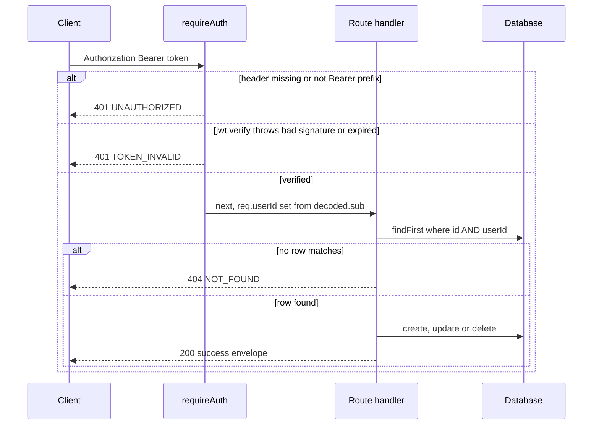

Write protection on this API is two thin layers and nothing else: a bearer-token
check in `apps/api/src/middleware/auth.ts`, and an explicit `userId` filter that
every handler adds to its own Prisma query. There is no role model, no
permission table, no session store, and no identity provider in the loop. The
database is *not* configured to enforce isolation — see "RLS is documented but
not applied" below — so the application-level filter is the only thing separating
one user's rosters from another's.

## The trust model: symmetric secret, `sub` is identity

`docs/API.md` states the model plainly: write endpoints require
`Authorization: Bearer <token>`, algorithm **HS256**, secret = the instance's
`JWT_SECRET`. Claims consumed are `sub` (user id, required), `email` (optional)
and the standard `iat`/`exp`.

> Any client holding a token signed with the instance's `JWT_SECRET` can manage
> rosters as that `sub`. There is no third-party identity provider in the loop —
> you mint tokens for your own users and integrations.

That sentence is the security boundary. HS256 is symmetric, so *anyone who can
obtain the secret can impersonate any user id*, including an admin's; there is no
way to scope a token to fewer rights, and no revocation list — only `exp`
expiry. Multi-tenancy here is tenant *identification*, not authentication
strength: whoever can sign can choose a `sub`.

The repo documents minting as an operator task, not an API endpoint (there is no
`/auth/token` route anywhere in `apps/api/src/routes/`). `docs/API.md#L38-L54`
shows a `node -e` snippet over `jsonwebtoken`:

```bash
node -e "console.log(require('jsonwebtoken').sign(
  { sub: 'USER_PROFILE_UUID' },
  process.env.JWT_SECRET,
  { expiresIn: '7d' }
))"
```

The same section states **two hard requirements on `sub`**, and they are the
reason the snippet is not just "pick any string":

1. `sub` must be a **UUID** — roster rows key on `user_profiles.id`, declared
   `String @db.Uuid` in `packages/db-client/prisma/schema.prisma`; an arbitrary
   string fails with a database error.
2. a matching **`user_profiles` row must already exist** (`sub` → `user_id`
   foreign key). Until the local signup endpoint lands, the docs say to
   provision that row **directly in the database**.

So the supported integration pattern is "operator inserts a profile row, runs
this snippet with that uuid, hands the token to an external system", and that
external system's writes are recorded under the uuid the operator chose. There is
still no endpoint that performs either step for you.

### Configuration

Full env tables live on
[Configuration & Env Vars](../operations/configuration-and-env-vars.md) and
[Deployment & Compose](../operations/deployment-and-compose.md); this table is
scoped to the auth secret only.

| Concern | Value |
|---|---|
| Secret | `JWT_SECRET` env var, read **once at module load** into a const (`auth.ts:8`) |
| Code fallback when unset | `'dev-secret-change-in-production'` |
| `.env.example` | `JWT_SECRET=change-me-in-production` |
| `docker-compose.prod.yml` | `JWT_SECRET: ${JWT_SECRET:-please-change-me}` — **boots happily** with a placeholder that is public in this repository |
| `docker-compose.yml` / `docker-compose.dev.yml` | **not set at all** — those API containers run on the hardcoded dev secret (`.env.dev`, which the dev composition loads, carries only `NODE_ENV`) |

Because the secret is captured in a module-level `const`, changing
`JWT_SECRET` requires a process restart; there is no rotation or key-id support.

**Three different effective secrets are in play**, and they are not
interchangeable: a token that validates against a server started from
`docker-compose.prod.yml` with no override (`please-change-me`) will *not*
validate against a bare `node dist/index.js` (`dev-secret-change-in-production`),
and neither matches the `.env.example` value (`change-me-in-production`). No
composition in the repository refuses to start when `JWT_SECRET` is unset — the
prod file's `${JWT_SECRET:-...}` form substitutes a default rather than failing
(the `${VAR:?...}` guard that earlier revisions described is gone).

### Test vs production credentials — the operational consequence

`docs/DEPLOYMENT.md` §2 is explicit about why the placeholder default is
dangerous: the fallbacks (`JWT_SECRET=please-change-me`,
`postgres`/`postgrespassword`) are **public in this repository**, so
*everyone who can read the repo can mint valid auth tokens against a server still
using them*. The zero-config boot is deliberate — CI and throwaway test
environments come up with no configuration — but the corollary is that the
override is **mandatory for anything reachable beyond localhost**, and nothing in
the tooling verifies that you did it. Before exposing an instance, check the
running container's environment for `JWT_SECRET`; do not trust the compose file
to have forced the issue. See
[Deployment & Compose](../operations/deployment-and-compose.md) for the override
procedure and [Configuration & Env Vars](../operations/configuration-and-env-vars.md)
for the full variable list.

## `requireAuth` control flow



*Caption: A protected roster write — header gate, signature verification, then the ownership-scoped query that every handler repeats.*

`requireAuth` (`apps/api/src/middleware/auth.ts`) has exactly three outcomes:

1. **No `Authorization` header, or one that does not start with `Bearer `** →
   `401 { success: false, error: { code: 'UNAUTHORIZED', message: 'Missing or
   invalid Authorization header.' } }`. The token itself is `authHeader.slice(7)`.
2. **`jwt.verify(token, JWT_SECRET)` throws** (wrong secret, malformed, expired
   `exp`) → `401 { code: 'TOKEN_INVALID', message: 'JWT verification failed.' }`.
   The underlying error is swallowed, so clients cannot distinguish expiry from
   a bad signature.
3. **Verified** → `req.userId = decoded.sub`, `req.userEmail = decoded.email`,
   `next()`. The typed shape is `AuthenticatedRequest extends Request` with
   optional `userId` / `userEmail`.

`requireAuth` does **not** check that `sub` is a UUID, that `sub` exists in
`user_profiles`, that the token carries any scope, or that the caller is a real
human — the two documented `sub` requirements above are enforced only by
Postgres, and only indirectly. Handlers then use the non-null assertion
`req.userId!`, which is only safe because `requireAuth` always precedes them in
the route signature.

`optionalAuth` is also exported — it verifies a bearer token if present, ignores
verification failures silently, and always calls `next()`. **No route imports
it**; the only occurrence in the repo is its own definition. Do not assume a
public endpoint populates `userId`: the catalog reads
(`datasheets.ts`, `changelog.ts`) mount no auth middleware at all. Treat
`optionalAuth` as an available extension point for future public-but-personalised
reads, not as live behavior.

Every authenticated route uses `requireAuth`: `GET/POST /rosters`,
`GET/PUT/DELETE /rosters/:id`, `POST /rosters/:id/audit`, and both media
handlers (including the alternate `POST /media/upload` and `DELETE /media/:id`
paths). Catalog reads and `/health` declare `security: []` in
`docs/OPENAPI.yaml` and are genuinely open.

## The ownership invariant, repeated in every handler

There is no shared ownership helper. Each handler re-states the same filter
inline, and this repetition *is* the mechanism:

```ts
const army = await prisma.userArmy.findFirst({
  where: { id: req.params.id, userId: req.userId! },
});
if (!army) { /* 404 NOT_FOUND */ }
```

- `GET /rosters` — `findMany({ where: { userId } })`, so a caller can only ever
  enumerate their own lists (`updatedAt` desc).
- `GET /rosters/:id` — `findFirst({ id, userId })` with `include: { unitMedia: true }`.
- `PUT /rosters/:id` and `DELETE /rosters/:id` — `findFirst({ id, userId })` as a
  **guard**, then `update`/`delete` by `id` alone. The check-then-mutate pair is
  not wrapped in a transaction; that is safe against other tenants only because
  ownership cannot change, but the row *can* change between the guard and the
  write. `PUT` exploits that window by design: it merges the guard's snapshot
  with the request body field-wise (`req.body.name ?? existing.name`), while
  `detachmentSecondary` and `factionThemeOverride` are taken straight from the
  body with no `existing` fallback.
- `POST /rosters` — no guard needed; `userId: req.userId!` is stamped onto the
  created row, so ownership is assigned, never taken from the request body.
  `rulesetVersionId` is likewise server-controlled (`11.1.0-2026-Q3`).
- `POST /rosters/:id/audit` — `findFirst({ id, userId })` before loading
  datasheets and running the rules engine; a foreign roster cannot even be
  probed for compliance.
- `POST /rosters/:rosterId/units/:unitInstanceId/media` — ownership is checked on
  the **roster**, not the media row: `findFirst({ id: rosterId, userId })` runs
  after multer accepts the file and before the Sharp pipeline. Only then is the
  `UserUnitMedia` upsert given `userId: req.userId!`. Storage keys come from the
  same identity — `buildStorageKeyPrefix(req.userId!, rosterId, unitInstanceId)`
  yields `users/{userId}/rosters/{rosterId}/units/{unitInstanceId}` — so object
  storage namespaces track the tenant.
- `DELETE` media — scopes by `userId` in both lookup branches
  (`{ id, userId }` for `/media/:id`, `{ rosterId, unitInstanceId, userId }` for
  the nested path), then deletes the S3 objects and the row.

**Foreign rosters answer `404 NOT_FOUND`, never `403`.** Because the query simply
returns no row, an attacker cannot distinguish "does not exist" from "belongs to
someone else" — the OpenAPI `NotFound` response says so explicitly: *"Unknown
route/resource, or a resource owned by another user."* The trade-off is
operational: a legitimate client with a stale id and a client probing someone
else's ids get byte-identical responses.

### When `sub` violates the documented requirements

The tenant key is `String @db.Uuid` in Prisma (`UserArmy.userId`,
`UserUnitMedia.userId`), but `requireAuth` performs **no UUID validation** on
`sub`. A token whose `sub` is an arbitrary string reaches Postgres as a
non-UUID value and fails there, surfacing as a `500 { code: 'DB_ERROR' }` rather
than a `400` — the handler's `catch` block cannot tell a cast failure from a
connection problem. Relatedly, `user_armies.user_id` and
`user_unit_media.user_id` carry `ON DELETE CASCADE` foreign keys to
`user_profiles(id)`, and **no code path creates `user_profiles` rows** — not the
API (there is no signup route), not `seed.ts`, not the sync worker. So every
roster write requires a `user_profiles` row matching the token's `sub`, inserted
by hand exactly as `docs/API.md` instructs; otherwise the write is rejected by
the FK and the client sees `{ code: 'DB_ERROR' }` with HTTP 500. Both failures
look like server faults to the caller, which makes them easy to misdiagnose as
database outages.

## RLS is documented but not applied — the enforcement gap

`packages/db-client/prisma/rls-policies.sql` looks like the real isolation layer:
it runs `ALTER TABLE user_armies ENABLE ROW LEVEL SECURITY` and creates
policies on `user_armies`, `user_unit_media`, and `user_color_schemes` of the form

```sql
CREATE POLICY user_army_isolation ON user_armies
    FOR ALL USING (auth.uid() = user_id) WITH CHECK (auth.uid() = user_id);
```

Treat that file as **aspirational, dead configuration**, for three independent
reasons:

1. **Nothing applies it.** The init migration
   (`packages/db-client/prisma/migrations/20261005170232_init/migration.sql`)
   contains no `CREATE POLICY`, `ENABLE ROW LEVEL SECURITY`, or `CREATE FUNCTION
   auth.uid()`, and no `grep`-visible caller anywhere references
   `rls-policies.sql`. The API image's `apps/api/entrypoint.sh` runs only
   `npx prisma migrate deploy`, and the dev `db` step in
   `scripts/dev-container.sh` runs `migrate deploy` + `seed.ts`. Postgres in
   this stack therefore has no policies, and even if the file were applied it
   would fail: `auth.uid()` is a Supabase-provided function that does not exist
   on plain Postgres.
2. **The API connects as the table owner anyway.** `DATABASE_URL` in every
   compose file is the `postgres` superuser, which bypasses RLS regardless.
3. **The comments about a "sync-worker service role" have no counterpart** —
   no code creates or switches roles, and there is no raw SQL anywhere
   (`$executeRaw`/`$queryRaw` do not appear in the repo).

**Consequence for readers and for change plans:** application-level `userId`
scoping is the *only* enforcement. A handler that forgets `userId` in its
`where` clause silently exposes another tenant's data with no database backstop
and no test to catch it — `apps/api` has no test suite (its `lint` script is
just `tsc --noEmit`), and the Playwright suite exercises the guest/local path
only. When adding a route that touches `user_armies`, `user_unit_media`, or
`user_color_schemes` add the `userId` filter yourself and treat `404` as the
answer for non-matching rows. The public catalog tables (`datasheets_11e`,
`weapons_11e`, `abilities_11e`, `stratagems_11e`, `wargear_rules_11e`,
`leader_compatibility_11e`, `paint_swatches`) are intentionally un-RLS'd and
publicly readable, which matches the "read endpoints are public" contract.

## How the web client interacts with this contract

The Next.js app sends a bearer token taken from a **legacy Supabase session**
(`apps/web/src/lib/api.ts` → `getAuthToken()` → `supabase.auth.getSession()` →
`data.session?.access_token`), falling back to `null` when Supabase is
unconfigured. Two consequences matter:

- A Supabase access token is signed with the Supabase project's own JWT secret,
  not the instance's `JWT_SECRET`, so `jwt.verify` rejects it → `401
  TOKEN_INVALID` on every write.
  The client never special-cases `401`: each roster function wraps `apiFetch` in
  `try/catch` and **falls back to `localStorage`** (`forceorg_rosters_${userId}`,
  guest ids like `guest_captain_titus_xxxx`). Roster mutations thus appear to
  succeed in the UI while nothing reaches Postgres.
- With no token at all, `apiFetch` sends no `Authorization` header → `401
  UNAUTHORIZED` → the same silent local-persistence path. This is the intended
  guest journey, and it is why the API can be entirely offline without breaking
  the UI.

Practically: browser-side persistence and server-side ownership are only
*brought into alignment by an operator-minted JWT over a provisioned profile
row*. See
[App Shell & Guest Session](../webapp/app-shell-and-guest-session.md) and
[Roster Persistence & Offline Sync](../workflows/roster-persistence-and-offline-sync.md),
and for the surrounding middleware chain
[API Server & Middleware](api-server-and-middleware.md).

## Failure modes worth remembering

| Situation | Observable result |
|---|---|
| No / non-`Bearer` header on a protected route | `401 UNAUTHORIZED` |
| Expired, tampered, or wrong-secret token | `401 TOKEN_INVALID` (cause not distinguished) |
| Valid token, `sub` not in `user_profiles` | `500 DB_ERROR` on roster writes (FK violation) |
| Valid token, non-UUID `sub` | `500 DB_ERROR` (Postgres UUID cast) |
| Id belonging to another user | `404 NOT_FOUND`, identical to genuinely missing |
| `JWT_SECRET` unset (bare process / dev compositions) | API boots and verifies against `dev-secret-change-in-production` |
| Prod stack started with default `JWT_SECRET` | Stack comes up normally on `please-change-me`, so **anyone who can read the repo can mint valid tokens** and act as any `sub` |
| Rate limiter trips before auth | `429 RATE_LIMIT_EXCEEDED` (limit is per-IP, applied on `/api` ahead of `requireAuth`) |
