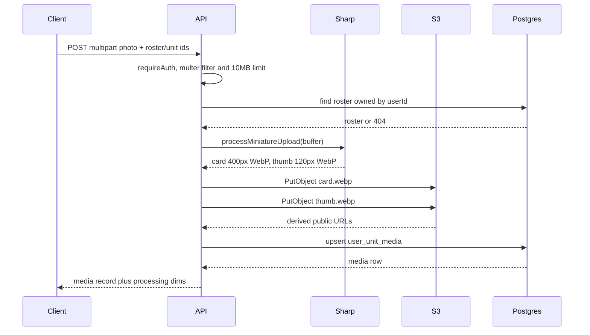

# Miniature Photo Upload: Sharp Pipeline & S3 Storage

Users can attach a custom photograph to a unit instance in one of their rosters.
The API accepts the raw upload in memory, derives two optimized WebP variants
with Sharp, writes both to an S3-compatible object store under a deterministic
key prefix, and stores the resulting public URLs plus that prefix in a single
`user_unit_media` row keyed by `(rosterId, unitInstanceId)`.

The subsystem spans three files plus deployment configuration:

| Responsibility | Location |
|---|---|
| HTTP surface, ingest limits, ownership check, DB writes | [`apps/api/src/routes/media.ts`](../../apps/api/src/routes/media.ts) |
| Image decoding and derivative generation | [`apps/api/src/services/miniature-processor.ts`](../../apps/api/src/services/miniature-processor.ts) |
| S3/R2 client, key layout, public URL derivation | [`apps/api/src/services/storage-service.ts`](../../apps/api/src/services/storage-service.ts) |
| Storage backend and credential wiring | [`docker-compose.yml`](../../docker-compose.yml), [`.env.example`](../../.env.example), [`docs/DEPLOYMENT.md`](../../docs/DEPLOYMENT.md) |

Related: [Authentication And Ownership](authentication-and-ownership.md),
[Data Model And Migrations](../data/data-model-and-migrations.md),
[Configuration And Env Vars](../operations/configuration-and-env-vars.md),
[Deployment And Compose](../operations/deployment-and-compose.md).

## Entrypoints and aliases

`mediaRoutes` is mounted at `/api` in `apps/api/src/index.ts`, so the handlers
below live under `/api/...`. Both handlers are registered with an array of two
paths, giving every client a resource-nested route and a flat alias:

- `POST /api/rosters/:rosterId/units/:unitInstanceId/media` and
  `POST /api/media/upload`
- `DELETE /api/rosters/:rosterId/units/:unitInstanceId/media` and
  `DELETE /api/media/:id`

The dual aliases exist because the flat routes take their identifiers from the
multipart body instead of the path: the upload handler falls back to
`req.body.rosterId` / `req.body.unitInstanceId`, and returns
`400 INVALID_PARAMS` when neither source supplies both. Missing identifiers on
delete (neither `id` nor the roster/unit pair) similarly yield
`400 INVALID_PARAMS`. Both handlers run behind `requireAuth`, which populates
`req.userId` from the JWT `sub` claim.

## Ingest: multer memoryStorage

Uploads are handled by a single `multer` instance configured with
`multer.memoryStorage()`, a `fileSize` limit of `10 * 1024 * 1024` (10 MB), and
a `fileFilter` allowlist of `image/jpeg`, `image/png`, `image/webp`,
`image/heic`, and `image/heif`. Because storage is in-memory, the original
bytes are available as `file.buffer` for Sharp without any temp-file cleanup —
at the cost of holding the whole upload in the API process's heap. Files whose
mimetype is not on the allowlist are silently skipped by multer rather than
rejected with a specific error, so a disallowed upload surfaces as `400 NO_FILE`
("No image file provided") once the handler finds no file.

The middleware runs `upload.any()`, accepting an arbitrary field name; the
handler uses `req.file` or the first entry of `req.files`. The documented web
client sends the field `miniature_photo` (see `docs/API.md`), but the server
does not constrain the name.

## Sharp derivative pipeline

`processMiniatureUpload(buffer)` seeds one Sharp instance with
`{ failOn: 'truncated' }` and `.rotate()` (EXIF-orientation auto-rotation), then
`clone()`s it for two concurrent outputs:

| Derivative | Resize | Encode |
|---|---|---|
| Card image | `400x400`, `fit: 'inside'`, `withoutEnlargement: true` | WebP, `quality: 85`, `effort: 4`, `smartSubsample: true` |
| Thumbnail | `120x120`, `fit: 'cover'`, `position: sharp.strategy.entropy` | WebP, `quality: 80`, `effort: 4` |

Both branches run in a single `Promise.all`, so a corrupt or truncated input
rejects before any object is written. The card branch never upscales and only
fits inside the 400 px box, so small uploads keep their native dimensions; the
thumbnail branch always lands exactly at 120×120 by cropping, choosing the crop
window by entropy rather than centering so the most visually dense region
survives. The function returns buffers plus `width`, `height`, and `sizeBytes`
for each variant; the upload handler echoes those dimensions back to the client
in the response's `processing` block.

## Storage keys and public URL precedence

`buildStorageKeyPrefix(userId, rosterId, unitInstanceId)` returns
`users/{userId}/rosters/{rosterId}/units/{unitInstanceId}`, and the handler
appends `/card.webp` and `/thumb.webp`. The layout is fully derived from
identifiers already known to the client, so a replacement upload writes the
same two keys and overwrites the previous objects in place — the media row's
`storageKeyPrefix` is what delete relies on later, not the URLs.

`uploadImage` issues a `PutObjectCommand` with `ContentType: 'image/webp'` and
`CacheControl: 'public, max-age=31536000, immutable'` into the configured
bucket. The URL it returns follows a three-step precedence:

1. `CDN_BASE_URL` (or `PUBLIC_CDN_BASE_URL`) — `${base}/${key}`, trailing
   slashes trimmed. This wins so a CDN or reverse-proxy origin can front the
   bucket without changing stored values.
2. Otherwise, when a custom `S3_ENDPOINT`/`AWS_ENDPOINT` is set, the
   path-style URL `${endpoint}/${bucket}/${key}` — correct for SeaweedFS, MinIO,
   and similar self-hosted stores.
3. Otherwise the AWS virtual-hosted URL `https://${bucket}.s3.amazonaws.com/${key}`.

Since the URLs are persisted into the DB row at upload time, changing CDN or
endpoint configuration does not retroactively rewrite existing `imageUrl` /
`thumbnailUrl` values; only a new upload repairs them.

## Client configuration and the S3_*/AWS_* aliasing

The S3 client is constructed once at module load from environment variables,
each read through a fallback chain: `S3_ENDPOINT` → `AWS_ENDPOINT`,
`S3_REGION` → `AWS_REGION` → `auto`, `S3_ACCESS_KEY_ID` → `AWS_ACCESS_KEY_ID` →
`''`, `S3_SECRET_ACCESS_KEY` → `AWS_SECRET_ACCESS_KEY` → `''`, and bucket
`S3_BUCKET` → `S3_BUCKET_NAME` → `forceorg-media`. This aliasing exists
specifically because `.env.example` documents the `S3_*` names while
`docker-compose.yml` injects `AWS_ENDPOINT`, `AWS_REGION`,
`AWS_ACCESS_KEY_ID`, `AWS_SECRET_ACCESS_KEY`, and `S3_BUCKET_NAME`; supporting
both lets either configuration start the API unchanged, and
`docs/DEPLOYMENT.md` lists the pairs side by side (`S3_ENDPOINT` /
`AWS_ENDPOINT`, `S3_BUCKET` / `S3_BUCKET_NAME`, `S3_REGION` / `AWS_REGION`).

Two further client behaviors matter operationally:

- `forcePathStyle: Boolean(S3_ENDPOINT)` — path-style addressing is enabled
  whenever any custom endpoint is configured, and disabled only when the client
  falls back to `https://s3.amazonaws.com`. Request signatures/URL shapes for
  MinIO/SeaweedFS/Garage therefore work without a separate toggle.
- Region defaults to `auto`, which local S3-compatible servers accept.

The default stack ships a SeaweedFS container (`chrislusf/seaweedfs`,
`server -dir=/data -s3 -s3.port=9000`, service name `s3`, volume `s3_data`)
rather than MinIO, whose images were removed from Docker Hub/quay.io. Compose
points the API at `AWS_ENDPOINT: http://s3:9000`, bucket
`S3_BUCKET_NAME: forceorg-miniatures`, and
`PUBLIC_CDN_BASE_URL: http://localhost:9000/forceorg-miniatures` — so in the
default deployment URL precedence rule 1 applies, and the bucket name appears
in the CDN base rather than being derived.

## Persistence: one row per unit instance

`user_unit_media` (Prisma model `UserUnitMedia`) stores `userId`, `rosterId`,
`unitInstanceId`, `imageUrl`, `thumbnailUrl`, and `storageKeyPrefix`, with
`@@unique([rosterId, unitInstanceId])` and cascade deletes from both
`UserProfile` and `UserArmy`. The unique constraint is what makes the upload
handler's `prisma.userUnitMedia.upsert({ where: { rosterId_unitInstanceId: ... } })`
a one-photo-per-unit-instance model: a second upload for the same unit replaces
the URLs and prefix instead of inserting a second row. Cascade behavior means
deleting a roster removes its media rows from Postgres but leaves the
corresponding objects in the bucket.

Before any processing, the handler verifies ownership with
`prisma.userArmy.findFirst({ where: { id: rosterId, userId: req.userId! } })`
and returns `404 NOT_FOUND` when the roster is not owned by the token subject.
The upload response contains the full media record plus the `processing`
dimension block.

## Upload flow

Caption: Miniature photo upload from multipart ingest through dual WebP
derivatives, object writes, and the media-row upsert.

## Deletion semantics and failure modes

`DELETE` resolves the row either by media `id` or by
`(rosterId, unitInstanceId)`, always scoped by `userId`, and returns
`404 NOT_FOUND` when nothing matches. It then calls `deleteImage` for
`${storageKeyPrefix}/card.webp` and `/thumb.webp` in a `Promise.all` and only
afterwards runs `prisma.userUnitMedia.delete`.

There is no transaction or compensation spanning the object store and
Postgres, so ordering determines which side can be orphaned:

- If an S3 delete fails, the handler throws before the DB delete; the client
  gets `500 DELETE_ERROR` and the row survives while objects may be
  half-removed (one of the two deletes can already have succeeded).
- If the DB delete fails after storage succeeded, the media row persists while
  its objects are gone, leaving URLs that no longer resolve. A re-upload to the
  same unit repairs the row because the storage key prefix is deterministic.

Uploads have the mirror-image hazard: if either `PutObjectCommand` or the
upsert fails after writes, objects can exist with no row pointing at them.
Nothing in this path garbage-collects such objects — reconciliation, if needed,
means comparing bucket keys under `users/` against `storageKeyPrefix` values.

The only client-visible error codes are `INVALID_PARAMS`, `NO_FILE`,
`NOT_FOUND`, `UPLOAD_ERROR`, and `DELETE_ERROR`, all wrapped in the API's
standard `{ success, error }` envelope; internal details go to
`console.error('[Media Upload]' ...)` / `'[Media Delete]'` rather than the
response.

## Extension notes

- Adding a derivative (e.g. a hero crop) means a third `pipeline.clone()`
  branch in `processMiniatureUpload`, a new key suffix appended to the prefix in
  both the upload and delete handlers, and — because deletes enumerate key
  suffixes explicitly — no schema change (the row stores only the prefix).
- Changing encoding policy is confined to `miniature-processor.ts`; changing
  addressing, bucket naming, or public URL shape is confined to the
  module-level constants in `storage-service.ts`, but note existing rows keep
  previously persisted URLs.
- There are currently no tests covering this path; the closest executable
  specification is the Media section of `docs/API.md`.
