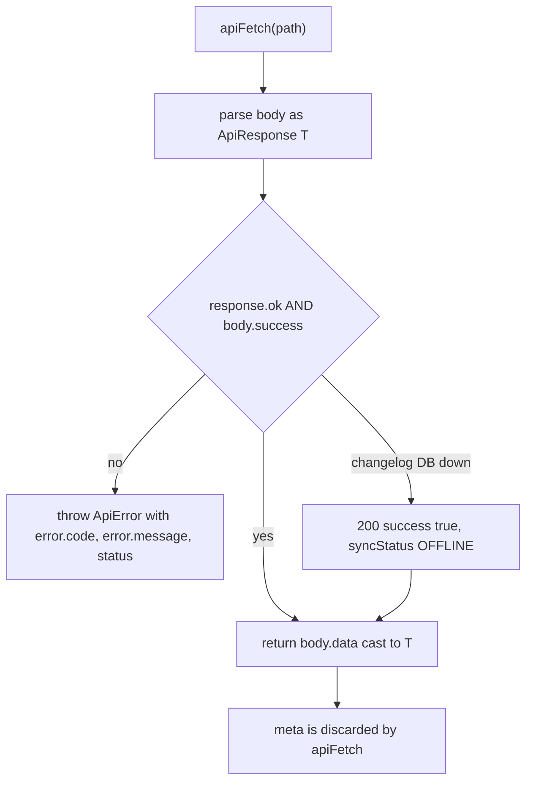
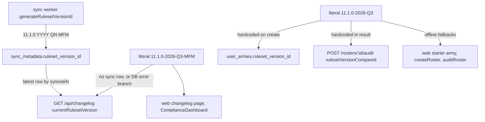

ForceOrg-40k has no runtime contract layer. Four artifacts together *are* the contract between `apps/api`, `apps/web`, `apps/sync-worker` and `packages/rules-engine-11e`:

1. `packages/types/src/index.ts` — TypeScript-only shapes (`@forceorg/types`).
2. `packages/db-client/prisma/schema.prisma` + the generated Prisma client (`@forceorg/db-client`) — persistence shapes and the runtime enums.
3. `docs/OPENAPI.yaml` / `docs/API.md` — the hand-written HTTP mirror of both.
4. String literals — the ruleset version id, which has no generator on the read side.

Nothing validates messages at runtime. Every hazard on this page comes from the fact that these four artifacts are kept in sync by convention and grep, not by a codegen step.

## `@forceorg/types`: the vocabulary package

`packages/types/package.json` points both `main` and `types` at `./src/index.ts` and declares **no dependencies** — it is a header-only package. Consumers import it exclusively with `import type`, so it contributes zero bytes at runtime; it appears in `@forceorg/api`, `@forceorg/sync-worker` and `@forceorg/rules-engine-11e` dependencies purely for typing.

The file is organised as one flat namespace of interfaces grouped by concern:

| Group | Types | Primary consumers |
|---|---|---|
| Rules catalog | `Datasheet`, `DatasheetStats`, `WeaponProfile`, `DatasheetWeapon`, `Ability`, `Stratagem`, `LeaderCompatibility`, `CompositeUnit` | API catalog routes, web console, `stratagem-filter`, `attachment-resolver` |
| Wargear AST | `WargearRuleAST`, `WargearOption`, `WargearSelection`, `ConsumedSlot` | `wargear-parser.ts` (producer), `RosterBuilder.tsx` (consumer) |
| Roster | `RosterPayload`, `RosterUnitInstance`, `UserArmy`, `ModelHealth` | `detachment-validator.ts`, audit route, web pages |
| Audit | `AuditResult`, `RosterDiscrepancy`, `DiscrepancySeverity` | audit route, `ComplianceDashboard.tsx` |
| Sync | `SyncMetadata`, `SyncDelta` | ETL pipeline, `diff-analyzer.ts`, changelog route |
| Transport | `ApiResponse<T>` | `apps/web/src/lib/api.ts` |

## The `ApiResponse<T>` envelope

```ts
export interface ApiResponse<T> {
  success: boolean;
  data?: T;
  error?: { code: string; message: string };
  meta?: { page?: number; totalPages?: number; totalCount?: number };
}
```

Success and error are mutually exclusive by convention, and `docs/OPENAPI.yaml` encodes that as two separate component schemas — `ApiSuccess` (`required: [success, data]`, `success: enum [true]`) and `ApiError` (`required: [success, error]`, `success: enum [false]`) — which every response `allOf`-composes onto. `meta` is the pagination block and, in practice, only `GET /api/datasheets` ever emits it (`page`, `totalPages`, `totalCount`).

Every handler in `apps/api` conforms, including the ones outside the routers:

| Producer | Shape |
|---|---|
| Rate limiter (`app.use('/api', apiLimiter)`) | 429 `{ success: false, error: { code: 'RATE_LIMIT_EXCEEDED', … } }` |
| `requireAuth` / JWT failure | 401 `UNAUTHORIZED`, `TOKEN_INVALID` |
| Router handlers | 400 `INVALID_PARAMS` / `NO_FILE`, 404 `NOT_FOUND`, 500 `DB_ERROR` / `UPLOAD_ERROR` / `DELETE_ERROR` / `AUDIT_ERROR` |
| Terminal 404 middleware | 404 `NOT_FOUND` "The requested endpoint does not exist." |
| Global error handler | 500 `INTERNAL_ERROR` (stack logged to stdout only) |
| All success paths | `{ success: true, data: … }`, status 200 (201 on roster create) |

The web client is the only in-repo consumer, and it treats the envelope as load-bearing: `apiFetch` parses the body as `ApiResponse<T>`, throws `ApiError(body.error?.code || 'UNKNOWN', …)` when `!response.ok || !body.success`, and otherwise **returns `body.data` as `T` with no runtime check**. Two consequences:

- A route that forgets the envelope breaks the client at the type level only; it will not be caught until a field is `undefined`.
- `success: true` does **not** mean "the data came from the database". `GET /api/changelog` catches its own DB failure and answers HTTP 200 with `success: true`, curated constants and `syncStatus: 'OFFLINE'`. Clients that want freshness must branch on `syncStatus`, never on `success`.



*Caption: how `apps/web/src/lib/api.ts` consumes the envelope — including the changelog route's deliberate `success: true` on a database failure.*

The envelope is documented twice beyond the type: `docs/API.md` ("Response envelope" + error-code table) and `docs/OPENAPI.yaml` (the `ApiError.code` enum of `UNAUTHORIZED`, `TOKEN_INVALID`, `NOT_FOUND`, `INVALID_PARAMS`, `NO_FILE`, `RATE_LIMIT_EXCEEDED`, `DB_ERROR`, `UPLOAD_ERROR`, `AUDIT_ERROR`, `DELETE_ERROR`, `INTERNAL_ERROR`). **Adding an error code means editing the route, the `ApiError` enum in `docs/OPENAPI.yaml`, and the table in `docs/API.md`** — none of them fail the build if you skip one. See [API Server & Middleware](../api/api-server-and-middleware.md) for the middleware chain that emits them.

## Ruleset version ids: one generator, many literals

The id format is `11.1.0-YYYY-QN-MFM` (ruleset baseline, calendar year, quarter, Munitorum Field Manual tag), and the **only generator** is in the ETL worker:

```ts
// apps/sync-worker/src/etl-pipeline.ts
function generateRulesetVersionId(): string {
  const now = new Date();
  const quarter = Math.ceil((now.getMonth() + 1) / 3);
  return `11.1.0-${now.getFullYear()}-Q${quarter}-MFM`;
}
```

It is called once per endpoint inside `processEndpoint` (so all four `sync_metadata` rows of a run share one id, including the `NO_DELTA` and `ERROR` rows) and again for the run summary. The generated value is written **only** to `SyncMetadata.rulesetVersionId` (`VarChar(60)`); the worker never rewrites `user_armies.ruleset_version_id`.

Everywhere else the version is a hardcoded string literal, in two non-interchangeable flavours — with and without the `-MFM` suffix:

| Literal | Sites | Role |
|---|---|---|
| `11.1.0-${year}-Q${quarter}-MFM` (computed) | `apps/sync-worker/src/etl-pipeline.ts` `generateRulesetVersionId()` | authoritative id stamped on `sync_metadata` |
| `'11.1.0-2026-Q3-MFM'` | `apps/api/src/routes/changelog.ts` (fallback when no sync row, and the offline catch branch); `apps/web/src/app/changelog/page.tsx` `FALLBACK_CHANGELOG`; `apps/web/src/components/ComplianceDashboard.tsx` (`rulesetVersionCompared` for its client-side audit, and the display default) | changelog/display identity |
| `'11.1.0-2026-Q3'` (no `-MFM`) | `apps/api/src/routes/rosters.ts` (the only value ever written to `UserArmy.rulesetVersionId` on create); `apps/api/src/routes/audit.ts` (`AuditResult.rulesetVersionCompared`); web fallbacks in `lib/api.ts` (`DEFAULT_STARTER_ARMY`, offline `createRoster`, offline `auditRoster`), `app/page.tsx`, `app/army/[id]/page.tsx`, `app/army/[id]/edit/page.tsx`, `components/CreateArmyModal.tsx`; documented as the server-set value in `docs/API.md` | roster/audit identity |



*Caption: the two ruleset-version literal families and the single place a computed id ever enters the system.*

The practical invariants and failure modes:

- `UserArmy.rulesetVersionId` and `AuditResult.rulesetVersionCompared` are **always** `'11.1.0-2026-Q3'`, regardless of what the worker has synced. The audit compares stored points against the live `datasheets_11e` rows while *labelling* the result with a frozen id, so a real MFM points change shows up as an `AMBER POINTS_SHIFT` discrepancy attributed to the wrong ruleset.
- The two families never string-match each other. Any future equality check between `currentRulesetVersion` (from `/changelog`) and `army.rulesetVersionId` (from `/rosters`) is false by construction.
- Advancing the ruleset requires editing the worker's template **and** every literal above; nothing but grep connects them. `docs/API.md` documents the roster value as server-controlled, so client-supplied `rulesetVersionId` is silently ignored by `POST /rosters`.
- `GET /changelog` also contains a degenerate ternary — `syncLogs.length > 0 ? 'SYNCHRONIZED' : 'SYNCHRONIZED'` — so `syncStatus` is `'SYNCHRONIZED'` whenever the DB query succeeds and `'OFFLINE'` only in the catch branch. `'PENDING'` exists in the union and in the OpenAPI enum but is never produced.

## Duplicated enums: TypeScript unions vs Prisma enums

Six names exist twice, in two incompatible mechanisms:

`BattlefieldRole`, `WargearRuleType`, `TargetRole`, `AbilitySource`, `BattlePhase`, `StratagemCategory`

- In `packages/types/src/index.ts` they are `export type X = 'A' | 'B' | …` aliases — erased at compile time, no runtime object, not importable as values.
- In `packages/db-client/prisma/schema.prisma` they are `enum X { … }` declarations with identical labels, which Prisma compiles into real value objects. `packages/db-client/src/index.ts` re-exports **those** six as values (`export { BattlefieldRole, … } from '@prisma/client'`) alongside `export type` re-exports of the model types.
- The initial migration materialises them as Postgres enums: `CREATE TYPE "BattlefieldRole" AS ENUM (…)` etc. in `packages/db-client/prisma/migrations/20261005170232_init/migration.sql`.
- `docs/OPENAPI.yaml` re-lists the labels inline a third time (`BattlefieldRole` schema, plus literal `phase`/`category` enums on `/stratagems` and in `AuditResult.discrepancies`).

Because the union and the enum are structurally identical, code type-checks whether it imports from `@forceorg/types` or `@forceorg/db-client` — but only the db-client import works as `BattlefieldRole.CHARACTER`, which is what `prisma/seed.ts` uses (`import { PrismaClient, BattlefieldRole, AbilitySource, BattlePhase, StratagemCategory } from '@prisma/client'`).

The same collision applies to the **model** names: `Datasheet`, `UserArmy`, `Ability`, `Stratagem`, `LeaderCompatibility`, `UserUnitMedia`, `SyncMetadata` are exported by both packages with materially different fields — Prisma `UserArmy.createdAt` is a `Date`, `@forceorg/types` `UserArmy.createdAt` is a `string` (ISO, because it crosses JSON); Prisma `Datasheet.unitComposition`/`stats` are `JsonValue`, the types version is `UnitComposition`/`DatasheetStats`. Audit and catalog routes bridge the gap with `as unknown as DatasheetType` casts, so a field-name change on either side is invisible to `tsc`.

**Adding, renaming or removing a label requires all of:** `schema.prisma`, a new migration (`ALTER TYPE … ADD VALUE` — the union edit alone will type-check and then fail at insert), `packages/types/src/index.ts`, the mirrored literals in `docs/OPENAPI.yaml`, `prisma/seed.ts`, and the `Record<string, …>` role-metadata maps in the web UI (`RosterBuilder.tsx`, `StratagemPanel.tsx`). Drift can only enter through the schema/seed path: the enum-bearing catalog tables (`datasheets_11e`, `weapons_11e`, `abilities_11e`, `stratagems_11e`, `wargear_rules_11e`, `leader_compatibility_11e`) have **no RLS** and are public-read with writes reserved for the sync-worker service role, while `user_armies`, `user_unit_media` and `user_color_schemes` are RLS-isolated by `auth.uid() = user_id` and never hold enum columns (`packages/db-client/prisma/rls-policies.sql`).

## `RosterPayload`: unvalidated JSON with TypeScript as schema of record

`UserArmy.rosterPayload` is declared as a bare `Json` column:

```prisma
rosterPayload Json @map("roster_payload")
```

There is no Zod/JSON-schema anywhere in the repo, no Prisma relation for units, and no validation on write: `POST /rosters` stores `rosterPayload || { units: [], totalPoints: 0, detachmentPointsUsed: 0 }`, and `PUT /rosters/:id` stores `req.body.rosterPayload ?? existing.rosterPayload` verbatim. `docs/OPENAPI.yaml` describes it as "Client-defined unit selection stored on the roster" and marks only `instanceId`, `datasheetId`, `datasheetName`, `modelCount`, `pointsCost` required.

**`@forceorg/types` is therefore the only machine-readable definition of the payload**, and the readers are strict about the fields they touch:

```ts
interface RosterUnitInstance {
  instanceId: string;          // join key: attachments, UserUnitMedia.unitInstanceId
  datasheetId: string;         // lookup into datasheets_11e
  datasheetName: string;       // display + discrepancy text
  modelCount: number;          // builder/UI only
  attachedLeaderId?: string | null;  // attachment validation
  wargearSelections: WargearSelection[]; // { ruleId, selectedOptionId, count }
  pointsCost: number;          // POINTS_SHIFT comparison vs Datasheet.basePoints
  customImageUrl?: string | null;
}
interface RosterPayload {
  units: RosterUnitInstance[];
  totalPoints: number;             // validatePointsLimit
  detachmentPointsUsed: number;    // validateDetachmentPoints
}
```

The audit route casts `army.rosterPayload as unknown as RosterPayload` and then reads `units[].datasheetId` unconditionally — a payload written by a different client shape throws inside the `try` and surfaces as a generic 500 `AUDIT_ERROR`. `validateRoster` in `@forceorg/rules-engine-11e` additionally depends on `totalPoints`, `detachmentPointsUsed`, `datasheetId` (Rule of Three counting), and `attachedLeaderId`/`instanceId` (orphan-attachment detection). Renaming any of these is a coordinated change across the types package, the validator and its vitest fixtures, and every offline-fallback literal in `apps/web`; renaming `instanceId` also orphans existing `user_unit_media` rows, whose `@@unique([rosterId, unitInstanceId])` join is a plain `VarChar(64)` with no foreign key.

There is already a live shape divergence rather than a clean contract:

- `RosterBuilder.tsx` persists its own local `RosterUnit` (`instanceId`, nested `catalogUnit`, `modelCount`, `pointsCost`, `validationErrors`, and `wargearSelections: { ruleId, optionId, count }[]`) straight into `rosterPayload` from the auto-save in `app/army/[id]/edit/page.tsx`. That nests the full catalog entry under a key the typed contract does not define, and uses **`optionId`** where `WargearSelection` declares **`selectedOptionId`**.
- The view mode therefore has to normalise both shapes: `app/army/[id]/page.tsx` defines an `OfflineRosterUnit` type and falls back to `datasheetId`/`datasheetName`/`pointsCost` when `catalogUnit` is absent, defaulting `battlefieldRole` to `'INFANTRY'`.
- Offline/guest mode in `lib/api.ts` writes the lean typed shape (`datasheetId`/`datasheetName`/`modelCount`/`wargearSelections: []`), so a single browser can hold rosters in either encoding.

The same "JSON column + TypeScript-only schema" pattern applies to `Datasheet.unitComposition`, `Datasheet.stats`, `UserColorScheme.palette` and `WargearRule.conditionTree`; for `conditionTree` specifically, the stored column and the `WargearRuleAST` (`scope`/`replaces`/`options`/`constraint`) that `compileWahapediaWargear` produces are **not** the same document — the AST is compiled from `WargearRule.rawText` at read time. See [Data Model & Migrations](../data/data-model-and-migrations.md) and [Rules Engine Overview](../rules-engine/rules-engine-overview.md).

## Sync contract

`SyncMetadata` follows the same duplication pattern with a weaker guarantee: `@forceorg/types` narrows `status` to `'SUCCESS' | 'NO_DELTA' | 'ERROR' | 'PENDING'`, while the schema stores `String @db.VarChar(30)` with no enum. The ETL only ever writes `SUCCESS`, `NO_DELTA` (ETag 304 or unchanged content hash) and `ERROR` (with `errorMessage`); the changelog route relays `status` verbatim. `SyncDelta` (`added`/`modified`/`removed`/`pointChanges`) is defined in `diff-analyzer.ts`, and although `etl-pipeline.ts` imports `analyzeDiff`/`formatChangelogSummary` it never calls them — no delta is persisted or exposed, and `GET /changelog` returns the curated `CURATED_BALANCE_CHANGES` constant regardless of what the worker fetched. The worker's own lifecycle is covered in [Wahapedia ETL Sync Worker](../sync/wahapedia-etl-sync-worker.md).

## Change checklist

When touching anything on this page:

- **New/changed enum label** → `schema.prisma`, migration SQL, `packages/types`, `docs/OPENAPI.yaml`, `prisma/seed.ts`, UI role maps.
- **New error code** → route, `ApiError.code` enum in `docs/OPENAPI.yaml`, table in `docs/API.md`; the web client will surface it as an `ApiError.code` string, so branch points in `apps/web` may need it.
- **New envelope field** → `ApiResponse<T>` plus the `ApiSuccess` component schema; remember `apiFetch` drops `meta`.
- **Roster payload field** → `RosterPayload`/`RosterUnitInstance`, `detachment-validator.ts` + tests, audit route, builder's local `RosterUnit`, view-mode normalisation, and every `DEFAULT_*`/offline literal in `apps/web`.
- **Ruleset bump** → worker template **and** both literal families listed above.
