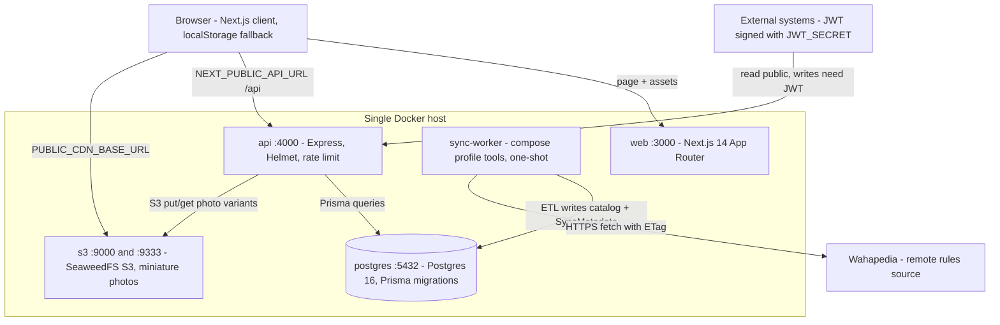

ForceOrg-40k (BeerHammer) is a **single-host, self-hosted system**. `README.md`
states it plainly: the canonical deployment is one Docker Compose stack
containing the Next.js web app, the Express API, PostgreSQL 16 and an
S3-compatible object store, with no managed backend, hosted database or
third-party storage service behind any of them, and the instance's own HTTP API
as the integration point for external systems. `docs/DEPLOYMENT.md` §1 renders
the same shape as an ASCII topology (browser → `web :3000` → `api :4000` →
`postgres:16` / `S3 :9000`, with `sync-worker` as an optional scheduled writer
inside the same host boundary). See
[Deployment & Compose](../operations/deployment-and-compose.md) for operations
detail and [Shared Contracts](./shared-contracts.md) for the cross-package
type/API contracts.

## Self-hosted invariant

- Every component a user depends on runs as a local container the operator
  controls (`README.md`, `docs/DEPLOYMENT.md` §1). Nothing is delegated to a
  cloud service.
- Everything that touches ForceOrg data over the network goes through
  `http://<host>:4000/api` served by that instance. Read endpoints
  (catalog browsing, changelog) are public; write endpoints require an HS256
  JWT signed with the instance's own `JWT_SECRET`. Any client that can mint a
  token with that secret is, by design, a first-class writer. The composed
  default is a **public placeholder** (`${JWT_SECRET:-please-change-me}`), so
  the stack boots with zero configuration in a test environment; `docs/DEPLOYMENT.md`
  §2/§3.1 make the boundary explicit — anything reachable beyond localhost
  MUST override it, because everyone who can read the repository can otherwise
  mint valid write tokens.
- The web frontend is guest-first and client-side: when the API is offline or
  the user is a guest, rosters persist in browser `localStorage` per callsign.
  The UI therefore stays fully usable with the API down, and the frontend can
  be hosted anywhere independently of the API.

## Workspace layout

The repository is an npm-workspaces monorepo driven by Turborepo. The root
`package.json` declares `workspaces: ["apps/*", "packages/*"]` and forwards
`build`, `dev`, `lint`, `test` and `test:coverage` to `turbo run`; `npm run dev`
is filtered to `@forceorg/web` and `@forceorg/api`, so the sync worker is never
part of the interactive dev loop.

| Workspace | Kind | Responsibility |
| :--- | :--- | :--- |
| `@forceorg/web` (`apps/web`) | Next.js 14 App Router app | UI on `:3000`; typed API client; browser-local roster persistence; Playwright E2E |
| `@forceorg/api` (`apps/api`) | Express 4 app | REST API on `:4000`; Helmet, CORS, rate limiting; JWT write auth; S3 photo variants |
| `@forceorg/sync-worker` (`apps/sync-worker`) | Node CLI | One-shot Wahapedia ETL pass that writes rules data straight to Postgres |
| `@forceorg/types` (`packages/types`) | Types-only package | Shared TypeScript shapes (`RosterPayload`, `ApiResponse<T>`, catalog types) |
| `@forceorg/ui-theme` (`packages/ui-theme`) | React/CSS package | Faction design system and chapter heraldry; `react`/`react-dom` as peers |
| `@forceorg/rules-engine-11e` (`packages/rules-engine-11e`) | Pure logic package | 11th edition wargear AST compiler and compliance auditor (`validateRoster`); vitest suite |
| `@forceorg/db-client` (`packages/db-client`) | Prisma package | Schema, migrations, seed script and the re-exported generated `PrismaClient` |

### Build dependency order

`turbo.json` gives `build`, `lint`, `test` and `test:coverage` `dependsOn:
["^build"]`, so a workspace's task only runs after the `build` task of every
workspace it depends on. Combined with the `dependencies` blocks this yields:

```
types  ──▶  rules-engine-11e  ──▶  api / sync-worker / web
   └────▶  ui-theme           ─────────────────────────▶  web
   └────▶  db-client          ─────────────────▶  api / sync-worker
```

Two packaging details matter to that order. `@forceorg/types` and
`@forceorg/ui-theme` point `main` and `types` at `./src/index.ts`, so consumers
read their sources directly (the web app also lists them in
`transpilePackages` in `next.config.js`); `@forceorg/db-client` and
`@forceorg/rules-engine-11e` compile to `dist/**` and must be built before
anything imports them at runtime. `db-client`'s build script is
`prisma generate && tsc`, and the root `postinstall` runs `prisma generate`
against `packages/db-client/prisma/schema.prisma`, so the Prisma client exists
before any workspace type-checks. Build outputs are cached under `dist/**` and
`.next/**` (excluding `.next/cache`).

The per-app Dockerfiles hard-code the same order explicitly rather than
invoking `turbo run build` across the whole repo: `Dockerfile.api` builds
`types → db-client → rules-engine-11e → api`, `Dockerfile.web` builds
`types → ui-theme → rules-engine-11e → web`, and `Dockerfile.sync-worker`
builds `types → db-client → rules-engine-11e → sync-worker`. Each image
therefore carries only the packages its process imports — the web image has no
Prisma client, the API image has no `ui-theme`.

## Process ownership

**`apps/web`** is the only thing a browser talks to directly. Its API base comes
from `NEXT_PUBLIC_API_URL` (`apps/web/src/lib/api.ts` falls back to
`http://localhost:4000/api`); because Next inlines `NEXT_PUBLIC_*` values into
the bundle, `docs/DEPLOYMENT.md` documents it as a **build-time** variable and
`Dockerfile.web` bakes a build-stage default of `http://localhost:4000/api` for
prerendering. Changing the API origin for an already-built web image does not
repoint the browser.

**`apps/api`** is a single Express process (`src/index.ts`) that owns the
network boundary: Helmet, CORS restricted to `CORS_ORIGIN` (default
`http://localhost:3000`), a 2 MB JSON body limit, a 300-request / 15-minute
per-IP rate limiter on `/api`, an unauthenticated `GET /api/health`, and five
route mounts (`datasheets`, `rosters`, `media`, `audit`, `changelog`) followed
by terminal 404 and 500 handlers that emit the shared `ApiResponse` envelope.
It is the only process that talks to S3: `src/services/storage-service.ts`
resolves `S3_ENDPOINT`/`AWS_ENDPOINT` and uses path-style addressing whenever a
custom endpoint is set, which is what makes local SeaweedFS a drop-in for real
S3. Middleware and route behaviour are covered in
[API Server & Middleware](../api/api-server-and-middleware.md).

**`apps/sync-worker`** is deliberately not a service. `src/index.ts` runs
`runETLPipeline()` and calls `process.exit(0)` on success or `process.exit(1)`
on any fatal error — no listener, no supervision. It fetches Wahapedia endpoints
directly over HTTPS and writes catalog rows and `SyncMetadata` **straight to
Postgres**, bypassing the API entirely; the API only reads that output (for
example through `/api/changelog`). Because it writes the same tables the API
serves, it is the one legitimate second writer in the topology and is scheduled
outside the app lifecycle: GitHub Actions cron at 02:00 UTC
(`.github/workflows/wahapedia-sync.yml`), or `docker compose run --rm
sync-worker` on a host cron/systemd timer.

**`packages/db-client`** is the persistence boundary. Every API route and the
ETL pipeline obtain `PrismaClient` from this package, which re-exports the
generated client and its runtime enums; the schema, migrations and idempotent
seed live alongside it. See
[Data Model & Migrations](../data/data-model-and-migrations.md).

**`packages/rules-engine-11e`** is the one piece of business logic that runs in
two different processes: the browser bundle imports it into `RosterBuilder` for
optimistic client-side validation, and the API imports `validateRoster` in
`POST /api/rosters/:id/audit` for the authoritative server-side audit. There is
no second copy of the rules; the same compiled module is shipped to both sides.

## Runtime topology



Caption: Containers on one self-hosted host and the edges between them — web to API to Postgres and S3, with the sync worker as an optional direct writer.

Points the diagram encodes:

- The browser calls the API **directly**, not through a Next.js server proxy;
  the web container serves UI and static assets only. `CORS_ORIGIN` is the knob
  that authorises that cross-origin call.
- Photo uploads travel through the API (multer + sharp generate variants, then
  an S3 put), while reads are served from the object store's public base URL
  (`PUBLIC_CDN_BASE_URL`, e.g. `http://localhost:9000/forceorg-miniatures`).
- The sync worker is the only inbound dependency on the public internet for
  data, and the only writer that does not go through HTTP.

## Compose orchestration

`docker-compose.yml` (build-from-source, development) and
`docker-compose.prod.yml` (pull published GHCR images, final hosting state)
declare the same five services with different delivery mechanisms.

| Service | Container | Port mapping | Notes |
| :--- | :--- | :--- | :--- |
| `postgres` | `forceorg-postgres` | `5432:5432` (dev only) | `postgres:16-alpine`, `pg_isready` healthcheck, `postgres_data` volume |
| `s3` | `forceorg-s3` | `9000:9000`, `9333:9333` (dev only) | prod pins SeaweedFS `3.80` (`server -s3 -s3.port=9000`), `s3_data` volume |
| `api` | `forceorg-api` | `${API_PORT:-4000}:4000` in prod | `depends_on: postgres: service_healthy` |
| `web` | `forceorg-web` | `${WEB_PORT:-3000}:3000` in prod | `depends_on: api` |
| `sync-worker` | `forceorg-sync-worker` | none | `profiles: ['tools']`, `depends_on: postgres: service_healthy` |

Startup and lifecycle facts that follow from these files:

- Ordering is enforced by health, not just by start order: the API and the sync
  worker wait for Postgres to pass `pg_isready`, and the web container waits for
  the API container.
- **Schema migration belongs to the API image, not to compose.**
  `apps/api/entrypoint.sh` runs `prisma migrate deploy` before
  `exec node apps/api/dist/index.js`, defaulting `DIRECT_URL` to `DATABASE_URL`
  when unset, and skipping migrations entirely (logging "catalog-only mode")
  when `DATABASE_URL` is absent. A fresh `docker run` of the published image
  against an empty database therefore works with no operator step.
- The sync worker is published as an image too, but stays behind the `tools`
  profile, so `docker compose up` never starts it; a pass is
  `docker compose run --rm sync-worker` (same in the prod file with
  `-f docker-compose.prod.yml`).
- The production compose pulls
  `ghcr.io/fatpat81/beerhammer/forceorg-{api,web,sync-worker}:${FORCEORG_TAG:-latest}`,
  pins SeaweedFS to `3.80`, and publishes **only** the API and web ports
  (`${API_PORT:-4000}` / `${WEB_PORT:-3000}`); Postgres and S3 stay unpublished
  on the host. Unset variables fall back to placeholder credentials —
  `JWT_SECRET=please-change-me`, `postgres`/`postgrespassword` — which are
  public in the repository and exist so CI and a bare test host boot with zero
  configuration. They are test-only: `docs/DEPLOYMENT.md` §2/§3.1 requires real
  values before anything is exposed beyond localhost. Rollback is re-tagging
  `FORCEORG_TAG=<previous sha>` and re-pulling.
- State lives in exactly two named volumes, `postgres_data` and `s3_data`;
  `docker compose down` keeps both, `down -v` wipes them, so backups mean a
  `pg_dump` plus a copy of `s3_data`.
- Postgres and S3 need not be published beyond the host; the documented
  exposure guidance is to publish only the API, behind a TLS-terminating
  reverse proxy, with `CORS_ORIGIN` narrowed to the origins that legitimately
  call it from a browser.

## Boundary rules when changing this system

- New HTTP surface goes in `apps/api`; the web app should not grow its own data
  layer, and external integrations must not reach into Postgres or S3.
- Anything that must run inside the browser bundle cannot import
  `@forceorg/db-client` — the web image is built without a generated Prisma
  client. Shared logic belongs in `rules-engine-11e` (pure) or `types`
  (types-only).
- A new background job should follow the sync worker's shape — one-shot,
  profile-gated, exits non-zero on failure — rather than becoming another
  always-on service, since the single-host model keeps only web and API long
  lived.
- Adding a workspace means wiring it into all three app Dockerfiles' explicit
  build order; `turbo run build` alone will not make a container image pick it
  up.
