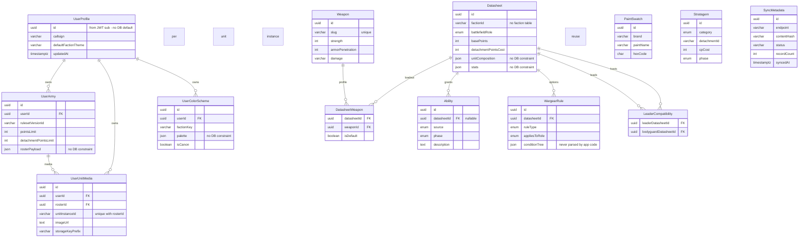
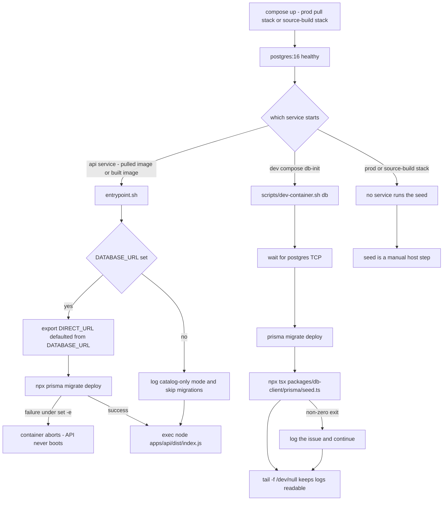

One Prisma schema owns the entire persistence surface: `packages/db-client/prisma/schema.prisma`.
It is the only schema in the repo, it is the only thing that has ever written a
migration (`packages/db-client/prisma/migrations/` contains exactly one
migration), and every runtime component — API, sync worker, seed script — talks
to Postgres through the client it generates, re-exported by
`packages/db-client/src/index.ts`. There is no raw SQL layer: `$executeRaw` and
`$queryRaw` appear nowhere in `apps/`, so anything the schema does not express
(constraints, policies, triggers, roles) simply does not exist at runtime.

## Three classes of table

| Class | Tables (`@@map` names) | Writers | Readers |
|---|---|---|---|
| Public 11e rules catalog | `datasheets_11e`, `weapons_11e`, `datasheet_weapons_11e`, `abilities_11e`, `stratagems_11e`, `wargear_rules_11e`, `leader_compatibility_11e`, `paint_swatches` | `seed.ts` (see caveat below) | public API routes `/api/datasheets`, `/api/datasheets/:id`, `/api/stratagems`, `/api/weapons` (`apps/api/src/routes/datasheets.ts` — no `requireAuth`) |
| Per-user | `user_profiles`, `user_armies`, `user_unit_media`, `user_color_schemes` | `rosters.ts`, `media.ts` handlers, scoped by `userId` | same handlers |
| ETL log | `sync_metadata` | `apps/sync-worker/src/etl-pipeline.ts` (append-only inserts) | `/api/changelog` (`changelog.ts`) |

`datasheet_weapons_11e` is public catalog data in practice, but it is the one
catalog table that `packages/db-client/prisma/rls-policies.sql` never comments
on — the file annotates the seven tables the seed actually populates.

The schema is deliberately *denormalized at the faction/detachment boundary*:
`factionId`, `detachmentPrimary`, `chapterLock`, `alliedFactionGroup` and
`detachmentId` are all bare `VARCHAR` keys with **no foreign key to a faction or
detachment table** — those tables do not exist. Faction and detachment identity
is a string convention shared with `@forceorg/types` and the rules engine; an
invalid `factionId` is accepted by Postgres and silently returns zero rows.

## Entity relationships and cascade topology



*Every table in `schema.prisma`, with the FK edges and the JSON columns that carry no database validation. Array columns (`keywords`, `requiredKeywords`) are shown as ordinary attributes.*

Two FK shapes deserve attention because they change how deletes behave:

- **Every foreign key in the schema is `ON DELETE CASCADE ON UPDATE CASCADE`.**
  Deleting a `user_profiles` row removes that user's armies, unit media and color
  schemes; deleting a `user_armies` row removes its `user_unit_media` rows;
  deleting a `datasheets_11e` row removes its wargear rules, abilities, weapon
  links and *both* sides of any `leader_compatibility_11e` row. There is no
  `RESTRICT`/`SET NULL` anywhere, so no delete can fail on a dangling reference —
  and no delete warns you about the fan-out either.
- **`user_unit_media` has two independent parents** (`userId → user_profiles`,
  `rosterId → user_armies`), and `abilities_11e.datasheet_id` is **nullable**.
  An ability can therefore exist with no datasheet at all, while a media row is
  reachable through either owner's cascade.

Uniqueness is thin. The only real constraints are `weapons_11e.slug`, and the
composite uniques `leader_compatibility_11e (leader, bodyguard)`,
`datasheet_weapons_11e (datasheet, weapon)` and
`user_unit_media (roster_id, unit_instance_id)` — the last one is what lets
`media.ts` upsert a miniature photo by `(rosterId, unitInstanceId)` instead of by
id. There is **no** unique constraint on `stratagems_11e.name`,
`abilities_11e (datasheet_id, name)` or `paint_swatches (brand, paint_name)`,
even though the seed deduplicates on exactly those triples in application code.

## JSON payload columns: the escape hatches

Five `Json` columns (all `JSONB NOT NULL`) carry the parts of the domain the
schema refuses to model, and **nothing in Postgres constrains their shape** — no
`CHECK`, no `jsonpath`, no FK from inside them:

| Column | Intended shape (`@forceorg/types`) | What breaks it |
|---|---|---|
| `user_armies.roster_payload` | `RosterPayload` = `{ units: RosterUnitInstance[], totalPoints, detachmentPointsUsed }` | `POST /api/rosters` and `PUT /api/rosters/:id` persist `req.body.rosterPayload` with only `|| { units: [], ... }` / `?? existing` fallbacks |
| `wargear_rules_11e.condition_tree` | conceptually the `WargearRuleAST` from `wargear-parser.ts` | **no code reads or writes this column at all** — it is only ever serialized out through `include: { wargearRules: true }` |
| `datasheets_11e.unit_composition` | `UnitComposition` (`models[]` with `count` *or* `min`/`max` + `baseSize`) | seed rows use both shapes; nothing enforces either |
| `datasheets_11e.stats` | `DatasheetStats` (`movement`, `toughness`, `save`, optional `invulnerableSave`, `leadership`, `objectiveControl`) | `Necron Warriors` stats omit `invulnerableSave`; a missing key surfaces only when the rules engine reads it |
| `user_color_schemes.palette` | undefined — no type, no route, no reader | the table is never touched by any application code |

The practical consequences:

- The audit route (`apps/api/src/routes/audit.ts`) casts
  `army.rosterPayload as unknown as RosterPayload` and then calls
  `rosterPayload.units.map(...)`. A payload written by an external token holder
  without a `units` array does not fail validation — it throws inside the handler
  and the client gets `500 DB_ERROR`.
- `roster_payload` and `user_unit_media` are kept consistent only by the client.
  Removing a unit from `rosterPayload` via `PUT /api/rosters/:id` leaves its
  `user_unit_media` row (and its S3 objects) behind; only deleting the whole
  roster cascades them away.
- Catalog JSON is *writable by the seed with arbitrary literals*, so the
  `@forceorg/types` interfaces and the DB contents can drift silently. See
  [Shared Contracts: Types, Envelope, Ruleset Versions](../architecture/shared-contracts.md).

Enum drift is the mirror-image risk: the six Postgres enum types
(`BattlefieldRole`, `WargearRuleType`, `TargetRole`, `AbilitySource`,
`BattlePhase`, `StratagemCategory`) created by `CREATE TYPE` in the init
migration are duplicated as string-union types in `packages/types/src/index.ts`.
Widening a union in TypeScript without an `ALTER TYPE … ADD VALUE` migration
type-checks and then fails at insert.

## Migrations: one init migration, applied at container start

`packages/db-client/prisma/migrations/` holds a single migration,
`20261005170232_init/migration.sql`, plus the `provider = "postgresql"` lock
file. It creates the six enum types, all 13 tables, every index and every
foreign key — i.e. schema evolution has never actually happened here, so
`prisma migrate deploy` is currently a no-op after first apply, and any real
change will be the first migration anyone writes against this schema.

**The authoritative table count is 13.** The init migration contains exactly 13
`CREATE TABLE` statements (lines 20–189) and `schema.prisma` declares 13
`model` blocks, one `@@map` per table. `docs/DEPLOYMENT.md` disagrees with
itself: §3.1 says the pull-based stack "self-migrates a fresh database on boot
(14 tables)" while §3.2's service table says "13 tables after auto-migration".
Treat §3.1's `14` as a doc bug — nothing in the migration or schema produces a
14th table (`_prisma_migrations` is created by Prisma itself and is not part of
the model surface).

```bash
# generate client only
npx prisma generate --schema=packages/db-client/prisma/schema.prisma
# create a new migration (developer workflow, db-client "migrate" script)
npx prisma migrate dev --schema=packages/db-client/prisma/schema.prisma
# apply pending migrations (production/dev-container workflow)
npx prisma migrate deploy --schema=packages/db-client/prisma/schema.prisma
```

The connection is split the pgbouncer way: `url = env("DATABASE_URL")` for
queries, `directUrl = env("DIRECT_URL")` for migration/introspection traffic.
`.env.example` and the dev/source-build compositions set both to the same
string; the pull-based prod composition sets `DIRECT_URL` only on
`sync-worker` and lets the API image's entrypoint default it from
`DATABASE_URL`, which the schema comment calls out as the supported shape for
plain self-hosted Postgres.

Client generation happens through the root `postinstall`
(`prisma generate --schema=packages/db-client/prisma/schema.prisma`), but that
hook is not load-bearing: `Dockerfile.api` installs with
`npm ci --ignore-scripts` and then runs `npx prisma generate` explicitly, and
`.github/workflows/wahapedia-sync.yml` runs the same command as its own step
after `npm ci`. `Dockerfile.api` also copies
`packages/db-client/prisma` **and** the `prisma`/`@prisma` packages into the
runtime stage, purely so `migrate deploy` can run at container start. The sync
worker image does the opposite — its runtime stage carries only built `dist`
directories, so that container cannot migrate anything.

## Seed: idempotent by three different mechanisms

`packages/db-client/prisma/seed.ts` is run with `tsx` (registered as the Prisma
`prisma.seed` hook and exposed as `npm run db:seed` at the repo root):

```bash
npx tsx packages/db-client/prisma/seed.ts
```

It populates 7 core stratagems, 14 paint swatches, 11 weapons, 5 datasheets
(3 Adeptus Astartes, 2 Necrons), 12 datasheet-weapon links, 2 leader-compatibility
pairs and 5 abilities, then `process.exit(1)` on any thrown error. It is safe to
re-run, but the protection differs per table:

- **Application-level guard** (`findFirst` then `create`) for stratagems, paint
  swatches and abilities — because those tables have no matching unique index,
  this is best-effort, not atomic.
- **`upsert` on a real unique key** for weapons (`slug`) and for the two link
  tables (composite uniques).
- **`upsert` on hard-coded UUIDs with `update: {}`** for datasheets
  (`11111111-…0001..0003`, `22222222-…0001..0002`). Since `update` is empty, an
  edited datasheet in `seed.ts` will **not** be pushed to a database that already
  has the row; you must delete the row (cascading) or change it by hand.

The seed writes **only** catalog tables. It creates no `user_profiles` rows, no
`wargear_rules_11e` rows and no `sync_metadata` rows — which is exactly where two
gaps live: `user_armies.user_id` has a FK to `user_profiles(id)`, and no code path
in the repo inserts a profile (see
[JWT Auth, Token Minting & Ownership Scoping](../api/authentication-and-ownership.md)),
so a roster write for an unknown `sub` is rejected by the FK and surfaces as
`500 DB_ERROR`. And `wargear_rules_11e` stays empty, so `/api/datasheets/:id`
returns `wargearRules: []` and the whole wargear-selection story is unexercised.

## Operational path



*How schema and seed data reach a database in each deployment mode. Migrations are automatic everywhere the API image runs — including the pull-based prod stack, where the image entrypoint is the only migration mechanism; the seed is automatic only in the dev compose `db-init` service.*

| Task | Command | Notes |
|---|---|---|
| Generate client | `npm run db:generate` (root) | runs `prisma generate` in `packages/db-client` |
| Create a migration | `npm run db:migrate` (root) | `prisma migrate dev` — developer-only; never runs in CI or images |
| Apply pending migrations | `npx prisma migrate deploy --schema=packages/db-client/prisma/schema.prisma` | automatic in the API entrypoint of both the pulled prod image and the source-build image; also listed as a maintenance op in `docs/DEPLOYMENT.md` §4 |
| Re-seed reference data | `npm run db:seed` or `npx tsx packages/db-client/prisma/seed.ts` | documented as idempotent; requires a host checkout + Node because it is not in any image |
| PSQL shell (dev) | `./scripts/dev.sh psql` | `psql -U postgres -d forceorg_dev` |
| Reset local schema | `docker compose -f docker-compose.dev.yml down -v && ./scripts/dev.sh up` | wipes the `dev_postgres_data` volume, then re-migrates and re-seeds |

Operationally the sharp edges are:

- **Migration failure blocks boot.** `entrypoint.sh` runs under `set -e`, so a
  pending migration that errors kills the API container before `node` starts.
- **No `DATABASE_URL` is a supported mode, not a crash.** The entrypoint logs
  `catalog-only mode`, skips migrations and boots anyway; DB-backed routes then
  answer with their `500`/offline fallbacks.
- **Migrations never seed.** The published API image migrates but does not seed,
  so a fresh production database boots with an empty catalog until someone runs
  `seed.ts` (or a sync pass).
- **The prod composition is fully self-migrating.** `docker-compose.prod.yml`
  pulls `ghcr.io/fatpat81/beerhammer/forceorg-api:${FORCEORG_TAG:-latest}` and
  its `api` service carries no `command` override — the comment there says it
  plainly: "Self-migrating image: entrypoint applies pending Prisma
  migrations." A fresh prod/test database therefore reaches the full 13-table
  schema with only Docker on the host: no source checkout, no Node, no Prisma
  CLI (`docs/DEPLOYMENT.md` §3.1 makes the same claim, apart from its wrong
  table count).
- **Zero-config prod defaults line up with the seed's assumptions.** Unset
  variables in the prod composition fall back to the placeholder credentials
  `postgres`/`postgrespassword` with db `forceorg_dev`, i.e. exactly the DSN
  `.env.example`, `docker-compose.yml` and `docker-compose.dev.yml` hard-code —
  so a zero-config test stack migrates and can be seeded with the documented
  commands unchanged. Those values are public in the repository and must be
  overridden beyond localhost.
- **`docker-compose.prod.yml` sets `DATABASE_URL` on the `api` service but not
  `DIRECT_URL`** — it relies entirely on the entrypoint default. `sync-worker`
  is the only prod service that receives `DIRECT_URL` explicitly, and with a
  *different* fallback password (`${POSTGRES_PASSWORD:-postgres}` vs
  `:-postgrespassword` on `DATABASE_URL`); the mismatch is harmless only because
  the worker image ships no schema and runs no migrations.

## RLS: intent, not enforcement

`packages/db-client/prisma/rls-policies.sql` is the only file that talks about
multi-tenant isolation and a "sync-worker service role". Read it as design intent
that was never wired up:

```sql
ALTER TABLE user_armies ENABLE ROW LEVEL SECURITY;
CREATE POLICY user_army_isolation ON user_armies
    FOR ALL USING (auth.uid() = user_id) WITH CHECK (auth.uid() = user_id);
```

Four independent reasons it does nothing today:

1. **Nothing applies it.** No migration contains `ENABLE ROW LEVEL SECURITY`,
   `CREATE POLICY` or a `CREATE FUNCTION auth.uid()`; no script, Dockerfile or
   workflow references `rls-policies.sql`. Both automated paths
   (`apps/api/entrypoint.sh`, `scripts/dev-container.sh db`) run only
   `prisma migrate deploy`.
2. **`auth.uid()` is a Supabase function** that does not exist on plain Postgres
   16 — the file would error on the first `CREATE POLICY` even if applied.
3. **The compose DSNs are the `postgres` superuser**, which bypasses RLS
   regardless of policies.
4. **The write-privilege comments have no counterpart**: no role is created or
   assumed anywhere, and the only in-repo writer of catalog tables is the seed
   script — the ETL worker writes *only* `sync_metadata`.

`user_profiles` is not even covered by a policy, and
`user_color_schemes` / `user_armies` / `user_unit_media` isolation exists only in
the application. The rules tables are public-read by design, matching the
"read endpoints are public" API contract.

## sync_metadata: the ETL's real output

The Wahapedia pipeline never mutates catalog rows. Per endpoint per pass it reads
the newest `sync_metadata` row, sends `If-None-Match`, compares a SHA-256 content
hash, and **inserts one new row** with `status` = `NO_DELTA`, `SUCCESS` or
`ERROR` plus `recordCount` and a generated `rulesetVersionId`
(`11.1.0-YYYY-QN-MFM`, derived from the current date). So the table is an
append-only audit log with a `(endpoint, syncedAt)` index rather than
per-endpoint state, and the "rules changed" signal is metadata only — no
datasheet row is ever updated by it.

`GET /api/changelog` is the consumer: it takes the 10 newest rows to derive
`currentRulesetVersion` and `lastSyncedAt`, falling back to the literal
`11.1.0-2026-Q3-MFM` when the table is empty. That is the same *read-side*
divergence to watch in `user_armies.ruleset_version_id`, which `POST /api/rosters`
hard-codes to `11.1.0-2026-Q3` — the roster column, the seed's data, the changelog
fallback and the worker's generator are four independent string literals that no
constraint ties together.

Timestamps are `TIMESTAMPTZ(6)`, and `updated_at` columns are maintained by
Prisma's `@updatedAt`, **not** by the database: there is no trigger or default, so
any future raw-SQL or manual `UPDATE` leaves them stale. Catalog tables
(`datasheets_11e`, `weapons_11e`, `abilities_11e`, `stratagems_11e`,
`wargear_rules_11e`, `paint_swatches`, `sync_metadata`) have no `updated_at` at
all — they are modelled as insert-only.

## Adding or changing a table

1. Edit `packages/db-client/prisma/schema.prisma`, keeping `@@map` snake_case
   table names and the `@map`-ed column names consistent with the init migration.
2. Generate the migration with `prisma migrate dev`; for enum changes, hand-check
   that the generated SQL is `ALTER TYPE … ADD VALUE` rather than a type swap, and
   update the mirrored unions in `packages/types/src/index.ts`, `prisma/seed.ts`
   and `docs/OPENAPI.yaml` in the same change.
3. Re-run the seed if the new table is reference data, and keep the seed's
   dedupe key aligned with a **real unique index** rather than a `findFirst`.
4. Ship it through the images, not the host: the pulled prod stack migrates only
   what `Dockerfile.api` copies into the runtime stage
   (`packages/db-client/prisma`), so an uncommitted or out-of-image migration
   never reaches a pull-based deployment.
5. Anything security-relevant must be enforced in the handler: adding a policy
   line to `rls-policies.sql` changes nothing until a migration or a real role
   makes it true.
