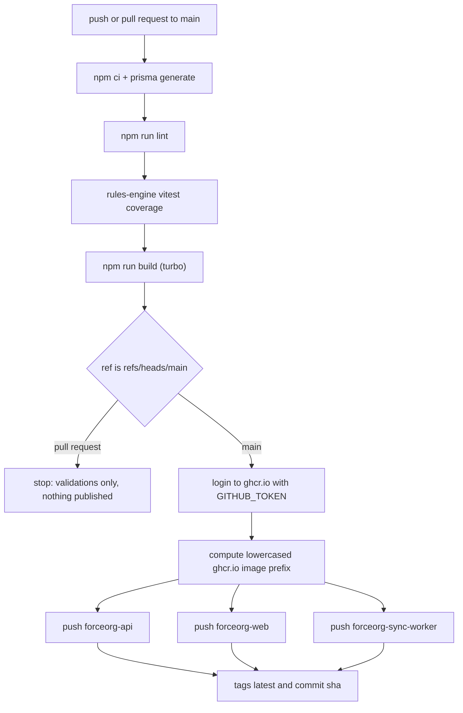
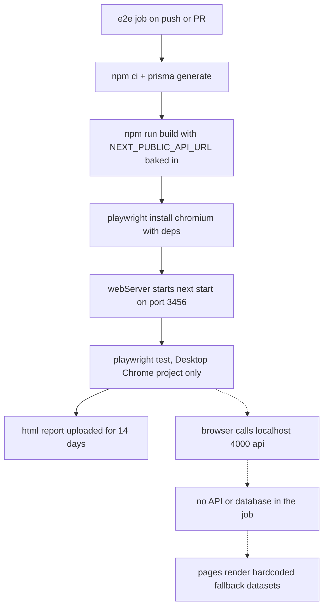

## Overview

The repository carries **two independent CI definitions** for the same monorepo:

| Definition | Host | Triggers | Publishes |
| --- | --- | --- | --- |
| [`.github/workflows/deploy.yml`](../../.github/workflows/deploy.yml) | GitHub Actions | `push` + `pull_request` on `main` | 3 images to GHCR, `main` only |
| [`.github/workflows/e2e.yml`](../../.github/workflows/e2e.yml) | GitHub Actions | `push` + `pull_request` on `main` | Playwright HTML report artifact |
| [`.github/workflows/wahapedia-sync.yml`](../../.github/workflows/wahapedia-sync.yml) | GitHub Actions | cron `0 2 * * *` + `workflow_dispatch` | nothing (writes to the database) |
| [`.github/workflows/openwiki-update.yml`](../../.github/workflows/openwiki-update.yml) | GitHub Actions | cron `0 8 * * *` + `workflow_dispatch` | an `openwiki/update` pull request |
| [`.gitlab-ci.yml`](../../.gitlab-ci.yml) | GitLab CI | MR events + default branch (test); default branch (images) | `web` + `api` images to `$CI_REGISTRY` |

Neither pipeline contains a deploy step. Both stop at publishing artifacts; the published images are pulled by
[`docker-compose.prod.yml`](../../docker-compose.prod.yml) — see
[Deployment & Compose](deployment-and-compose.md). The production compose file pulls from
`ghcr.io/fatpat81/beerhammer/...`, i.e. the GHCR repository belonging to the GitHub remote this tree is checked
out from, so GitHub Actions is the pipeline that actually publishes what production runs today; `.gitlab-ci.yml`
only executes against a GitLab-hosted copy and pushes to a different registry under different image names.

## GitHub Actions: `deploy.yml` (lint → test → build → publish)

`validate-and-build` is a single job running on `ubuntu-latest` with `contents: read` and `packages: write`.
Every run, PR or `main`, executes the same validation prefix:

1. `actions/setup-node@v4` with `node-version: 20` and npm caching.
2. `npm ci`.
3. `npx prisma generate --schema=packages/db-client/prisma/schema.prisma`.
4. **Code Quality Audits** — `npm run lint` followed by `npm run test:coverage --prefix packages/rules-engine-11e`.
5. **Build Application Artifacts** — `npm run build`.

`npm run lint` and `npm run build` are `turbo run lint` / `turbo run build`, so the lint gate is `tsc --noEmit`
for `types`, `ui-theme`, `db-client`, `rules-engine-11e`, `api` and `sync-worker` plus `next lint` for the web
app, and the build gate is the whole graph with `dependsOn: ["^build"]`. The only unit-test suite executed on a
GitHub PR is the Vitest coverage run in `packages/rules-engine-11e` (`vitest run --coverage`); that package is
the only workspace defining `test`/`test:coverage` scripts, and the workflow never runs root `npm run test`.

A failure in any of steps 2–5 blocks the merge, because those steps are unguarded. Everything after that is
guarded by `if: github.ref == 'refs/heads/main'`, so **pull requests validate but publish nothing**.

On `main` the job then logs in to `ghcr.io` as `github.actor` with `secrets.GITHUB_TOKEN`, and pushes three
images built from the repository root context:

| Dockerfile | Image name | Tags |
| --- | --- | --- |
| `Dockerfile.api` | `forceorg-api` | `latest`, `${{ github.sha }}` |
| `Dockerfile.web` | `forceorg-web` | `latest`, `${{ github.sha }}` |
| `Dockerfile.sync-worker` | `forceorg-sync-worker` | `latest`, `${{ github.sha }}` |

Both tags are always pushed, so `:latest` is not a distinct artifact — it is the same manifest as the SHA tag,
which is what `docker-compose.prod.yml` consumes by default (`FORCEORG_TAG:-latest`). There is no rollback
workflow: because every `main` push also leaves an immutable SHA tag in GHCR, rolling back means setting
`FORCEORG_TAG=<previous commit sha>` on the host and pulling again.

GHCR rejects image names containing uppercase characters — the workflow comment notes that this repo's name has
them — so it first computes `echo "name=ghcr.io/${GITHUB_REPOSITORY,,}"` into step output `imagename` and every
tag is prefixed with that lowercased value. Changing the repository owner or name changes the publish path that
production compose must pull from (`ghcr.io/fatpat81/beerhammer/forceorg-*`).

*Caption: `deploy.yml` control flow — the shared validation prefix, the PR/publish split, and the three GHCR pushes.*

## GitHub Actions: `e2e.yml` (Playwright)

The 20-minute `e2e-tests` job runs on the same `push`/`pull_request` triggers as `deploy.yml` but is a separate
workflow, so a browser failure is an independent failing check.

1. `npm ci`, then `npx prisma generate --schema=packages/db-client/prisma/schema.prisma`.
2. `npm run build` with `NEXT_PUBLIC_API_URL: http://localhost:4000/api`. This value is inlined into the
   browser bundle at build time by Next.js (`apps/web/src/lib/api.ts` reads it once as `API_BASE`), which is
   why the workflow sets it on the build step rather than on the test step.
3. `npx playwright install --with-deps chromium`.
4. `npx playwright test --project="Desktop Chrome"` with `working-directory: apps/web`.
5. `actions/upload-artifact@v4` with `if: always()` uploads `apps/web/playwright-report/` for 14 days.

`apps/web/playwright.config.ts` supplies the rest of the CI behaviour: `testDir: './e2e'`, `reporter: 'html'`,
`forbidOnly: !!process.env.CI` (a committed `test.only` fails CI), `retries: 2` and `workers: 1` under CI, and a
`webServer` that runs `npx next start -p 3456` against
`baseURL = process.env.PLAYWRIGHT_TEST_BASE_URL || 'http://localhost:3456'` with
`reuseExistingServer: false`, so the suite always exercises a server built from the current tree instead of
adopting a process already holding the port.

The config declares two projects, `Desktop Chrome` and `Mobile Safari` (iPhone 14). CI selects only
`Desktop Chrome`, and it installs only Chromium, so `Mobile Safari`/WebKit coverage exists locally only.

**There is no API container, database, or object store in this job** — no `services:` and no compose step. The
single started process is the Next.js server, so every `fetch` to `http://localhost:4000/api` in
`e2e/critical-flows.spec.ts` fails and the pages fall back to their in-file demo datasets
(`FALLBACK_CATALOG_DATASHEETS` in the catalog, `FALLBACK_CHANGELOG` on `/changelog`, the fallback army and
`DEMO_FALLBACK_UNITS` in the tabletop console). The five specs therefore assert against curated fallback
content: guest "Instant Commander Access" login, catalog search for "Terminator Squad", changelog "Points
Reductions", the console stratagems overlay, and the audit modal. Adding a spec that needs real persistence —
or removing fallback data from a page — will pass locally against a full stack and fail (or silently test
nothing) in CI. See [Testing Strategy](../testing/testing-strategy.md).

*Caption: the E2E job starts only the Next.js server, so the specs run against the pages' fallback data rather than the real API.*

## GitHub Actions: `wahapedia-sync.yml` (scheduled ETL)

Triggers are `cron: '0 2 * * *'` (daily 02:00 UTC) plus `workflow_dispatch` for manual engineering runs. The job
is not a validation gate; it *is* the production ETL runner, and it is the only scheduled writer to the
datasheet tables.

Steps: `npm ci` → `npx prisma generate --schema=packages/db-client/prisma/schema.prisma` → three explicit
`npm run build --workspace=...` invocations for `packages/types`, `packages/db-client` and
`packages/rules-engine-11e` (the worker's dependency closure, rather than the full turbo graph) →
`npm run worker:sync --prefix apps/sync-worker`, which executes `tsx src/index.ts` (TypeScript is run directly;
`apps/sync-worker/dist` is not built or used here).

The run receives only three secrets: `DATABASE_URL`, `DIRECT_URL` and `ALERT_WEBHOOK_URL`. Both database
variables feed the Prisma datasource (pooled `url` plus `directUrl` for pgbouncer-style setups), and
`ALERT_WEBHOOK_URL` is consumed by `sendAlert()` in `etl-pipeline.ts`. Failure semantics:

- `apps/sync-worker/src/index.ts` exits `0` after `runETLPipeline()` resolves and `1` on a thrown error.
- Per-endpoint failures are caught and recorded as `SyncMetadata` rows with `status: 'ERROR'`, so one bad
  endpoint does not fail the workflow.
- A webhook summary is POSTed **only when `updated > 0 || errors > 0`**, and `sendAlert` returns immediately
  when `ALERT_WEBHOOK_URL` is unset. A clean no-delta run therefore produces no notification at all, and a run
  with only caught endpoint errors surfaces as a green workflow with a red webhook message.

See [Wahapedia ETL Sync Worker](../sync/wahapedia-etl-sync-worker.md) for the pipeline itself.

## GitHub Actions: `openwiki-update.yml` (documentation regeneration)

Runs `cron: "0 8 * * *"` and on demand. This is the producer of the `openwiki/` pages, including this one:
it clones with `fetch-depth: 0` (a shallow clone hides the commit last documented and turns the update into an
empty diff) and sets up Node 22 — the application pipelines all pin Node 20 — then installs
`openwiki@0.7.0` plus optional `mermaid`/`jsdom` for diagram validation, and runs
`openwiki code --update --print` against an OpenAI-compatible endpoint configured by
`OPENAI_COMPATIBLE_API_KEY` (secret), `OPENAI_COMPATIBLE_BASE_URL` (repo variable) and
`OPENWIKI_MODEL_ID: "qwen38-flash-fp8"`, with optional LangSmith tracing credentials.

The `openwiki` step is `continue-on-error: true`, and the run-state file `openwiki/.run.json` is deleted before
committing. The job then opens (and reuses) a pull request from branch `openwiki/update` adding exactly
`openwiki`, `AGENTS.md`, `.github/workflows/openwiki-update.yml`, and `CLAUDE.md` when present — `git add` is
given no missing path. Only changes inside those paths survive the run. Finally the job re-raises the failure
with `exit 1` **after** the PR exists, so a partially completed run still yields a reviewable PR containing the
pages finished before the failure, which is meant to become the baseline for the next scheduled run.

Consequence for editors: do not hand-edit generated pages under `openwiki/`; change the source code or the
authored docs and let this workflow regenerate them.

## GitLab CI: `.gitlab-ci.yml`

Two stages, `test` then `build-images`, with `default: interruptible: true` (a new push cancels the in-flight
pipeline) and `TURBO_TELEMETRY_DISABLED: "1"`.

- **`test`** (`node:20-alpine`, on `merge_request_event` or the default branch): installs `git` via `apk`
  (Turborepo needs it), caches `.npm/` and `.turbo/` keyed by `${CI_COMMIT_REF_SLUG}`, then runs
  `npm ci --cache .npm --prefer-offline`, `npx prisma generate --schema=packages/db-client/prisma/schema.prisma`,
  and `npx turbo run test build`.
- **`build-web` / `build-api`** (default branch only) run in `docker:24.0.5` with a `docker:24.0.5-dind`
  service, log in to `$CI_REGISTRY` with `CI_REGISTRY_USER`/`CI_REGISTRY_PASSWORD`, build `Dockerfile.web` and
  `Dockerfile.api` from the repo root, and push `$CI_REGISTRY_IMAGE/{web,api}` tagged `latest` and
  `$CI_COMMIT_SHA`.

Differences an editor must know before assuming the two pipelines are interchangeable:

- GitLab's merge-request gate is `turbo run test build`; GitHub's PR gate is `lint` + `rules-engine-11e`
  coverage + `build` and never invokes `turbo run test`. In practice both run the same unit suite today —
  `packages/rules-engine-11e` is the only workspace with a `test` script — but GitHub additionally enforces
  `turbo run lint` (`tsc --noEmit` per package, `next lint` for the web app), which GitLab never invokes
  directly and only reaches transitively through the build.
- GitLab publishes **only `web` and `api`**, under `$CI_REGISTRY_IMAGE/web` and `/api`, not the
  `forceorg-*` names on GHCR. `Dockerfile.sync-worker` is never built by GitLab CI, so the sync-worker image
  exists only on GHCR — which is what production compose pulls from `ghcr.io/fatpat81/beerhammer/...`.

## Operational notes and extension points

- Every CI entrypoint regenerates the Prisma client explicitly, even though the root `postinstall` script
  (`prisma generate --schema=packages/db-client/prisma/schema.prisma`) already runs during `npm ci`. The
  explicit steps are therefore redundant-but-harmless; keep at least one of the two in any new workflow.
- Only the four workflow files listed in the Overview exist under `.github/workflows/`; there is no deploy,
  rollback, migration, or release workflow, and no branch-protection or required-checks configuration is
  committed in the repository. Which checks actually block a merge is configured in hosted GitHub settings,
  outside this tree. Schema migration is likewise not a CI concern: it happens at container start, when
  `apps/api/entrypoint.sh` runs `prisma migrate deploy` before launching the server (see
  [Deployment & Compose](deployment-and-compose.md)), so a failed migration surfaces as a restart loop on the
  host rather than as a red pipeline.
- To add a new publishable image, mirror the `deploy.yml` pattern: a `docker/build-push-action@v5` step with
  `if: github.ref == 'refs/heads/main'`, tags prefixed by `${{ steps.imagename.outputs.name }}` (lowercased),
  and both `:latest` and `:latest`-plus-`github.sha` tags so compose can pin by SHA.
- To add a scheduled job, follow `wahapedia-sync.yml`: `schedule` + `workflow_dispatch`, Node 20 with npm
  caching, and inject credentials only as `${{ secrets.* }}` on the step that needs them.
- The workflow comments reference an external plan (`§2.1`, `§5.3`, `§2.2`) rather than in-repo docs; treat
  those section markers as historical, not as links.

Related: [System Topology](../architecture/system-topology.md),
[Deployment & Compose](deployment-and-compose.md),
[Data Model & Migrations](../data/data-model-and-migrations.md).
