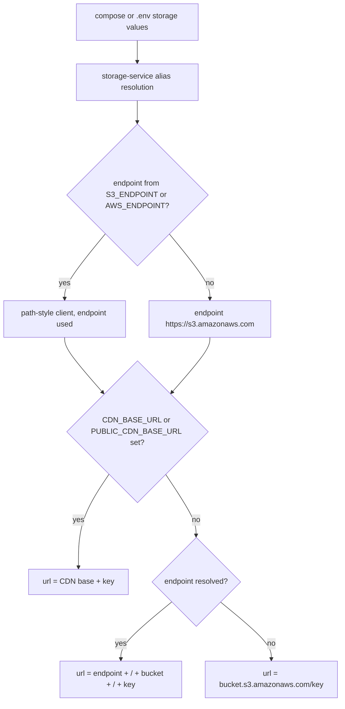

## Overview

Configuration is plain `process.env` reads — there is no config loader, schema validation, or startup validation pass anywhere in the monorepo. Each consumer reads its own variables at module load and applies a hard-coded fallback, so a missing variable never prevents a service from booting; it silently changes what that service talks to. Nothing checks credentials, bucket existence, or even that `JWT_SECRET` was overridden at boot — failures surface later, at the first authenticated request or the first `PutObjectCommand`. Compose files supply container env; [`.env.example`](../../.env.example) documents a hand-run setup; [`.env.dev`](../../.env.dev) is a committed, safe-to-commit file used only by the dev containers.

Three consequences dominate day-to-day operation:

- **`NEXT_PUBLIC_*` values are baked at web build time.** Next.js inlines them into the client bundle, so changing them requires rebuilding `@forceorg/web`.
- **Storage names are aliased.** `.env.example` documents `S3_*`, while every compose file injects `AWS_*` / `S3_BUCKET_NAME` / `PUBLIC_CDN_BASE_URL`. [`storage-service.ts`](../../apps/api/src/services/storage-service.ts) accepts both.
- **Security-relevant defaults are public.** The JWT secret, Postgres credentials, and Supabase client values all have fallbacks committed in this repository. [`docs/DEPLOYMENT.md` §2](../../docs/DEPLOYMENT.md) states plainly that these placeholder defaults exist so test environments and CI boot with zero configuration, and that anything reachable beyond localhost **must** override them — anyone who can read the repo can mint valid tokens against a server still using them.

## Web app (`apps/web`)

| Variable | Read at | Fallback when unset | Effect |
| --- | --- | --- | --- |
| `NEXT_PUBLIC_API_URL` | [`src/lib/api.ts`](../../apps/web/src/lib/api.ts) (`API_BASE`) | `http://localhost:4000/api` | Base URL every browser API call is prefixed with. |
| `NEXT_PUBLIC_SUPABASE_URL` | [`src/lib/supabase.ts`](../../apps/web/src/lib/supabase.ts) | `https://placeholder.supabase.co` | Supabase auth endpoint used to look up a session token. |
| `NEXT_PUBLIC_SUPABASE_ANON_KEY` | [`src/lib/supabase.ts`](../../apps/web/src/lib/supabase.ts) | `placeholder-anon-key` | Anon key paired with the URL above. |
| `NEXT_TELEMETRY_DISABLED` | Next.js CLI | unset | Set to `1` by the dev compose file and `Dockerfile.web`. |
| `PLAYWRIGHT_TEST_BASE_URL` | [`playwright.config.ts`](../../apps/web/playwright.config.ts) (`use.baseURL`) | `http://localhost:3456` | Target of the E2E suite. |
| `CI` | [`playwright.config.ts`](../../apps/web/playwright.config.ts) | unset | Truthy → `forbidOnly`, 2 retries, single worker. |
| `PORT` | Next.js `start` | `3000` | Set in `Dockerfile.web` and in both full-stack compose files. |

`NEXT_PUBLIC_SUPABASE_URL` / `NEXT_PUBLIC_SUPABASE_ANON_KEY` are **not** documented in `.env.example` and are not set by any compose file — in every shipped configuration the browser talks to the placeholder host. That is survivable by design: `getAuthToken()` wraps `createClient()` + `getSession()` in a `try/catch` that returns `null`, and `apiFetch` simply omits the `Authorization` header, so the app degrades to guest / localStorage-persistence mode rather than erroring ([`api.ts#L31-L59`](../../apps/web/src/lib/api.ts)).

### `NEXT_PUBLIC_*` is a build-time value

[`Dockerfile.web`](../../Dockerfile.web) sets `ENV NEXT_PUBLIC_API_URL=http://localhost:4000/api` in the **builder** stage immediately before `npm run build --workspace=@forceorg/web`. The published web image therefore always contains `http://localhost:4000/api` in its client bundle. Setting `NEXT_PUBLIC_API_URL` on the `web` service ([`docker-compose.yml#L80`](../../docker-compose.yml), [`docker-compose.prod.yml#L80`](../../docker-compose.prod.yml)) changes only the runtime environment of `next start` and does not rewrite the already-inlined URL — serving the browser from a different host/port requires a rebuild with a different build-time value, alongside a matching `CORS_ORIGIN` on the API. The same rule applies locally: `npm run build` / `next dev` read `apps/web/.env.local` at that moment.

## API server (`apps/api`)

| Variable | Read at | Fallback when unset | Effect |
| --- | --- | --- | --- |
| `PORT` | [`src/index.ts#L16`](../../apps/api/src/index.ts) | `4000` | Listen port; also `ENV PORT=4000` in `Dockerfile.api`. |
| `NODE_ENV` | Express / deps | unset | `production` in prod compose, `development` in dev compose. |
| `CORS_ORIGIN` | [`src/index.ts#L21`](../../apps/api/src/index.ts) | `http://localhost:3000` | Single allowed browser origin (with `credentials: true`). |
| `JWT_SECRET` | [`src/middleware/auth.ts#L8`](../../apps/api/src/middleware/auth.ts) | `dev-secret-change-in-production` | HS256 secret for verifying write-endpoint bearer tokens. |
| `DATABASE_URL` | Prisma datasource | none required at import, required for DB routes | Pool/app connection string. |
| `DIRECT_URL` | Prisma `directUrl` | defaulted by the API entrypoint | Used by `prisma migrate`. |
| `S3_ENDPOINT` / `AWS_ENDPOINT` | `storage-service.ts` | `https://s3.amazonaws.com` | Storage endpoint; presence also forces path-style addressing. |
| `S3_REGION` / `AWS_REGION` | `storage-service.ts` | `auto` | SDK region. |
| `S3_ACCESS_KEY_ID` / `AWS_ACCESS_KEY_ID` | `storage-service.ts` | `''` (empty string) | Access key. |
| `S3_SECRET_ACCESS_KEY` / `AWS_SECRET_ACCESS_KEY` | `storage-service.ts` | `''` (empty string) | Secret key. |
| `S3_BUCKET` / `S3_BUCKET_NAME` | `storage-service.ts` | `forceorg-media` | Bucket for miniature photo variants. |
| `CDN_BASE_URL` / `PUBLIC_CDN_BASE_URL` | `storage-service.ts` | `''` | Public base URL prefixed to stored keys. |

### Which `JWT_SECRET` a container verifies against

There are **three** different ways this secret ends up unset or defaulted, and they do not agree:

| Start path | Secret actually used |
| --- | --- |
| `docker-compose.prod.yml` with `JWT_SECRET` unset | `please-change-me` — injected by `${JWT_SECRET:-please-change-me}` ([`docker-compose.prod.yml#L60`](../../docker-compose.prod.yml)) |
| `docker-compose.yml` (source build) or `docker-compose.dev.yml` | `dev-secret-change-in-production` — those compositions set **no** `JWT_SECRET` at all, so the code fallback in [`auth.ts#L8`](../../apps/api/src/middleware/auth.ts) applies |
| Bare `node apps/api/dist/index.js` / `--env-file .env` | `dev-secret-change-in-production` unless `.env` supplies `change-me-in-production` as documented in [`.env.example#L16`](../../.env.example) |

So *which* secret a container verifies against depends on how it was started, not just on whether you "set" one — a token minted for a compose-default server is rejected by a bare process and vice versa (both failures look like `401 TOKEN_INVALID`). Both fallback values are public in this repository, so an API started without an explicit `JWT_SECRET` accepts tokens anyone can mint; `docs/DEPLOYMENT.md` §2 labels that behavior test/CI-only and requires an override before any network exposure ([`docs/DEPLOYMENT.md#L45-L51`](../../docs/DEPLOYMENT.md)).

The secret is read **once at module load** into a module-level `const`, so changing `JWT_SECRET` requires a process restart — there is no rotation, key-id, or reload path. Read endpoints stay public; only routes behind `requireAuth` / `optionalAuth` consult the secret. See [Authentication & Ownership](../api/authentication-and-ownership.md).

### Database: `DATABASE_URL` and `DIRECT_URL`

The Prisma datasource declares `url = env("DATABASE_URL")` and `directUrl = env("DIRECT_URL")` ([`schema.prisma#L6-L13`](../../packages/db-client/prisma/schema.prisma)). `directUrl` is what `prisma migrate deploy` needs, so a plain self-hosted Postgres with only one connection string would otherwise fail schema validation. The API image entrypoint closes that gap: when `DATABASE_URL` is set it exports `DIRECT_URL="${DIRECT_URL:-$DATABASE_URL}"` and then runs `prisma migrate deploy` before starting the server; when `DATABASE_URL` is unset it skips migrations entirely and logs "catalog-only mode" ([`entrypoint.sh#L10-L18`](../../apps/api/entrypoint.sh)).

The compositions are not uniform about supplying the variable:

- `docker-compose.yml` and `docker-compose.dev.yml` set `DATABASE_URL` **and** `DIRECT_URL` to the *same* literal DSN on every service that touches the database.
- `docker-compose.prod.yml` sets `DIRECT_URL` **only on `sync-worker`** ([`docker-compose.prod.yml#L92-L95`](../../docker-compose.prod.yml)); the `api` service gets `DATABASE_URL` alone ([`docker-compose.prod.yml#L54-L69`](../../docker-compose.prod.yml)). In the pull-based stack it is therefore the entrypoint default, not compose, that satisfies `directUrl` for the API.

Because every place that sets both sets them equal, the pooled/direct split is only meaningful behind a pgbouncer-style pooler; nothing in the repo runs one. Note also that the prod `sync-worker` block interpolates its `DIRECT_URL` from `${POSTGRES_PASSWORD:-postgres}` while its `DATABASE_URL` on the line above uses `${POSTGRES_PASSWORD:-postgrespassword}` — a latent divergence that is harmless today (Prisma uses `directUrl` only for migrate/introspection, and the worker does not migrate) but would bite anyone who starts running migrations from the worker with no host password set.

### Object storage: the `S3_*` / `AWS_*` fallback chain

Every storage variable is resolved as `S3_X ?? AWS_X` (or the `_NAME` / `PUBLIC_` variant), with the `S3_*` name winning:

```typescript
const S3_ENDPOINT = env('S3_ENDPOINT') ?? env('AWS_ENDPOINT');
const S3_REGION = env('S3_REGION') ?? env('AWS_REGION') ?? 'auto';
const S3_ACCESS_KEY_ID = env('S3_ACCESS_KEY_ID') ?? env('AWS_ACCESS_KEY_ID') ?? '';
const S3_SECRET_ACCESS_KEY = env('S3_SECRET_ACCESS_KEY') ?? env('AWS_SECRET_ACCESS_KEY') ?? '';
const BUCKET = env('S3_BUCKET') ?? env('S3_BUCKET_NAME') ?? 'forceorg-media';
const CDN_BASE = env('CDN_BASE_URL') ?? env('PUBLIC_CDN_BASE_URL') ?? '';
```

The chain exists because the two configuration sources disagree: [`.env.example`](../../.env.example) documents `S3_BUCKET`, `S3_REGION`, `S3_ENDPOINT`, while all three compose files inject the AWS-SDK-native names (`AWS_ENDPOINT`, `AWS_REGION`, `S3_BUCKET_NAME`, `PUBLIC_CDN_BASE_URL`). Accepting both means a host using `--env-file .env` and a host using compose get identical behavior. The comment at [`storage-service.ts#L13-L14`](../../apps/api/src/services/storage-service.ts) records that intent.

Two subtleties follow from reading the resolution order:

- The aliasing happens **before** the client is built, so the resolved `S3_ENDPOINT` constant already holds an `AWS_ENDPOINT` value. `forcePathStyle: Boolean(S3_ENDPOINT)` therefore enables path-style addressing for either name — required for MinIO/SeaweedFS, and correctly disabled when falling through to real AWS.
- `S3_BUCKET` wins over `S3_BUCKET_NAME`. Because `.env.example` documents bucket `forceorg-media` and compose creates/uses `forceorg-miniatures`, a partially exported `.env` (e.g. only `S3_BUCKET` set) can silently point uploads at a bucket the local S3 server never created.

Resolution happens once at module import into an `S3Client`. Nothing validates the values, so a missing endpoint or credential produces a booting API and failures only at the first `PutObjectCommand` / `DeleteObjectCommand`. The empty-string credential fallback is passed straight into the client's `credentials` rather than left unset, so the SDK's ambient credential chain is never consulted — an unconfigured store (which is exactly what prod compose's empty `AWS_ACCESS_KEY_ID` / `AWS_SECRET_ACCESS_KEY` defaults produce against a real S3 endpoint) surfaces as `UPLOAD_ERROR` from the upload route, not as a startup error. See [Media Upload & Object Storage](../api/media-upload-and-object-storage.md).

### Image URL derivation

`uploadImage` returns a URL built by a three-step precedence chain that is stored with the media record, not computed per request:



*Precedence for both the S3 client endpoint and the public URL returned from `uploadImage`.*

`CDN_BASE` wins when set, its trailing slashes are stripped, and `/${key}` is appended. The second branch (`endpoint + /bucket/key`) is correct only when that endpoint is also reachable from the browser — which is why the source-build and dev compositions set `PUBLIC_CDN_BASE_URL: http://localhost:9000/forceorg-miniatures` rather than letting the internal `http://s3:9000` endpoint leak into stored URLs. Leaving `PUBLIC_CDN_BASE_URL` empty in `docker-compose.prod.yml` (its default is empty) makes the API mint `http://s3:9000/...` image URLs that resolve only inside the compose network. Uploads also carry `CacheControl: 'public, max-age=31536000, immutable'`, so corrected URLs are not retroactively rewritten for objects already stored.

## Sync worker (`apps/sync-worker`)

| Variable | Read at | Fallback when unset | Effect |
| --- | --- | --- | --- |
| `DATABASE_URL` | Prisma client used by `etl-pipeline.ts` | none — the run fails | Target database for `SyncMetadata` rows. |
| `DIRECT_URL` | Prisma `directUrl` | none | Only needed for schema validation / migrations. |
| `ALERT_WEBHOOK_URL` | [`etl-pipeline.ts#L169`](../../apps/sync-worker/src/etl-pipeline.ts) | unset | Discord/Slack webhook for the run summary. |

`sendAlert()` returns immediately when `ALERT_WEBHOOK_URL` is unset, and it is only called at all when the pass reports `updated > 0 || errors > 0` — a run that finds no deltas never alerts, and a webhook that throws is swallowed with `console.error`. Alerts are therefore best-effort, not a durable notification path. Both compose files interpolate `ALERT_WEBHOOK_URL: ${ALERT_WEBHOOK_URL:-}` so the host value passes through and an unset host value yields an empty string; the scheduled workflow feeds all three variables from repository secrets ([`wahapedia-sync.yml#L36-L41`](../../.github/workflows/wahapedia-sync.yml)).

## Dev container variables

[`docker-compose.dev.yml`](../../docker-compose.dev.yml) layers config three ways: `env_file: .env.dev` on the shared `x-dev-common` anchor, an inline `environment:` mapping, and host-side `${VAR:-default}` interpolation.

| Variable | Scope | Default | Effect |
| --- | --- | --- | --- |
| `NODE_ENV` | dev containers via [`.env.dev`](../../.env.dev) | committed as `development` | The only value in the committed `.env.dev`; editing it affects dev containers only. |
| `WEB_PORT` | host interpolation | `3000` | Host port published for `web`, and feeds `CORS_ORIGIN: http://localhost:${WEB_PORT:-3000}`. |
| `API_PORT` | host interpolation | `4000` | Host port published for `api`, and feeds `NEXT_PUBLIC_API_URL: http://localhost:${API_PORT:-4000}/api` for the hot-reloading web container and the toolchain. |
| `DATABASE_URL` / `DIRECT_URL` | all dev services | container-internal `postgres` DSN | Hard-coded to the dev Postgres credentials. |
| `AWS_ENDPOINT`, `AWS_REGION`, `AWS_ACCESS_KEY_ID`, `AWS_SECRET_ACCESS_KEY`, `S3_BUCKET_NAME`, `PUBLIC_CDN_BASE_URL` | dev `api` service | SeaweedFS on `http://s3:9000`, bucket `forceorg-miniatures` | Same AWS-native names the production image expects. |
| `PLAYWRIGHT_BROWSERS_PATH` | dev `toolchain` service | `/pw-browsers` | Shared browser-cache volume; `e2e` aborts if Chromium is absent from it. |

`WEB_PORT`/`API_PORT` are consumed by Compose interpolation, not passed into the containers, so `WEB_PORT=13000 API_PORT=14000 ./scripts/dev.sh up` republishes the ports *and* keeps CORS plus the browser's API base consistent in one step. Inside the containers the servers still bind `3000`/`4000`. The `toolchain` one-shot joins only the image anchor (not `x-dev-common`), so it does not read `.env.dev` but does receive `NEXT_PUBLIC_API_URL` derived from `API_PORT` — which matters because `dev-container.sh e2e` runs `npx next build` inside it. Note that the dev `api` service defines its own `environment:` block, which **replaces** the anchor's mapping rather than merging, so `NEXT_PUBLIC_API_URL` is deliberately absent from it (the dev web server consumes it at build/dev time, not the API).

## E2E (`apps/web`)

The committed Playwright config owns its own environment: the `webServer` block runs `npx next start -p 3456` with `NEXT_PUBLIC_API_URL` defaulting to `http://localhost:4000/api`, and `reuseExistingServer: false` so the suite can never exercise a stale server holding the port. `PLAYWRIGHT_TEST_BASE_URL` overrides `use.baseURL` when the suite must reach a web server elsewhere than `http://localhost:3456`. GitHub Actions sets `NEXT_PUBLIC_API_URL` during `npm run build` and runs Chromium headless with `--with-deps` ([`e2e.yml#L32-L42`](../../.github/workflows/e2e.yml)). See [CI/CD Workflows](ci-cd-pipelines.md).

## Compose interpolation variables (`docker-compose.prod.yml`)

The pull-based production file is parameterized entirely through host variables with placeholder defaults — its own header calls these "TEST-FRIENDLY DEFAULTS" that are public in the repository and must be overridden before network exposure ([`docker-compose.prod.yml#L11-L18`](../../docker-compose.prod.yml)):

| Variable | Default | Effect |
| --- | --- | --- |
| `FORCEORG_TAG` | `latest` | Image tag for `forceorg-{api,web,sync-worker}` from GHCR; pin a commit sha to roll back. |
| `JWT_SECRET` | `please-change-me` | Public placeholder injected into `api`; must be overridden for real deployments. |
| `CORS_ORIGIN` | `http://localhost:3000` | Allowed browser origin. |
| `POSTGRES_USER` / `POSTGRES_PASSWORD` / `POSTGRES_DB` | `postgres` / `postgrespassword` / `forceorg_dev` | Interpolated into the Postgres service and the `api` / `sync-worker` `DATABASE_URL`; `sync-worker` also gets a `DIRECT_URL` from the same placeholders (with `postgres` as its password fallback). `api` gets **no** `DIRECT_URL`. |
| `AWS_REGION` | `us-east-1` | Storage region. |
| `AWS_ENDPOINT` | — | Hard-coded `http://s3:9000`; **not** interpolated, so the bundled SeaweedFS container is the only possible target. |
| `AWS_ACCESS_KEY_ID` / `AWS_SECRET_ACCESS_KEY` | empty / empty | Storage credentials; passed through to the SDK as empty strings. |
| `S3_BUCKET_NAME` | `forceorg-miniatures` | Storage bucket. |
| `PUBLIC_CDN_BASE_URL` | empty | Public image base; empty yields container-internal `http://s3:9000/...` image URLs. |
| `API_PORT` / `WEB_PORT` | `4000` / `3000` | Host port mappings. |
| `NEXT_PUBLIC_API_URL` | `http://localhost:4000/api` | Runtime-only for the web container — see the build-time caveat above. |
| `ALERT_WEBHOOK_URL` | empty | Passed through to the `sync-worker` one-shot. |

One documentation trap: the "Default in compose" column of [`docs/DEPLOYMENT.md` §2](../../docs/DEPLOYMENT.md) describes the **source-build** composition, where `PUBLIC_CDN_BASE_URL` really is `http://localhost:9000/forceorg-miniatures` and storage credentials are `minioadmin`/`minioadminpassword`. Under the pull-based prod file those same variables default to empty, so the same doc page describes two materially different runtime shapes.

The API image resolves storage and database config at startup and self-migrates; the `s3` and `postgres` services are never meant to leave the host, so `docs/DEPLOYMENT.md` recommends publishing only the API and restricting `CORS_ORIGIN` to real caller origins.

## Operating rules

- Treat every fallback as a **test-only** value. Grep the process environment of a running API for `JWT_SECRET` before exposing it; the placeholder secret is the single highest-impact silent default, and the code fallback and compose fallback differ.
- Set `JWT_SECRET`, `POSTGRES_PASSWORD`, `AWS_ACCESS_KEY_ID`/`AWS_SECRET_ACCESS_KEY`, and `CORS_ORIGIN` explicitly; nothing in the boot path complains when they are left at defaults.
- Change `NEXT_PUBLIC_API_URL` by rebuilding the web image (or the local dev build), never by editing compose env alone.
- Set `PUBLIC_CDN_BASE_URL` (or `CDN_BASE_URL`) to a browser-reachable URL before the first upload, since derived URLs are persisted per object and cached immutably.
- Prefer one naming family per deployment: mixing `S3_*` and `AWS_*` values in the same environment is legal but makes bucket/endpoint drift easy to miss.

## Related

- [Authentication & Ownership](../api/authentication-and-ownership.md) — how `JWT_SECRET` gates write routes.
- [Media Upload & Object Storage](../api/media-upload-and-object-storage.md) — the upload pipeline that consumes the storage variables.
- [Deployment & Compose](deployment-and-compose.md) — the three compositions and image build/publish flow.
- [Dev Environment](dev-environment.md) — the containerized dev workbench behind `scripts/dev.sh`.
- [Wahapedia ETL Sync Worker](../sync/wahapedia-etl-sync-worker.md) — the worker that consumes `DATABASE_URL` / `ALERT_WEBHOOK_URL`.
