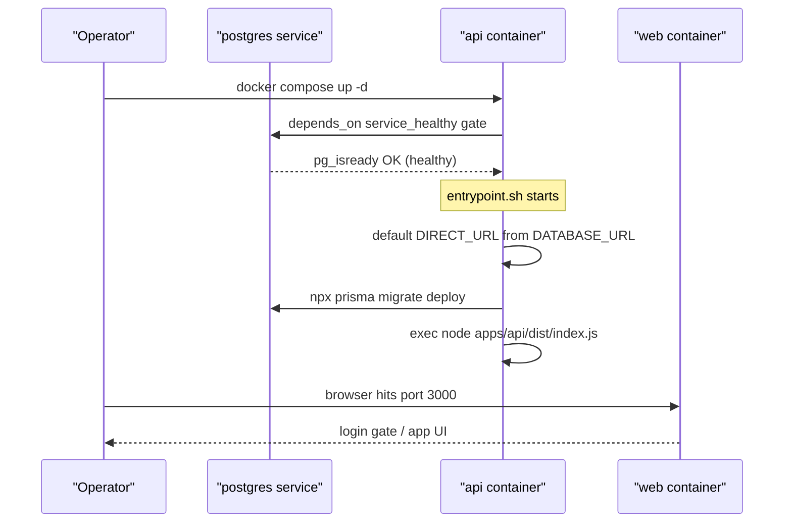

## Overview

ForceOrg-40k is designed to be fully self-hosted: the Next.js web app, the Express API, PostgreSQL, and S3-compatible object storage all run as containers on infrastructure the operator controls ([docs/DEPLOYMENT.md](../../docs/DEPLOYMENT.md) §1). The repository ships **three compose files** for three distinct jobs, plus four Dockerfiles:

| File | Purpose | Build or pull |
| --- | --- | --- |
| [`docker-compose.yml`](../../docker-compose.yml) | Full-stack stack built from source (`docker compose up -d --build`) — hosting, troubleshooting, and "does the production stack work" checks | builds local images from `Dockerfile.api` / `Dockerfile.web` / `Dockerfile.sync-worker` |
| [`docker-compose.prod.yml`](../../docker-compose.prod.yml) | Pull-based production deployment — the host needs only Docker; images come from GHCR | pulls `ghcr.io/fatpat81/beerhammer/forceorg-{api,web,sync-worker}:${FORCEORG_TAG:-latest}` |
| [`docker-compose.dev.yml`](../../docker-compose.dev.yml) | Shared containerized *development* environment with hot reload behind `./scripts/dev.sh` | builds one shared `forceorg-dev` image from `Dockerfile.dev`; source is bind-mounted, never baked in |



*Startup ordering: the compose healthcheck gates the API, whose entrypoint applies Prisma migrations before the server ever listens.*

## Compose services and startup ordering

All three files model the same topology: `postgres`, an S3 service, `api`, `web`, and an optional one-shot `sync-worker`.

- **postgres** — `postgres:16-alpine` with a `pg_isready` healthcheck (5s interval, 5 retries in the source-build and production compositions, 10 in the dev composition). Data lives in the named volume `postgres_data` (dev: `dev_postgres_data`). `docker compose down` keeps the volume; `down -v` wipes it ([docs/DEPLOYMENT.md](../../docs/DEPLOYMENT.md) §3 "Data & backups").
- **s3** — SeaweedFS (`chrislusf/seaweedfs`) running `server -dir=/data -s3 -s3.port=9000`, which replaced MinIO after MinIO removed its public images (comment in [`docker-compose.yml`](../../docker-compose.yml) L28-L30). The production composition **pins `3.80`**; the source-build and dev compositions track `latest`. The S3 API is exposed on 9000 and the master UI on 9333 in those two, while the production composition publishes **no** S3 ports at all, keeping storage on the compose network only. Data lives in the `s3_data` volume.
- **api** — depends on `postgres` with `condition: service_healthy`, so Express never starts against a database that cannot yet accept connections. Being healthy replaces any startup wait: the entrypoint's `prisma migrate deploy` runs against a reachable server ([`docker-compose.yml`](../../docker-compose.yml#L49-L51), [`docker-compose.prod.yml`](../../docker-compose.prod.yml#L50-L52)).
- **web** — depends on `api` (plain `depends_on`, no health condition); it only needs the API URL to be routable since it calls the API from the browser via `NEXT_PUBLIC_API_URL`.
- **sync-worker** — the Wahapedia ETL. It sits behind `profiles: ['tools']` in both the source-build and production compositions and is gated on `postgres` with `condition: service_healthy`, so `docker compose up` never starts it; an operator runs one-shot passes explicitly (`docker compose run --rm sync-worker`) or schedules them on the host with cron/systemd ([`docker-compose.yml`](../../docker-compose.yml#L84-L101), [`docker-compose.prod.yml`](../../docker-compose.prod.yml#L84-L95), [Dockerfile.sync-worker](../../Dockerfile.sync-worker#L1-L5)).

### Published ports (source-build composition)

| Service | Host port | Check |
| --- | --- | --- |
| web | 3000 | login gate loads at `http://localhost:3000` |
| api | 4000 | `GET http://localhost:4000/api/health` returns `{"success":true,...}` |
| postgres | 5432 | 13 tables present after auto-migration |
| s3 | 9000 (S3), 9333 (master UI) | HTTP 200 |

These checks are the post-deploy verification table in [docs/DEPLOYMENT.md](../../docs/DEPLOYMENT.md) §3.2. The `/api/health` handler is a static status/version/timestamp response in [`apps/api/src/index.ts`](../../apps/api/src/index.ts#L44-L53). In the production composition the API and web ports are parameterized as `${API_PORT:-4000}` and `${WEB_PORT:-3000}`, and Postgres and S3 publish nothing — the hardening guidance is that direct Postgres/S3 ports "do not need to leave the host" ([docs/DEPLOYMENT.md](../../docs/DEPLOYMENT.md) §3 "Exposing the API to external systems").

### How many tables does a fresh database have?

The source of truth is the init migration: `20261005170232_init/migration.sql` issues **13** `CREATE TABLE` statements, and `schema.prisma` declares 13 models ([migration.sql](../../packages/db-client/prisma/migrations/20261005170232_init/migration.sql#L20-L189), [schema.prisma](../../packages/db-client/prisma/schema.prisma)). Note a documentation discrepancy: [docs/DEPLOYMENT.md](../../docs/DEPLOYMENT.md) §3.1 says the self-migrating image produces "14 tables" while §3.2's verification table says 13. Trust the migration and treat §3.1 as stale.

## Container images

All four Dockerfiles build on `node:20-bookworm-slim` with multi-stage builder → runner layouts.

**`Dockerfile.api`** builds `@forceorg/types`, `db-client`, `rules-engine-11e`, and `apps/api` in dependency order after `prisma generate`. The runner stage is deliberately self-migrating: it installs `libvips42` (Sharp's native dependency for image variants), copies the Prisma schema **and migrations directory** plus the Prisma CLI (`node_modules/prisma`, `@prisma`, `.bin`) into the image so `prisma migrate deploy` can run at container start with no host tooling. It exposes 4000 and sets `ENTRYPOINT ["/app/entrypoint.sh"]` ([Dockerfile.api](../../Dockerfile.api#L32-L66)).

**`Dockerfile.web`** builds the Next.js App Router frontend (types → ui-theme → rules-engine-11e → web), bakes a build-time fallback `NEXT_PUBLIC_API_URL=http://localhost:4000/api` for SSG prerendering, and runs as the non-root `nextjs` user (uid 1001) on port 3000 ([Dockerfile.web](../../Dockerfile.web#L32-L66)).

**`Dockerfile.sync-worker`** produces a one-shot image: `CMD ["node", "apps/sync-worker/dist/index.js"]` runs a single ETL pass against `DATABASE_URL` and exits — scheduling is the host's job ([Dockerfile.sync-worker](../../Dockerfile.sync-worker#L1-L56)). It is published to GHCR alongside the app images, so a production host can run ETL passes with no checkout or build.

**`Dockerfile.dev`** is a shared toolchain image: pinned Node 20, `npm ci` from the lockfile, Prisma client generated at build, plus Chromium system libraries so Playwright E2E runs in the same image. Source is *not* baked in; `docker-compose.dev.yml` bind-mounts the repo to `/app` with container-owned `dev_node_modules`, `dev_web_next`, and `dev_turbo_cache` volumes so host edits hot-reload without shadowing dependencies. The image writes a lockfile checksum to `node_modules/.deps-stamp` so the runtime entry script can skip reinstalling when dependencies haven't changed ([Dockerfile.dev](../../Dockerfile.dev#L25-L42)).

## The API entrypoint: migration-before-serve

[`apps/api/entrypoint.sh`](../../apps/api/entrypoint.sh) is the ordering contract that makes the published image safe to `docker run` against a fresh database with no compose-level command override:

1. `set -e` — any migration failure aborts the container before the server starts.
2. If `DATABASE_URL` is set, export `DIRECT_URL="${DIRECT_URL:-$DATABASE_URL}"`. The Prisma schema declares `directUrl = env("DIRECT_URL")`, and plain self-hosted Postgres has no pooled/direct split; defaulting the variable keeps schema validation working in any setup. This default is load-bearing in production: `docker-compose.prod.yml` sets `DATABASE_URL` for `api` but **no** `DIRECT_URL`, so the entrypoint is the only thing that supplies it (whereas both compositions do set `DIRECT_URL` explicitly for `sync-worker`).
3. Run `npx prisma migrate deploy --schema=packages/db-client/prisma/schema.prisma` — pending migrations are applied on every boot.
4. If `DATABASE_URL` is unset, log "skipping migrations (catalog-only mode)" and boot anyway; DB-backed routes then fail at request time while static behavior keeps serving.
5. `exec node apps/api/dist/index.js` — the server replaces the shell as PID 1.

The same `migrate deploy` command is the documented manual maintenance operation for applying pending schema changes ([docs/DEPLOYMENT.md](../../docs/DEPLOYMENT.md) §4). Migration mechanics and the 13-model schema are covered in [Data Model & Migrations](../data/data-model-and-migrations.md).

## Seeding reference data

Migration creates the schema but the database starts **empty**. The seed script inserts core stratagems, starter datasheets, weapons, abilities, and paint swatches, and is idempotent — each row is looked up first and skipped when it already exists, so re-running is safe ([seed.ts](../../packages/db-client/prisma/seed.ts#L30-L34)):

```bash
npx prisma migrate deploy --schema=packages/db-client/prisma/schema.prisma
npx tsx packages/db-client/prisma/seed.ts
```

In the dev composition this step is automated: the one-shot `db-init` service waits for Postgres with a TCP probe ([scripts/dev-wait-for-postgres.js](../../scripts/dev-wait-for-postgres.js)), runs `migrate deploy` + seed, then idles via `tail -f /dev/null` so its logs stay available ([docker-compose.dev.yml](../../docker-compose.dev.yml#L71-L77), [dev-container.sh](../../scripts/dev-container.sh#L11-L21)).

## Pull-based production deployment

The final hosting state is pull-based: no source checkout, no build on the host ([docker-compose.prod.yml](../../docker-compose.prod.yml#L1-L19)):

```bash
export FORCEORG_TAG=latest        # or pin a commit sha for rollback
export JWT_SECRET=<your-secret>
docker compose -f docker-compose.prod.yml pull
docker compose -f docker-compose.prod.yml up -d
```

Images are published to GHCR by the deploy workflow on every push to `main` as `forceorg-api`, `forceorg-web`, and `forceorg-sync-worker`, each tagged `latest` and `${{ github.sha }}` ([.github/workflows/deploy.yml](../../.github/workflows/deploy.yml#L58-L89); see [CI/CD Pipelines](ci-cd-pipelines.md)). Because every push doubles the tag set with an identical manifest, rollback is `FORCEORG_TAG=<previous sha> up -d`. Update is re-pull + `up -d`; the API image self-migrates on boot, so schema changes ship with the image.

### Placeholder defaults, not a start-up refusal

Every security-relevant variable in `docker-compose.prod.yml` is written as `${VAR:-placeholder}`: `JWT_SECRET=please-change-me`, `POSTGRES_USER`/`POSTGRES_PASSWORD` → `postgres`/`postgrespassword`, `S3_BUCKET_NAME` → `forceorg-miniatures`, and `AWS_ACCESS_KEY_ID`/`AWS_SECRET_ACCESS_KEY` and `PUBLIC_CDN_BASE_URL` → empty ([docker-compose.prod.yml](../../docker-compose.prod.yml#L26-L67)). The file deliberately does **not** use required-expansion syntax (`${JWT_SECRET:?}`), so `up` never refuses to start; `docker compose -f docker-compose.prod.yml up -d` succeeds with zero configuration anywhere Docker runs, including CI.

That is the documented test-vs-production boundary rather than a bug to reconcile against the docs: [docs/DEPLOYMENT.md](../../docs/DEPLOYMENT.md) §2 and §3.1 state the placeholders are intentional so test/CI environments boot unconfigured, and that anything reachable beyond localhost **must** override them — because the values are public in the repository, anyone who can read it can mint valid tokens against a server still using them. The API auth middleware reinforces the risk with its own insecure fallback (`'dev-secret-change-in-production'`) when `JWT_SECRET` is unset ([auth.ts](../../apps/api/src/middleware/auth.ts#L8); see [Authentication & Ownership](../api/authentication-and-ownership.md)). The operational consequence is that no compose-level guard warns you: verifying the override is entirely the operator's responsibility.

The storage placeholders have their own failure shape. A zero-config production boot yields a healthy API and a working login gate, but photo upload and storage features fail at request time because `AWS_ACCESS_KEY_ID`/`AWS_SECRET_ACCESS_KEY` resolve to empty credentials, and — with `PUBLIC_CDN_BASE_URL` empty — returned image URLs are derived from `AWS_ENDPOINT` as `http://s3:9000/forceorg-miniatures/...`, which only resolves *inside* the compose network, so a host browser cannot load them ([storage-service.ts](../../apps/api/src/services/storage-service.ts#L17-L33), [storage-service.ts](../../apps/api/src/services/storage-service.ts#L59-L69)).

## Production hardening

From [docs/DEPLOYMENT.md](../../docs/DEPLOYMENT.md) §2 and §3:

- Override `JWT_SECRET` and the database/storage credentials (`POSTGRES_PASSWORD`, `AWS_ACCESS_KEY_ID`/`AWS_SECRET_ACCESS_KEY`) from their defaults — mandatory for anything reachable beyond localhost.
- Put the API behind a reverse proxy with TLS when serving other machines; the API is the only integration surface (public reads, JWT-signed writes).
- Restrict `CORS_ORIGIN` to the origins that should call the API from a browser, and point `NEXT_PUBLIC_API_URL` at the real host/port.
- Keep Postgres (5432) and S3 (9000/9333) off the public network — publish only the API. The production composition already does this.
- Backups are the two named volumes: `pg_dump` against the Postgres container plus a copy of `s3_data` (uploaded photo variants).

When running single-app images outside compose (`docker build -f Dockerfile.api .`), pass the environment via `--env-file`; the entrypoint still self-migrates ([docs/DEPLOYMENT.md](../../docs/DEPLOYMENT.md) §3 "Production hardening (single-app images)").

## Source-build composition: dev credentials, no JWT_SECRET

`docker-compose.yml` is the troubleshooting/from-source path and has not been parameterized like the production file. Postgres (`postgres`/`postgrespassword`), the SeaweedFS S3 keys (`minioadmin`/`minioadminpassword`), `CORS_ORIGIN`, and `PUBLIC_CDN_BASE_URL` are all hard-coded literals, and it sets **no `JWT_SECRET` at all** for `api` ([docker-compose.yml](../../docker-compose.yml#L14-L17), [docker-compose.yml](../../docker-compose.yml#L53-L66)). The API therefore silently signs and verifies write-endpoint tokens with the middleware's `dev-secret-change-in-production` fallback — acceptable for a throwaway local stack, never for a reachable host.

## Shared containerized development environment

`docker-compose.dev.yml` (project name `forceorg-dev`) makes Docker the only host requirement: everyone develops against the same Node 20 toolchain regardless of host OS. The operator entry point is [`./scripts/dev.sh`](../../scripts/dev.sh) — `up`, `down`, `rebuild`, `verify` (lint + build + unit tests in the `toolchain` one-shot under the `tools` profile), `test`, `e2e`/`e2e-install` (Playwright Chromium into the shared `dev_pw_browsers` volume), `logs`, `shell`, and `psql`. Host port collisions are handled with `WEB_PORT`/`API_PORT` overrides ([docker-compose.dev.yml](../../docker-compose.dev.yml#L12-L13), [dev-container.sh](../../scripts/dev-container.sh#L33-L62)). Unlike the production stack, the dev composition **does** publish Postgres on 5432 and SeaweedFS on 9000/9333 for host tooling, backed by its own `dev_postgres_data`/`dev_s3_data` volumes.

Configuration values for every container — connection strings, S3 endpoint/bucket, `JWT_SECRET`, `CORS_ORIGIN`, `NEXT_PUBLIC_API_URL` — are detailed in [Configuration & Env Vars](configuration-and-env-vars.md); how the API consumes S3 for photo variants is in [Media Upload & Object Storage](../api/media-upload-and-object-storage.md).
