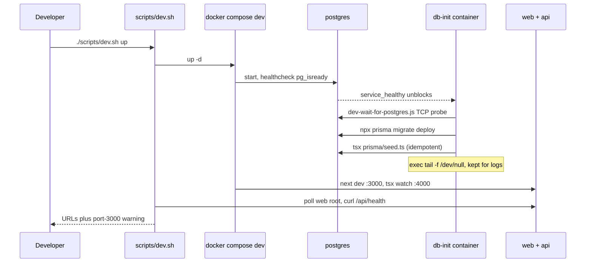

## Two supported loops, one set of npm entry points

Local development can run in two loops that share the same Turbo workspace commands:

- **Host-native** — Node 20 on the machine, `npm install` then `npm run dev`, which starts the web and API dev servers directly. Docker is only needed for the backing services ([docs/DEV_NOTES.md](../../docs/DEV_NOTES.md) §1–§2).
- **Containerized (shared)** — Docker is the *only* host requirement; no Node needed. `./scripts/dev.sh up` starts Postgres, SeaweedFS S3, the web dev server, and the API dev server with hot reload, all from one `forceorg-dev` image ([docs/DEV_ENVIRONMENT.md](../../docs/DEV_ENVIRONMENT.md) §1–§3).

Both loops run the identical root scripts, so CI, `./scripts/dev.sh verify`, and a laptop produce the same lint/build/test gates.

Host-native prerequisites come from the repo itself: `.nvmrc` pins Node `20` and `package.json` declares `engines.node >= 20.0.0` with `packageManager: npm@10.8.0`; the root `.npmrc` sets `include=dev` so an install never skips the toolchain ([.nvmrc](../../.nvmrc), [.npmrc](../../.npmrc), [package.json](../../package.json#L24-L31)).

## Root npm scripts

The root [package.json](../../package.json#L10-L23) is a thin Turbo/npm-workspace façade:

| Script | What it runs |
| --- | --- |
| `dev` | `turbo run dev --filter=@forceorg/web --filter=@forceorg/api` — web on :3000, API on :4000, hot reload (`dev` is `cache: false, persistent: true` in [turbo.json](../../turbo.json#L9-L12)) |
| `build` / `lint` / `test` / `test:coverage` | `turbo run <task>` across all workspaces; `lint` and `test` depend on `^build` |
| `test:e2e` | delegates to `npm run test:e2e --workspace=@forceorg/web` (Playwright) |
| `db:generate` / `db:migrate` / `db:seed` | forward to `packages/db-client`'s `prisma generate`, `prisma migrate dev`, and `tsx prisma/seed.ts` ([db-client package.json](../../packages/db-client/package.json#L10-L14)) |
| `postinstall` | `prisma generate --schema=packages/db-client/prisma/schema.prisma` — so a fresh `npm install` yields a usable Prisma client with no extra step |
| `dev:s3-migrate` | `turbo run dev --filter=@forceorg/sync-worker` (the Wahapedia ETL, not part of `npm run dev`) |

`db:migrate` maps to `prisma migrate dev` (author + apply interactive migrations), whereas the dev container and the deployed API use `prisma migrate deploy` (apply committed migrations only) — see [Data Model & Migrations](../data/data-model-and-migrations.md).

## `scripts/dev.sh` — the host-side entry point

[`scripts/dev.sh`](../../scripts/dev.sh) is the only host command needed for the containerized loop. It `cd`s to the repo root and shells out to `docker compose -f docker-compose.dev.yml`; unknown arguments print the header comment as usage and exit 1. Each subcommand dispatches into [`scripts/dev-container.sh`](../../scripts/dev-container.sh) *inside* a container:

| `dev.sh` subcommand | Compose action | In-container command |
| --- | --- | --- |
| `up` | `up -d`, then polls `http://localhost:${WEB_PORT:-3000}/` up to 60× and curls `${API_PORT:-4000}/api/health` | starts `postgres`, `s3`, `db-init`, `web`, `api` |
| `down` | `down` (volumes kept) | — |
| `rebuild` | `build --no-cache deps` then `up -d --force-recreate db-init` | — |
| `verify` | `run --rm toolchain` | `dev-container.sh verify` → `npm run lint`, `npm run build`, `npm test` |
| `test` | `run --rm toolchain` | `dev-container.sh test` → `npm test` (Vitest units only) |
| `e2e-install` | `run --rm toolchain` | `dev-container.sh e2e-install` → `npx playwright install chromium` in `apps/web` |
| `e2e` | `run --rm toolchain` | `dev-container.sh e2e` → `npx next build` + `npx playwright test --project="Desktop Chrome"` |
| `shell` | `run --rm toolchain` | `dev-container.sh shell` → `exec bash` |
| `logs [svc]` | `logs -f <svc>`, falling back to `logs -f` for all services | — |
| `psql` | `exec postgres psql -U postgres -d forceorg_dev` | — |

`verify`, `test`, `e2e`, `e2e-install`, and `shell` all reuse one `toolchain` service that sits behind `profiles: ['tools']`, so `dev.sh up` never starts it and each one-shot exits with the gate's status ([docker-compose.dev.yml](../../docker-compose.dev.yml#L108-L127), [dev.sh](../../scripts/dev.sh#L29-L64)).

*`dev.sh up` bring-up: healthcheck gating, the db-init migrate/seed one-shot, then the host-side smoke checks.*

## Hot reload without dependency drift

The dev composition bind-mounts the repo at `/app` so host edits hot-reload, while `node_modules`, `apps/web/.next`, and the Turbo cache live in **named volumes** (`dev_node_modules`, `dev_web_next`, `dev_turbo_cache`) so a host `node_modules` can never shadow the container's pinned dependencies. Postgres and SeaweedFS data live in `dev_postgres_data` / `dev_s3_data`, which survive `dev.sh down` and are wiped only by `docker compose -f docker-compose.dev.yml down -v` ([docker-compose.dev.yml](../../docker-compose.dev.yml#L33-L37), [docs/DEV_ENVIRONMENT.md](../../docs/DEV_ENVIRONMENT.md) §5).

`Dockerfile.dev` bakes the *toolchain only*: Node 20 bookworm-slim, Chromium runtime libs (so E2E runs in the same image), `npm ci --include=dev` from manifests copied before source, and a `package-lock.json` checksum written to `node_modules/.deps-stamp` so the runtime can tell whether dependencies changed. Source is never baked in ([Dockerfile.dev](../../Dockerfile.dev#L9-L42)). Adding a dependency means running `npm install` (host or `dev.sh shell`) and then `./scripts/dev.sh rebuild` so the image's dependency layer matches the lockfile. Note that `rebuild` currently runs `docker compose build --no-cache deps`, but `docker-compose.dev.yml` defines no `deps` service — the recreate of `db-init` never runs if that build fails, so a lockfile change on pull is normally resolved by rebuilding the shared image through the anchor's `build:` block ([dev.sh](../../scripts/dev.sh#L43-L46), [docker-compose.dev.yml](../../docker-compose.dev.yml#L18-L22)).

## db-init: the migrate-and-seed one-shot

`db-init` is the only thing that touches the schema in the dev loop. It joins the shared dev anchor, `depends_on: postgres: condition: service_healthy`, and `restart: 'no'`, and runs `dev-container.sh db`:

1. `node /app/scripts/dev-wait-for-postgres.js` — parses `host:port` out of `DATABASE_URL` and retries a plain TCP `net.connect` every 2s for up to 60 attempts, exiting 1 with "postgres did not become ready in 120s" on timeout. It is a reachability probe, not a query.
2. `npx prisma migrate deploy --schema=packages/db-client/prisma/schema.prisma` — pending migrations only; under `set -euo pipefail` a failed migration aborts the container, so `web`/`api` come up against an un-migrated schema but nothing silently "fixes" it.
3. `SEED_STATUS=0 npx tsx packages/db-client/prisma/seed.ts || echo "[dev-db] Seed step reported an issue (continuing — seed is idempotent fallback data)"` — the `|| echo` deliberately absorbs seed failures so a seed problem never blocks the environment.
4. `exec tail -f /dev/null` — the container idles instead of exiting so `dev.sh logs db-init` still shows what happened ([dev-container.sh](../../scripts/dev-container.sh#L10-L21), [dev-wait-for-postgres.js](../../scripts/dev-wait-for-postgres.js#L1-L29)).

Because migrations are `deploy`-only and the seed is idempotent — weapons/datasheets/links use `upsert`, stratagems/swatches/abilities do `findFirst`-then-`create` — the container is safe to re-run on every `up`, and it is force-recreated by `dev.sh rebuild`. It seeds fallback catalog content (core stratagems, paint swatches, weapons, Space Marine and Necron datasheets with weapon links and abilities), not test fixtures ([seed.ts](../../packages/db-client/prisma/seed.ts#L16-L227)).

## Ports, conflicts, and overrides

| Listener | Port | Notes |
| --- | --- | --- |
| web (Next dev) | container `3000` → host `${WEB_PORT:-3000}` | host 3000 is a common collision |
| api (Express via `tsx watch`) | container `4000` → host `${API_PORT:-4000}` | API binds `process.env.PORT \|\| 4000`, compose sets `PORT=4000` |
| postgres | `5432:5432` | db `forceorg_dev`, user `postgres` |
| s3 (SeaweedFS) | `9000` S3, `9333` master UI | `dev.sh` does not remap these |
| Playwright web server | `3456` (container-internal) | started by the Playwright config, never published |

<!-- openwiki: broken internal link [../../docs/DEV_NOTES.md#L46-L55] heading anchor "L46-L55" does not exist in "../../docs/DEV_NOTES.md". Fix the href or restore the target, then delete this comment. -->
`WEB_PORT`/`API_PORT` are Compose interpolation variables, so one prefix (`WEB_PORT=13000 API_PORT=14000 ./scripts/dev.sh up`) simultaneously republishes both host ports *and* keeps `CORS_ORIGIN` and `NEXT_PUBLIC_API_URL` consistent, while the processes inside still bind 3000/4000. `dev.sh up` prints an explicit reminder that the web dev server publishes host port 3000 and suggests `WEB_PORT=13000` ([dev.sh](../../scripts/dev.sh#L22-L41), [docker-compose.dev.yml](../../docker-compose.dev.yml#L27-L31)). The same collision exists on the host-native path, where the documented workaround is freeing the port or running `npx next dev -p 3400` from `apps/web` ([docs/DEV_NOTES.md](../../docs/DEV_NOTES.md#L46-L55)).

E2E is immune to the 3000 problem by construction: `dev-container.sh e2e` runs `npx next build` and then `playwright test`, and the committed config's `webServer` boots its own `npx next start -p 3456` with `reuseExistingServer: false` so the suite always exercises a server built from the current tree rather than an unrelated process holding the port. If Chromium is absent from `PLAYWRIGHT_BROWSERS_PATH` (default `/pw-browsers`, the `dev_pw_browsers` volume), `e2e` aborts and tells you to run `e2e-install` ([playwright.config.ts](../../apps/web/playwright.config.ts#L14-L39), [dev-container.sh](../../scripts/dev-container.sh#L46-L62)). See [Testing Strategy](../testing/testing-strategy.md).

## Operational notes

- **Environment files**: the shared anchor reads `env_file: .env.dev`, a committed safe-to-commit file whose only content is `NODE_ENV=development`; the compose comment claims `dev.sh` creates it when absent, but `dev.sh` contains no such logic, so deleting the file breaks `up`. See [Configuration & Env Vars](configuration-and-env-vars.md).
- **Guest mode**: the host-native UI path needs no env vars at all — when the API is unreachable the app falls back to guest mode with rosters in `localStorage`, so `npm run dev` alone is a valid click-through loop.
<!-- openwiki: broken internal link [../../docs/DEV_ENVIRONMENT.md#L118-L127] heading anchor "L118-L127" does not exist in "../../docs/DEV_ENVIRONMENT.md". Fix the href or restore the target, then delete this comment. -->
- **Stale build cache**: alternating `npm run build` and dev mode can leave `apps/web/.next` with production output, producing `globals.css` parse 500s; the containerized fix is `docker compose -f docker-compose.dev.yml restart web`, the host fix is deleting `.next` ([docs/DEV_ENVIRONMENT.md](../../docs/DEV_ENVIRONMENT.md#L118-L127)).
- **Reset**: `docker compose -f docker-compose.dev.yml down -v && ./scripts/dev.sh up` re-migrates and re-seeds from scratch.
- **Maintenance helper**: [`scripts/generate_icons.js`](../../scripts/generate_icons.js) is a standalone `sharp` script that renders `icon-192.png` / `icon-512.png` from `apps/web/public/icons/icon.svg`; it is run manually and is not wired into any npm script.

For the production compose topology and the API's migration-before-serve entrypoint, see [Deployment, Docker Compose & Container Images](deployment-and-compose.md); for what CI runs automatically, see [CI/CD Workflows](ci-cd-pipelines.md). First-run steps are in [Quickstart](../quickstart.md).
