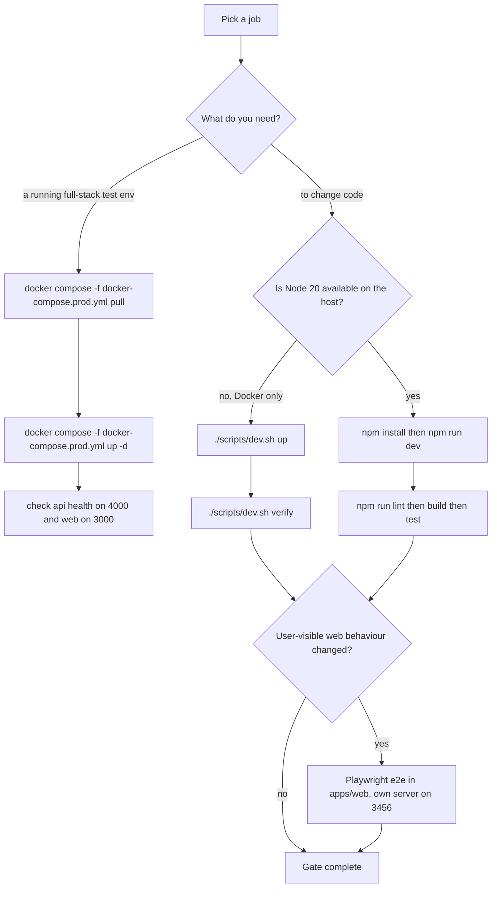

## What this system is

**ForceOrg-40k / BeerHammer** is a self-hosted force-construction and tabletop combat console for **Warhammer 40,000 11th Edition**, implemented as an npm/Turborepo monorepo of four apps and four packages ([README.md](../README.md), [package.json](../package.json#L2-L9)):

- `apps/web` — Next.js 14 App Router frontend (guest-first UI, published on **:3000**)
- `apps/api` — Express REST API with JWT write protection and rate limiting (**:4000**)
- `apps/sync-worker` — scheduled Wahapedia ETL job; not part of the dev loop
- `packages/types`, `packages/ui-theme`, `packages/rules-engine-11e`, `packages/db-client` — shared types, faction theming, 11e rules engine, Prisma schema/client

Everything is designed to run on **one host you control**: PostgreSQL 16 and S3-compatible storage (SeaweedFS) are local containers, there is no managed cloud dependency, and the HTTP API is the only integration surface for external systems ([README.md](../README.md)).

## Three supported ways to start it

They are three different jobs, not three variants of the same one:

| Path | What it is for | Source checkout needed? | Build step? |
| --- | --- | --- | --- |
| `npm run dev` | day-to-day host-native development | yes | no (dev servers) |
| `./scripts/dev.sh up` | day-to-day development with Docker as the only host requirement | yes | one-time `forceorg-dev` image |
| `docker compose -f docker-compose.prod.yml pull && up -d` | throwaway **test environment** / final hosting | only for the compose file | no — published GHCR images |

Only the first two run the verification gate below; the pull-based path is a running stack, not a toolchain.

## Boot path 1 — host-native (Node 20)

```bash
npm install   # one-time; postinstall also runs prisma generate
npm run dev   # web :3000 + api :4000, hot reload
```

`npm run dev` is `turbo run dev --filter=@forceorg/web --filter=@forceorg/api`, so it starts exactly those two dev servers; the turbo `dev` task is `cache: false, persistent: true` ([package.json](../package.json#L12), [turbo.json](../turbo.json#L9-L12)). Prerequisites come from the repo itself: `.nvmrc` pins Node 20, `engines.node >= 20.0.0`, and `.npmrc` sets `include=dev` ([docs/DEV_NOTES.md](../docs/DEV_NOTES.md), §1 "Prerequisites (host-native path)").

**No environment variables are required for UI-only work.** If the API is not running or unreachable, the app falls back to guest mode and rosters persist in the browser ([docs/DEV_NOTES.md](../docs/DEV_NOTES.md), §6 "Environment variables — what's needed and what isn't").

## Boot path 2 — containerized workbench (Docker is the only host requirement)

```bash
./scripts/dev.sh up        # db + s3 + api + web, hot reload, detached
./scripts/dev.sh verify    # the full gate inside the container
./scripts/dev.sh e2e       # Playwright guest journey
./scripts/dev.sh down      # stop everything (data volumes kept)
```

`./scripts/dev.sh` is the single host-side entry point: it shells out to `docker compose -f docker-compose.dev.yml` and dispatches subcommands into `scripts/dev-container.sh` inside the container (`db | web | api | verify | test | e2e | e2e-install | shell`). First run builds the `forceorg-dev` image; afterwards the database is auto-migrated and auto-seeded by the `db-init` one-shot ([scripts/dev.sh](../scripts/dev.sh#L29-L65), [scripts/dev-container.sh](../scripts/dev-container.sh#L10-L44), [docs/DEV_ENVIRONMENT.md](../docs/DEV_ENVIRONMENT.md), §4 "How it's wired").

If port 3000 (or 4000) is taken, remap only the published host ports: `WEB_PORT=13300 API_PORT=14000 ./scripts/dev.sh up` ([docs/DEV_ENVIRONMENT.md](../docs/DEV_ENVIRONMENT.md), §2 "First-time setup"). Both dev loops run the identical root npm scripts, so laptop, container and CI produce the same gates. Full details in [Development Environment & Scripts](operations/dev-environment.md).

## Boot path 3 — pull-based full-stack test environment (zero config)

```bash
docker compose -f docker-compose.prod.yml pull     # published GHCR images
docker compose -f docker-compose.prod.yml up -d    # postgres + s3 + api + web
```

This starts the same four services as a real deployment from
`ghcr.io/fatpat81/beerhammer/forceorg-{api,web}`, with no checkout build and no
`.env` file: every unset variable falls back to a `${VAR:-default}` placeholder,
so the composition **does** boot without configuration. The defaults are public
placeholders — `JWT_SECRET=please-change-me`, `postgres`/`postgrespassword`
([docker-compose.prod.yml](../docker-compose.prod.yml#L14-L18),
[docker-compose.prod.yml](../docker-compose.prod.yml#L26-L66)). That is
deliberate for local and CI test stacks, and unsafe anywhere beyond localhost;
the test-vs-production credential boundary and the override procedure are in
[docs/DEPLOYMENT.md](../docs/DEPLOYMENT.md) §2 — not duplicated here.

**No manual migration step.** The API image is self-migrating: its entrypoint
defaults `DIRECT_URL` to `DATABASE_URL` and runs `prisma migrate deploy` before
starting the server, so a fresh `postgres` volume is migrated on boot
([apps/api/entrypoint.sh](../apps/api/entrypoint.sh#L10-L20),
[docs/DEPLOYMENT.md](../docs/DEPLOYMENT.md) §3.1). Checks afterwards:
`curl http://localhost:4000/api/health` returns `{"success":true,...}` and
`http://localhost:3000` serves the login gate; `WEB_PORT`/`API_PORT` remap the
two published ports here too ([docker-compose.prod.yml](../docker-compose.prod.yml#L68-L82)).

The sync worker is **not** started by default — it sits in the `tools` profile
and runs as a one-shot ETL pass on demand
([docker-compose.prod.yml](../docker-compose.prod.yml#L84-L95)). Image
selection, rollback by tag, backups and hardening belong to
[Deployment, Docker Compose & Container Images](operations/deployment-and-compose.md).



*The two development loops converge on the same lint → build → unit-test gate, with Playwright on top when UI behaviour is in scope; the pull-based composition is a runtime stack and carries no source gate.*

## Using it with zero configuration

Sign in at the `/` login gate by typing any callsign and pressing **"Enter ForceOrg →"** — no account, no external identity provider. The guest session is stored in `localStorage` under `forceorg_local_user`, and rosters under `forceorg_rosters_<userId>`, so created armies survive a refresh per callsign ([apps/web/src/components/AuthProvider.tsx](../apps/web/src/components/AuthProvider.tsx#L61-L75), [apps/web/src/lib/api.ts](../apps/web/src/lib/api.ts#L121-L150)).

Every API call in `lib/api.ts` is wrapped in a try/catch that degrades to browser-local fixtures, so the UI is fully usable offline: an empty or down API yields the starter Ultramarines roster and an offline catalog instead of an error screen ([apps/web/src/lib/api.ts](../apps/web/src/lib/api.ts#L154-L175)). See [API Client & Offline Fallback Layer](webapp/api-client-fallback-layer.md).

A useful first click-through (documented and mirrored by the E2E suite) is: login gate → Command Nexus dashboard → ⚔ Console → 📚 Catalog search → 📡 Changelog → Assemble New Force → Audit ([docs/DEV_NOTES.md](../docs/DEV_NOTES.md), §2 "Load the software and click through the UI").

## Verification gate

From the repo root, the full local gate is (verbatim):

```bash
npm run lint     # ESLint (Next core-web-vitals) + tsc --noEmit across workspaces
npm run build    # Turbo production build across all workspaces
npm test         # Vitest unit tests (rules-engine-11e)
```

plus the Playwright e2e suite in `apps/web`, which **boots its own server on port 3456** and therefore never collides with a dev server on 3000:

```bash
cd apps/web
npx playwright install chromium                    # one-time on a new machine
npx playwright test --project="Desktop Chrome"     # guest journey, 5 tests
```

The committed Playwright config runs `npx next start -p 3456` with `reuseExistingServer: false`, and it does **not** build first — run `npm run build` (or `npx next build`) before `playwright test`, or you exercise a stale bundle ([apps/web/playwright.config.ts](../apps/web/playwright.config.ts#L29-L39), [scripts/dev-container.sh](../scripts/dev-container.sh#L46-L55)).

Know what the gate can actually observe: behavioural coverage exists only in `packages/rules-engine-11e` (Vitest) and `apps/web` (Playwright guest journey). The API, Prisma schema/migrations, sync worker and shared packages are gated by typecheck and a successful build only ([Testing Strategy & Validation Gates](testing/testing-strategy.md)).

## Task routing

| I want to… | Start here |
| --- | --- |
| Understand process boundaries, ports, which app owns what | [System Topology & Monorepo Layout](architecture/system-topology.md) |
| Change shared TS shapes, the success/error envelope, ruleset version ids | [Shared Contracts](architecture/shared-contracts.md) |
| Add/change an Express route, middleware, or the error contract | [Express API Server, Middleware Chain & Error Contract](api/api-server-and-middleware.md) |
| Touch auth, JWT minting/verification, or per-user data scoping | [JWT Auth, Token Minting & Ownership Scoping](api/authentication-and-ownership.md) |
| Work on miniature photo upload, Sharp, or S3 keys | [Miniature Photo Upload: Sharp Pipeline & S3 Storage](api/media-upload-and-object-storage.md) |
| Change the Prisma schema, a migration, or seed data | [Postgres Data Model, Prisma Migrations & Seed](data/data-model-and-migrations.md) |
| Pick the cheapest honest check for a change, or add tests | [Testing Strategy & Validation Gates](testing/testing-strategy.md) |
| Run/extend the local dev loop, `scripts/dev.sh`, db init | [Development Environment & Scripts](operations/dev-environment.md) |
| Stand up a throwaway full-stack test environment / pull published images | [Deployment, Docker Compose & Container Images](operations/deployment-and-compose.md) |
| Change compose files, Dockerfiles, migration-on-boot ordering, image tags | [Deployment, Docker Compose & Container Images](operations/deployment-and-compose.md) |
| Add or rename an environment variable (including the placeholder fallbacks) | [Configuration & Environment Variables](operations/configuration-and-env-vars.md) |
| Change what CI blocks on or publishes | [CI/CD Workflows](operations/ci-cd-pipelines.md) |
| Work on 11e rules semantics in general | [Rules Engine 11E: Public API, Consumers & Tests](rules-engine/rules-engine-overview.md) |
| Change points/DP/Rule-of-Three/attachment compliance | [Roster & Detachment Validation Rules](rules-engine/roster-validation.md) |
| Change leader/bodyguard merging or stratagem eligibility | [Composite Units & Stratagem Filtering](rules-engine/composite-units-and-stratagems.md) |
| Change natural-language wargear parsing into AST rules | [Wargear AST Compiler](rules-engine/wargear-ast-compiler.md) |
| Change Wahapedia scraping, delta detection, or sync logging | [Wahapedia ETL Sync Worker](sync/wahapedia-etl-sync-worker.md) |
| Change any frontend fetch, offline fallback, or localStorage mirror | [Typed API Client & Offline Fallback Layer](webapp/api-client-fallback-layer.md) |
| Change routes, providers, or the guest session | [Web App Shell, Routing & Guest Session](webapp/app-shell-and-guest-session.md) |
| Change roster editing, composite unit cards, console widgets | [Roster Builder, Composite Unit Card & Console Components](webapp/console-and-builder-components.md) |
| Change faction palettes, CSS variables, or chapter heraldry | [Faction Theme System & Chapter Heraldry](webapp/ui-theme-and-heraldry.md) |
| Trace create/edit/delete of a roster across browser, API and Postgres | [Workflow: Roster Persistence & Offline Sync](workflows/roster-persistence-and-offline-sync.md) |
| Trace the compliance audit modal through the API and engine | [Workflow: Rules Compliance Audit](workflows/rules-audit-compliance-flow.md) |
| Trace sync status and balance changes to the changelog page | [Workflow: Rules Changelog & Sync Status Surfacing](workflows/rules-changelog-and-sync-status.md) |

## Where else to look

- [docs/DEV_NOTES.md](../docs/DEV_NOTES.md) — host-native flow, UI click-through, known local gotchas (port 3000 collisions, stale `apps/web/.next`).
- [docs/DEV_ENVIRONMENT.md](../docs/DEV_ENVIRONMENT.md) — containerized workbench, volumes, port overrides, troubleshooting.
- [docs/DEPLOYMENT.md](../docs/DEPLOYMENT.md) — server deployment, the pull-based image path (§3.1), and the test-vs-production credential boundary (§2).
- [docs/API.md](../docs/API.md) and [docs/OPENAPI.yaml](../docs/OPENAPI.yaml) — the API contract third-party clients integrate against; read endpoints are public, writes require a JWT signed with the instance's `JWT_SECRET`.

Source code and tests remain authoritative; treat this wiki and the docs as just-in-time orientation, per [AGENTS.md](../AGENTS.md).
