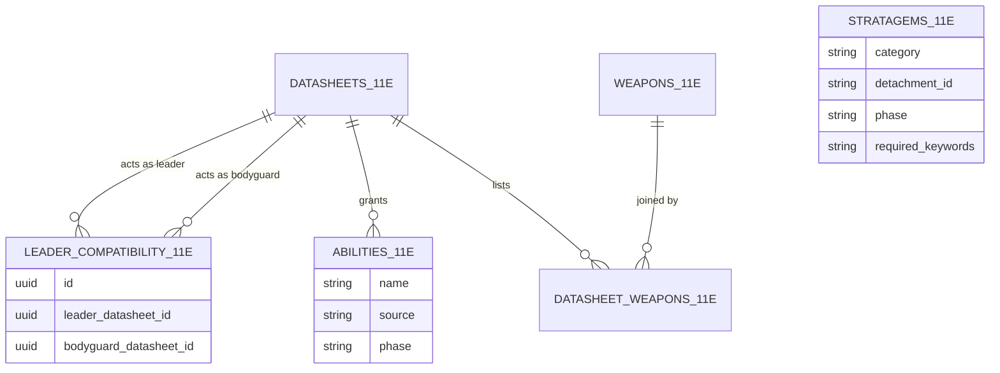
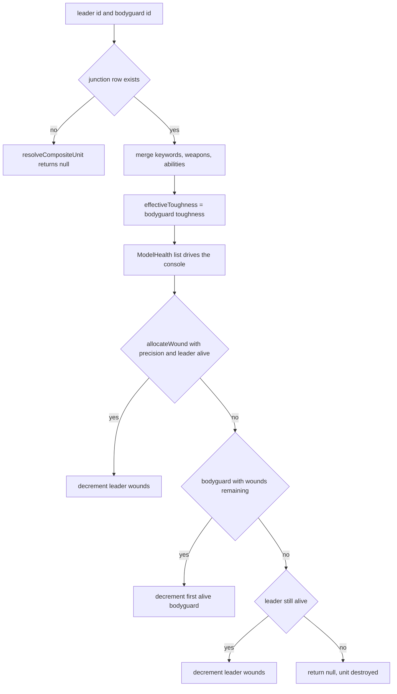
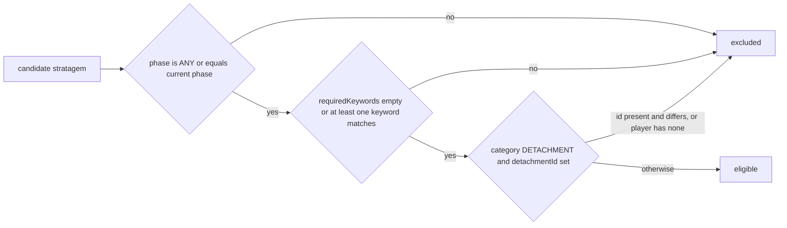

Two sibling modules inside `@forceorg/rules-engine-11e` own the "unit in play" rules:
`attachment-resolver.ts` (§6.1) collapses a Character datasheet plus a Bodyguard datasheet
into one runtime `CompositeUnit` and tracks damage across its models, and
`stratagem-filter.ts` (§6.2) decides which stratagems that unit may buy in the current
battle phase. Both are pure, side-effect-free functions over `@forceorg/types` shapes;
neither touches Prisma or HTTP. They are re-exported from
[the package entrypoint](../../packages/rules-engine-11e/src/index.ts) and are the
canonical statement of these rules even though the console currently renders from roster
payloads and demo fixtures — see [Console & Builder Components](../webapp/console-and-builder-components.md)
and [Rules Engine Overview](rules-engine-overview.md).

## Canonical data model

Attachment legality is *data*, not code. The junction table
`leader_compatibility_11e` (`LeaderCompatibility` in
[the Prisma schema](../../packages/db-client/prisma/schema.prisma#L146-L160)) holds one row
per legal `(leader_datasheet_id, bodyguard_datasheet_id)` pair, with a composite unique
index and `onDelete: Cascade` foreign keys to `datasheets_11e` on **both** sides, so
deleting a datasheet silently removes every legality row that mentions it. The table is
public-read with writes reserved for the sync-worker service role
(`packages/db-client/prisma/rls-policies.sql`), and `prisma/seed.ts` populates it with
`upsert` keyed on the pair. See
[Data Model & Migrations](../data/data-model-and-migrations.md).

*Attachment legality and the rule text the engine merges: pairs live in the junction table, abilities carry a `source` tag, stratagems carry phase/category/keyword gates.*

## Composite merge rules

`resolveCompositeUnit(leader, bodyguard, leaderWeapons, bodyguardWeapons, leaderAbilities,
bodyguardAbilities, compatibilityTable)` is the single entrypoint. It first calls
`isAttachmentValid(leader.id, bodyguard.id, compatibilityTable)` and returns **`null`** when
no junction row matches — invalid merges fail closed rather than producing a half-built unit.
The compatibility table is passed *in* by the caller as a `LeaderCompatibility[]`; the engine
never queries it, which keeps the resolver testable with a literal array and makes the
junction table the single place to change legality without a code change.

The direction of the pair matters: `isAttachmentValid` matches `leaderDatasheetId` and
`bodyguardDatasheetId` positionally, so a reversed pair is invalid even though the FK
columns are symmetric in the schema (asserted by
`packages/rules-engine-11e/src/__tests__/attachment-resolver.test.ts`).

Three merge helpers define what the merged unit is worth:

| Helper | Semantics | Notes |
|---|---|---|
| `mergeKeywords` | union → `Set` dedupe → `Array.sort()` | sorted, stable output; feeds keyword-gated stratagems |
| `mergeWeapons` | leader weapons first, then bodyguard, first `weapon.id` wins | dedupe by **id**, not name; two datasheets sharing a weapon profile appear once |
| `mergeAbilities` | plain concatenation `[...leader, ...bodyguard]` | no dedupe — provenance comes from each `Ability.source` (`LEADER`, `BODYGUARD`, `ENHANCEMENT`, `DETACHMENT`, `CORE`), which the console renders as a `[Leader]` badge |

`resolveEffectiveToughness(leaderStats, bodyguardStats, bodyguardModelsAlive)` returns
`bodyguardStats.toughness` when `bodyguardModelsAlive > 0`, else `leaderStats.toughness`:
the leader's toughness is suppressed while any bodyguard model survives. Two consequences
matter for callers:

- `resolveCompositeUnit` passes the **literal `1`** for `bodyguardModelsAlive`, so a freshly
  built composite always reports bodyguard toughness. It is a build-time default, not a live
  value.
- To keep the displayed toughness correct as casualties mount, a caller must recompute:
  `resolveEffectiveToughness(leader.stats, bodyguard.stats, countAliveBodyguards(models))`.

## Wound allocation and model health

Wound bookkeeping operates on `ModelHealth[]` (`{ id, modelName, isLeader, maxWounds,
currentWounds }`), a per-model list rather than a unit-level wound pool.

*Build-time merge followed by per-wound allocation order; `allocateWound` is the only function that mutates wound state (immutably).*

`allocateWound(models, hasPrecision = false)` implements the 11th Edition ordering:
with `hasPrecision` set (a `[PRECISION]` weapon) and an alive leader, the leader takes the
wound; otherwise the first alive non-leader model takes it; the leader becomes a legal target
only once every bodyguard is at 0 wounds; when nothing is alive it returns **`null`**, which is
the caller's destroy-the-unit signal. Each call applies exactly one wound and returns a new
array (`updatedModels`) plus the `targetModelId` — the input is never mutated, so React state
updates can use the result directly. Note that detecting `[PRECISION]` on the attacking
weapon is the caller's job; the resolver only accepts the boolean.

The two companion predicates close the loop: `isUnitDestroyed(models)` is true only when
*every* model (leader included) is at 0 wounds, and `countAliveBodyguards(models)` counts
non-leader models with `currentWounds > 0` — the exact value `resolveEffectiveToughness`
consumes, and therefore the bridge between the damage state and the defence characteristic.

## The console's ModelHealth tracking

`CompositeUnitCard.tsx` is the consumer of this state shape. It accepts `initialModels` and
copies it into local component state (`useState<ModelHealth[]>(initialModels)`), then renders a
"Wound Allocation Matrix": one row per model with a leader star marker, a
`currentWounds / maxWounds W` readout or `DESTROYED`, a colour-graded wound bar, and `+`/`−`
buttons that are disabled at the dead and full-health ends respectively. `handleWoundDelta`
clamps to `[0, maxWounds]`, fires a haptic pulse (`navigator.vibrate` — a short tick, a
three-pulse pattern on death), and calls `onModelWoundChange?.(modelId, next)`.

The card also hardcodes the merge outcome in its header: the `T` stat pip prints
`stats.bodyguardToughness`, i.e. the console renders the bodyguard-first toughness rule
visually rather than calling `resolveEffectiveToughness`.

Two divergences from the engine are current page facts, not hypotheticals, and any change to
the resolvers must be paired with them:

- Wound state is **session-local**. `/army/[id]` renders `CompositeUnitCard` without passing
  `onModelWoundChange`, so deltas never reach the roster payload or the API, and it passes no
  `key` while the card reads `initialModels` only in the `useState` initializer — switching the
  active unit in the sidebar reconciles the same instance and carries the previous unit's
  wounds over.
- `ModelHealth` is **inferred heuristically**, not resolved. `/army/[id]` expands
  `catalogUnit.modelComposition` into one entry per model, marks `isLeader: true` when the
  model name contains `sergeant`, `captain` or `leader`, and assigns `maxWounds` as `3` when
  `wounds || toughness || 4` exceeds 5, else `2`; with an empty roster payload it renders
  `DEMO_FALLBACK_UNITS` instead. None of `allocateWound`, `isUnitDestroyed`,
  `countAliveBodyguards` or `resolveCompositeUnit` is imported by the web app today — the card
  exposes manual `+`/`−` controls and leaves ordering to the human, so the engine's allocation
  order is unexercised in production paths (see the Testing section).

The shared shapes live in [shared contracts](../architecture/shared-contracts.md):
`@forceorg/types` exports `CompositeUnit`, `LeaderCompatibility` and `ModelHealth`, but
`CompositeUnitCard.tsx` redeclares its own `ModelHealth` (field-identical), `WeaponProfile`
and `UnitAbility` with capitalized `'Leader' | 'Bodyguard' | ...` sources that `/army/[id]`
maps from the uppercase `AbilitySource` enum. Duplicating the wound shape means the engine and
the UI can drift without any type error.

## Stratagem eligibility rules

`filterStratagems(allStratagems, unitKeywords, currentPhase, detachmentId?)` applies three
gates in order, all of which must pass:

*The three-gate eligibility pipeline: phase, then keywords, then detachment scope.*

- **Phase** (`isPhaseActive`): a stratagem declaring `ANY` is active in every phase; otherwise
  it requires exact equality with the current `BattlePhase`
  (`COMMAND | MOVEMENT | SHOOTING | CHARGE | FIGHT | ANY`).
- **Keywords** (`unitSatisfiesKeywords`): an empty `requiredKeywords` list is universal; a
  non-empty one passes on **any single** match (`some`), compared after upper-casing both
  sides, so catalog casing differences never gate a unit out.
- **Detachment**: `CORE` stratagems are always available; a `DETACHMENT` stratagem carrying a
  `detachmentId` is dropped unless the player's `detachmentId` is present and equal. The guard
  is `category === 'DETACHMENT' && strat.detachmentId`, so a `DETACHMENT` row with a **null**
  `detachmentId` bypasses the check and is always available — a data-entry gotcha for anyone
  seeding detachment rules.

`groupStratagemsByCategory` is the display-side companion: it partitions an already-filtered
list into `{ core, detachment }`, and `StratagemPanel` styles the two categories with
different accent borders and badges.

## How the console actually filters

`StratagemPanel.tsx` loads catalog rows through `fetchStratagems({ detachmentId })` and then
applies its **own** inline copy of the phase and keyword predicates inside a `useMemo` —
upper-casing `unitKeywords` and passing on `requiredKeywords.some(...)`, and treating a
selected phase tab as "this phase plus all `ANY` stratagems", which mirrors `isPhaseActive`
without calling it. It performs **no** client-side detachment gate; detachment scoping is
delegated to the server via the `detachmentId` query parameter. An extra
`detachmentStratagems` prop is appended to the working set, deduplicated by `id`, though no
page currently passes it. `availableStratagemsCount` on the unit card is a hardcoded `6`, so
the badge is not derived from any filter.

The server-side filter is a plain Prisma `findMany` over `stratagems_11e` with
`where.phase` / `where.category` / `where.detachmentId` set from the query string
(`apps/api/src/routes/datasheets.ts`). Because `detachmentId` is matched by **exact equality**,
requesting it excludes every `CORE` stratagem (whose `detachment_id` is `NULL`) — the opposite
of the engine's "core stratagems are always available" invariant. In practice the seed only
creates `CORE` rows with no `detachmentId`, so the console's detachment-scoped request returns
zero rows; `fetchStratagems` swallows non-2xx responses and returns `[]`, and the panel then
falls back to its hardcoded `CORE_STRATAGEMS` list, flips its source badge to `○ Core Rules`,
and shows a retryable notice on error. The visible consequence: with the current seed the
panel's live/API path is rarely exercised, and demo fixtures do the filtering.

## Extension points and change discipline

- Adding or removing an attachment possibility is a data change (`leader_compatibility_11e`
  row, plus the seed/migration that owns it); no resolver edit is needed because
  `isAttachmentValid` reads whatever table it is handed.
- A new keyword-matching rule belongs in `unitSatisfiesKeywords` only — but the console's
  inline duplicate in `StratagemPanel.tsx` must be changed in the same commit or the UI and
  the engine will disagree about what a unit can buy.
- Any new model-state rule (multi-wound models, `[PRECISION]` detection from weapon keywords,
  `Epic Hero` handling) belongs in `attachment-resolver.ts`, since that module already owns
  `ModelHealth` transitions; wiring it means finally passing `onModelWoundChange` and a stable
  `key` from `/army/[id]`.
- `mergeAbilities` intentionally keeps duplicates from both datasheets; de-duplicating there
  would erase the `LEADER` vs `BODYGUARD` provenance the card uses for its badges.

## Focused tests

`packages/rules-engine-11e` is tested with Vitest (`npm test` → `vitest run`) and carries the
repo's only real unit coverage for these rules:

- `__tests__/attachment-resolver.test.ts` — valid / invalid / **reversed** attachment pairs;
  bodyguard toughness while bodyguards live vs leader toughness at zero; keyword union with
  dedupe and sorted output; bodyguard-first allocation, leader-only-after-bodyguards,
  `PRECISION` bypassing the guard, `null` on a destroyed unit; `isUnitDestroyed` and
  `countAliveBodyguards` counting only non-leaders with wounds left.
- `__tests__/stratagem-filter.test.ts` — universal (empty keyword) eligibility, ANY-match
  keywords, case-insensitivity, phase mismatch exclusion, and the four `filterStratagems`
  cases: `ANY`-phase core stratagems always returned, wrong-phase dropped, missing keyword
  dropped, foreign-detachment stratagem dropped while the matching detachment admits it; plus
  the `core`/`detachment` partition.

Because these resolvers have no production caller, the tests are the only guardrail; the web
app aliases `@forceorg/rules-engine-11e` straight to `packages/rules-engine-11e/src`
(`apps/web/tsconfig.json`) for type resolution, and only `RosterBuilder.tsx` (wargear parser)
and the audit route (`validateRoster`) import from the package today.
