Matched-play compliance in ForceOrg-40k is split across three layers that must not be
confused with one another:

- `packages/rules-engine-11e/src/detachment-validator.ts` — the *only* implementation of the
  structural force-org checks. Pure functions over `@forceorg/types`, no Prisma, no HTTP.
- `apps/api/src/routes/audit.ts` — the server entrypoint (`POST /api/rosters/:id/audit`).
  It loads the persisted roster, adds its own **point-shift / missing-datasheet** detection,
  calls `validateRoster`, and translates engine codes and severities into the
  `RosterDiscrepancy` taxonomy the UI understands.
- `apps/web/src/components/ComplianceDashboard.tsx` — the audit modal. When the API call
  fails it computes a *much narrower* local audit from props, and `apps/web/src/lib/api.ts`
  has a third, still narrower, fallback inside `auditRoster` itself.

Related: [Rules Engine Overview](rules-engine-overview.md),
[Composite Units & Stratagems](composite-units-and-stratagems.md),
[API Server & Middleware](../api/api-server-and-middleware.md),
[Shared Contracts](../architecture/shared-contracts.md).

## The four engine checks

All four return `ValidationError[]` (`{ code, severity: 'ERROR' | 'WARNING', message, unitInstanceId? }`)
and every one of them currently emits `'ERROR'` — no validator ever produces a `'WARNING'`.

| Code | Function | Condition | Severity | Unit-scoped? |
| --- | --- | --- | --- | --- |
| `POINTS_EXCEEDED` | `validatePointsLimit` | `roster.totalPoints > pointsLimit` | `ERROR` | no |
| `DP_EXCEEDED` | `validateDetachmentPoints` | `roster.detachmentPointsUsed > dpLimit` | `ERROR` | no |
| `RULE_OF_THREE` | `validateRuleOfThree` | > 3 instances of one `datasheetId` whose role is neither `BATTLELINE` nor `DEDICATED_TRANSPORT` | `ERROR` | no |
| `ORPHAN_ATTACHMENT` | `validateAttachments` | `unit.attachedLeaderId` set but no roster unit with that `instanceId` | `ERROR` | yes (`unitInstanceId`) |

Both budget checks are strict `>` comparisons, so a roster sitting exactly on the limit is
valid — the tests pin that boundary (`totalPoints: 2000` against a `2000` limit yields zero
errors). They read the *denormalised* totals carried in `RosterPayload`
(`totalPoints`, `detachmentPointsUsed`) and never recompute them from the unit list, so a
stale cached total in the payload is validated as-is.

```ts
// packages/rules-engine-11e/src/detachment-validator.ts
export function validateRuleOfThree(
  roster: RosterPayload,
  datasheetLookup: Map<string, Datasheet>
): ValidationError[] {
  const errors: ValidationError[] = [];
  const counts = new Map<string, { name: string; count: number; role: BattlefieldRole }>();

  for (const unit of roster.units) {
    const ds = datasheetLookup.get(unit.datasheetId);
    if (!ds) continue;
    const existing = counts.get(unit.datasheetId);
    if (existing) existing.count++;
    else counts.set(unit.datasheetId, { name: ds.name, count: 1, role: ds.battlefieldRole });
  }

  for (const [dsId, entry] of counts) {
    // Exemptions: BATTLELINE and DEDICATED_TRANSPORT are not capped at 3
    if (entry.role === 'BATTLELINE' || entry.role === 'DEDICATED_TRANSPORT') continue;
    if (entry.count > 3) {
      errors.push({
        code: 'RULE_OF_THREE',
        severity: 'ERROR',
        message: `"${entry.name}" appears ${entry.count} times. Maximum 3 copies allowed in matched play.`,
      });
    }
  }
  return errors;
}
```

Rule-of-Three counting is by `datasheetId` (not by name), one error is emitted per offending
datasheet, and units whose datasheet is absent from `datasheetLookup` are **silently skipped**
— a roster of entirely unknown datasheets produces no Rule-of-Three findings at all.

`validateAttachments` only proves the referenced leader still exists in the roster:

```ts
if (unit.attachedLeaderId) {
  const leaderUnit = roster.units.find(u => u.instanceId === unit.attachedLeaderId);
  if (!leaderUnit) {
    errors.push({
      code: 'ORPHAN_ATTACHMENT',
      severity: 'ERROR',
      message: `Unit "${unit.datasheetName}" references leader instance "${unit.attachedLeaderId}" which is not in the roster.`,
      unitInstanceId: unit.instanceId,
    });
  }
}
```

`validateRoster` is a plain concatenation of the four checks in the order
points → DP → Rule of Three → attachments, so a single roster can surface several codes at
once (the `validateRoster` test asserts `POINTS_EXCEEDED` and `DP_EXCEEDED` co-occur).
`detachment-validator.ts` is re-exported wholesale from
[the package entrypoint](../../packages/rules-engine-11e/src/index.ts#L28-L36), and
`apps/api/src/routes/audit.ts` is its only production caller.

## What is deliberately *not* validated

Documented here so the gaps are not mistaken for behaviour:

- **Model counts.** `RosterUnitInstance.modelCount` is never inspected anywhere in
  `apps/api` — the string `modelCount` does not appear in the API source at all. Squad
  size min/max from `Datasheet.unitComposition` is therefore unenforced at audit time.
- **Wargear / loadout selections.** `RosterUnitInstance.wargearSelections` is likewise
  unread by the API. The wargear AST constraints (`maxSelections`, `consumedSlots`,
  `isMutuallyExclusive` in `WargearRuleAST`) are compiled by
  [the wargear parser](composite-units-and-stratagems.md) for the builder UI but never
  re-checked server-side, despite the category name `INVALID_LOADOUT` suggesting otherwise.
- **Attachment *legality*.** `validateAttachments` checks existence only. The rules engine
  already contains `isAttachmentValid(leaderDatasheetId, bodyguardDatasheetId, compatibilityTable)`
  backed by the `leader_compatibility_11e` junction table
  ([attachment-resolver.ts](../../packages/rules-engine-11e/src/attachment-resolver.ts#L20-L30)),
  but neither `validateAttachments` nor the audit route ever loads that table or calls it.
  A leader that exists but is not allowed to attach to that bodyguard passes the audit.
- **Detachment quotas beyond the raw DP number.** No check reads
  `detachmentPrimary`/`detachmentSecondary`, role quotas, or `Datasheet.detachmentPointsCost`;
  only the pre-summed `detachmentPointsUsed` total is compared to `army.detachmentPointsLimit`.

## The audit route's mapping layer

`POST /api/rosters/:id/audit` is mounted behind `requireAuth` and scoped to the caller
(`prisma.userArmy.findFirst({ where: { id, userId } })`), returning `404 NOT_FOUND` for
another user's roster and `500 AUDIT_ERROR` on any throw. It then does two independent things.

**1. Route-native drift detection.** It batch-fetches current datasheets
(`prisma.datasheet.findMany({ where: { id: { in: datasheetIds } } })`, unfiltered by ruleset
version) and compares them to what the roster recorded:

- datasheet missing from the lookup → `severity: 'RED'`, `category: 'INVALID_LOADOUT'`,
  "no longer exists in the active ruleset", and the unit is `continue`d (so it also drops out
  of Rule-of-Three counting inside the engine call, which receives the same sparse lookup);
- `currentDs.basePoints !== unit.pointsCost` → `severity: 'AMBER'`,
  `category: 'POINTS_SHIFT'`, with `oldValue`/`newValue` rendered as the old and new point
  strings. This is the only producer of `POINTS_SHIFT` on the server.

**2. Engine output translation.** Every `ValidationError` is folded into a
`RosterDiscrepancy`:

```ts
for (const err of validationErrors) {
  discrepancies.push({
    unitInstanceId: err.unitInstanceId || '',
    unitName: '',
    severity: err.severity === 'ERROR' ? 'RED' : 'AMBER',
    category: err.code === 'RULE_OF_THREE' ? 'DP_VIOLATION' : 'INVALID_LOADOUT',
    message: err.message,
  });
}
```

Consequences worth knowing before changing anything:

- severity maps `ERROR → RED`, `WARNING → AMBER`; the `WARNING` arm is currently dead code
  because no check emits it;
- `RULE_OF_THREE` is the *only* code mapped to `DP_VIOLATION`, so it lands under the UI's
  "Detachment Points" tab even though it is a copy quota;
- `POINTS_EXCEEDED` and `DP_EXCEEDED` — the genuinely points/DP-related failures — both
  collapse into `INVALID_LOADOUT`, i.e. the UI's "Loadouts & Rules" tab;
- engine errors carry no `unitName` (always `''`) except `ORPHAN_ATTACHMENT`, which carries
  `unitInstanceId`. The dashboard falls back to prettifying the category when `unitName` is
  empty. The engine's `code` itself is discarded and unrecoverable from the response.

Finally the route assembles `AuditResult`:

```ts
const result: AuditResult = {
  rosterId: army.id,
  rulesetVersionCompared: '11.1.0-2026-Q3',
  discrepancies,
  isCompliant: discrepancies.filter(d => d.severity === 'RED').length === 0,
  auditedAt: new Date().toISOString(),
};
```

`isCompliant` counts **only RED** discrepancies, so a roster with AMBER point shifts is
reported compliant. `rulesetVersionCompared` is a hardcoded literal — it is not read from
`UserArmy.rulesetVersionId` nor derived from the `SyncMetadata` ETL records that
[Shared Contracts](../architecture/shared-contracts.md) defines; nothing in `apps/api`
references `SyncMetadata` at all. The same literal is duplicated as the default when rosters
are created in `apps/api/src/routes/rosters.ts`.

```mermaid
flowchart TD
    A["POST /api/rosters/:id/audit (requireAuth)"] --> B{"roster owned by caller?"}
    B -- "no" --> C["404 NOT_FOUND"]
    B -- "yes" --> D["load current Datasheet rows for roster datasheetIds"]
    D --> E{"datasheet exists?"}
    E -- "no" --> F["RED INVALID_LOADOUT, unit skipped downstream"]
    E -- "yes" --> G{"basePoints equals recorded pointsCost?"}
    G -- "no" --> H["AMBER POINTS_SHIFT with old and new values"]
    G -- "yes" --> I["no discrepancy"]
    D --> J["validateRoster: points, DP, Rule of Three, attachments"]
    J --> K["ERROR to RED, WARNING to AMBER"]
    K --> L["RULE_OF_THREE to DP_VIOLATION, all other codes to INVALID_LOADOUT"]
    H --> M["AuditResult: isCompliant true only if zero RED"]
    L --> M
    F --> M
```



*Caption: audit request flow — route-local drift checks in the upper branch, engine checks and their code/severity remapping in the lower branch.*

## Client behaviour and the fallback audit

`ComplianceDashboard` runs `auditRoster(rosterId)` whenever it opens (and on Re-Audit), then
renders a three-state banner computed from the discrepancy list itself rather than from
`isCompliant`: `isFullyCompliant` requires *zero* discrepancies of any severity, while
`isBattleLegal` requires zero RED — an amber-only roster shows "Legal With Advisory Warnings".
Discrepancies are filterable by `POINTS_SHIFT`, `DP_VIOLATION`, `INVALID_LOADOUT`.

If `auditRoster` throws, the modal swallows the error (`console.warn`) and builds a local
audit from props only:

```ts
// apps/web/src/components/ComplianceDashboard.tsx
rulesetVersionCompared: '11.1.0-2026-Q3-MFM',
discrepancies: clientDiscrepancies,
isCompliant: clientDiscrepancies.filter(d => d.severity === 'RED').length === 0,
```

That local audit contains at most two findings, both `RED`: `currentPoints > pointsLimit`
(category `POINTS_SHIFT`) and `currentDp > dpLimit` (category `DP_VIOLATION`). There is no
Rule-of-Three, attachment, or datasheet-drift analysis offline, and the advertised ruleset
string differs from the server's (`11.1.0-2026-Q3-MFM` vs `11.1.0-2026-Q3`).

Below that sits a *third* fallback: `auditRoster` in `apps/web/src/lib/api.ts` catches its
own fetch failure and returns a synthetic result derived from the locally stored roster —
comparing `rosterPayload.totalPoints` to `army.pointsLimit` only, with a single
`army-total` / `POINTS_SHIFT` RED discrepancy and `rulesetVersionCompared` taken from
`army.rulesetVersionId || '11.1.0-2026-Q3'`. Because that layer returns successfully, the
dashboard's own richer fallback typically only fires when local roster loading also fails.

Two prop-level gaps make parts of this UI inert in practice:

- the roster and edit pages pass only `pointsLimit`/`currentPoints`, leaving `dpLimit = 3`
  and `currentDp = 0` at their defaults, so the offline DP check can never fire from those
  screens (only `apps/web/src/app/page.tsx` passes both DP props);
- no caller passes `onAutoFixPoints`, and the "Sync Active Points (1-Click)" button is
  gated on `pointShiftDiscrepancies.length > 0 && onAutoFixPoints` — so the 1-click
  point-resync action never renders even when `POINTS_SHIFT` items are listed.

## Focused tests

`packages/rules-engine-11e/src/__tests__/detachment-validator.test.ts` (Vitest) is the
specification for the engine layer and encodes its intent explicitly: exact-equality is legal
for both budgets; 3 copies of a standard unit pass and a 4th trips `RULE_OF_THREE`; 5
`BATTLELINE` and 4 `DEDICATED_TRANSPORT` copies are exempt; an attachment pointing at a
missing instance yields `ORPHAN_ATTACHMENT` carrying the *dependent* unit's `unitInstanceId`
(`'term-1'`); and `validateRoster` aggregates simultaneous `POINTS_EXCEEDED` + `DP_EXCEEDED`.
There is no test covering a datasheet absent from the lookup, nor any test for the audit
route's severity/category mapping.
