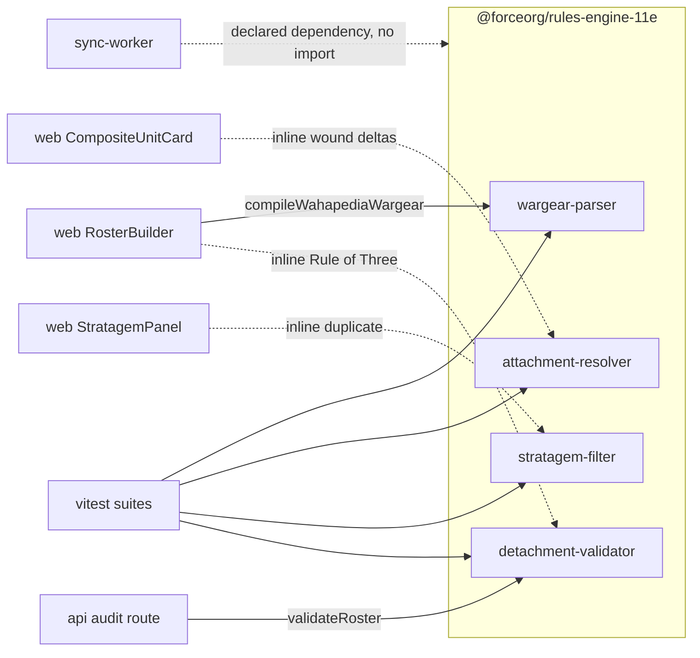

`packages/rules-engine-11e` (`@forceorg/rules-engine-11e`) is the repository's only pure
business-logic package: four modules of side-effect-free functions over
[Shared Contracts](../architecture/shared-contracts.md) types, with `@forceorg/types` as its
*only* runtime dependency and no Prisma, HTTP, or React anywhere in `src`.
That makes it simultaneously the highest-leverage place to add 11th Edition behaviour and the
weakest-protected, because only two of its four modules actually reach production — see
[System Topology](../architecture/system-topology.md).

Deep dives for the individual rule sets live on
[Roster Validation](roster-validation.md) and
[Composite Units & Stratagem Filtering](composite-units-and-stratagems.md); this page is the
map of what is exported, who calls it, and what the tests hold in place.

## The exported surface

`src/index.ts` is a pure re-export barrel — no factory, no configuration object, no
initialisation. Anything a consumer can use is one of these named functions plus the
`ValidationError` type.

| Module | Exports | Responsibility |
| --- | --- | --- |
| `wargear-parser.ts` (§7.1) | `compileWahapediaWargear`, `slugify`, `parseCountAndName`, `parseOptionList` | compiles raw Wahapedia wargear prose (or HTML) into `WargearRuleAST[]` |
| `attachment-resolver.ts` (§6.1) | `isAttachmentValid`, `resolveEffectiveToughness`, `mergeKeywords`, `mergeWeapons`, `mergeAbilities`, `resolveCompositeUnit`, `allocateWound`, `isUnitDestroyed`, `countAliveBodyguards` | merges a leader datasheet into a bodyguard datasheet and tracks damage across `ModelHealth[]` |
| `stratagem-filter.ts` (§6.2) | `filterStratagems`, `groupStratagemsByCategory`, `unitSatisfiesKeywords`, `isPhaseActive` | gates stratagems on battle phase, unit keywords and detachment identity |
| `detachment-validator.ts` | `validateRoster`, `validatePointsLimit`, `validateDetachmentPoints`, `validateRuleOfThree`, `validateAttachments`, plus `export type { ValidationError }` | matched-play force-org checks returning `{ code, severity, message, unitInstanceId? }` |

Two structural properties of the API matter to callers:

- **All external data is pushed in.** The engine never queries the database. Attachment
  legality takes a `LeaderCompatibility[]` the caller loaded from `leader_compatibility_11e`;
  roster validation takes a `Map<string, Datasheet>` the caller built from Prisma rows. That
  is what keeps every module testable with literals and keeps legality a *data* change.
- **Validation never throws.** Each check returns an array of `ValidationError` and simply
  skips roster units whose datasheet is missing from the lookup, so a sparse lookup silently
  narrows coverage instead of failing. The caller owns severity interpretation.

## Who actually calls it

Only two imports of `@forceorg/rules-engine-11e` exist in application code. The other two
modules are exercised exclusively by their vitest suites, and the components that render the
same rules re-implement the logic inline.

| Consumer | Import | Notes |
| --- | --- | --- |
| `apps/api/src/routes/audit.ts` | `validateRoster` | `POST /api/rosters/:id/audit`; folds the four codes into `RosterDiscrepancy` |
| `apps/web/src/components/RosterBuilder.tsx` | `compileWahapediaWargear` | memoised per expanded unit over `catalogUnit.wargearRulesRaw` |
| `apps/web/src/components/StratagemPanel.tsx` | — | re-implements phase + keyword filtering inline in a `useMemo`; does **not** call `filterStratagems` |
| `apps/web/src/components/RosterBuilder.tsx` (Rule of Three) | — | computes `ruleOfThreeViolations` with its own count map instead of `validateRuleOfThree` |
| `apps/web/src/components/CompositeUnitCard.tsx` | — | wound deltas via a local `handleWoundDelta` clamp; does **not** call `allocateWound` |
| `apps/sync-worker` | — | declares `"@forceorg/rules-engine-11e": "*"` in `package.json` but has no import of it |



*Dashed edges are logic the UI mirrors locally rather than calls — engine changes there do not automatically change what the console shows.*

The practical consequence is an ownership asymmetry: `validateRoster` is the single server-side
authority for force-org compliance, while `attachment-resolver` and `stratagem-filter` are the
*canonical statement* of their rules with zero production callers. Their vitest files are the
only guardrail, and the console can drift from them without any test failing — a divergence the
composite-units page documents in detail.

## Determinism caveats in the parser

`compileWahapediaWargear` is deterministic in structure but not in identity: each AST node id is
`rule_gen_${Date.now()}_${index}`, so recompiling the same text yields different `id` values, and
lines that match none of the five patterns are dropped with no diagnostic (an unrecognised line
compiles to an empty array). `parseOptionList` always sets `pointsDelta: 0`, so option pricing is
never derived from prose. `RosterBuilder` therefore keys each rendered rule card on
`rule.id + '-' + idx` rather than on the id alone, and its "+pts" option badge is unreachable in
practice because `pointsDelta` is always `0`. Any code that persists a `wargearSelections` entry
keyed by `ruleId` across recompiles is relying on an id that changes.

## Running the suite

The package defines the repository's only `test` and `test:coverage` scripts:

```bash
npm test --prefix packages/rules-engine-11e        # vitest run
npm run test:coverage --prefix packages/rules-engine-11e
```

`vitest.config.ts` turns on `globals`, sets the v8 coverage provider with `text`, `json` and
`html` reporters, includes `src/**/*.ts` and excludes `src/**/*.test.ts` and
`src/**/__tests__/**`. Coverage output lands in `coverage/` (removed by `npm run clean` alongside
`dist/`). Linting is `tsc --noEmit`; `build` is plain `tsc` emitting CommonJS to `dist` with
`rootDir: ./src` and test files excluded from the emit.

Four suites, 53 tests, in `src/__tests__/`:

- `wargear-parser.test.ts` (14) — slug shape, count/name parsing and bullet stripping, comma and
  `or` option lists with `1 of the following` preamble filtering, the five prose patterns
  (scale-factor, add-on, numeric model count, passive and active role-targeted), HTML input, and
  the empty-AST case for unrecognised text.
- `attachment-resolver.test.ts` (14) — valid, invalid and **reversed** attachment pairs; bodyguard
  toughness while bodyguards live versus leader toughness at zero; keyword union with dedupe and
  sorted output; bodyguard-first allocation, leader-only-after-bodyguards, `PRECISION` bypass, and
  `null` on a destroyed unit; `isUnitDestroyed` / `countAliveBodyguards`.
- `stratagem-filter.test.ts` (13) — universal keyword eligibility, any-match, case-insensitivity,
  phase matching including `ANY`, and the four `filterStratagems` cases (ANY-phase core always in,
  wrong phase out, missing keyword out, foreign detachment out while the matching detachment admits
  it) plus the `core` / `detachment` partition.
- `detachment-validator.test.ts` (12) — exact-equality legality for both budgets, `POINTS_EXCEEDED`
  and `DP_EXCEEDED` messages, 3 copies allowed versus a 4th tripping `RULE_OF_THREE`, `BATTLELINE`
  and `DEDICATED_TRANSPORT` exemptions, `ORPHAN_ATTACHMENT` carrying the dependent unit's
  `unitInstanceId`, and `validateRoster` aggregating simultaneous violations.

The tests import from `../<module>` directly rather than through `index.ts`, so the barrel can
gain a broken re-export without any test noticing.

## Build graph and CI gates

The package sits between `types` and every runtime app. GitHub's `deploy.yml` runs
`npm run lint` followed by `npm run test:coverage --prefix packages/rules-engine-11e` in its
**Code Quality Audits** step on every PR and push to `main`, and those steps are unguarded, so the
suite is effectively the repository's unit-test gate (GitHub never runs root `npm run test`).
GitLab's `test` job runs `npx turbo run test build`, which reaches the same vitest run through
turbo's `test` task (`dependsOn: ["^build"]`). See
[CI/CD Pipelines](../operations/ci-cd-pipelines.md).

Each container image builds the package before its consumer — `Dockerfile.api` and
`Dockerfile.sync-worker` then copy `dist/**` plus `package.json` into their runtime stages, while
`Dockerfile.web` copies the built `packages/` tree wholesale — see
[Deployment & Compose](../operations/deployment-and-compose.md). In development the web app skips
the build entirely: `apps/web/tsconfig.json` aliases `@forceorg/rules-engine-11e` to
`../../packages/rules-engine-11e/src`, and `next.config.js` lists it in `transpilePackages`, so web
consumes TypeScript sources directly while the API consumes compiled `dist`.

## Extension guidance

- New 11e rules belong in this package rather than in `apps/web` or `apps/api`: it is the only
  dependency-light, deterministic, tested home for them, and both server and browser already
  resolve it.
- Keep the "caller supplies the data" convention — pass lookup tables and datasheet maps in as
  arguments instead of introducing a Prisma or fetch dependency here.
- When adding a rule that the console already renders (stratagem gating, Rule of Three, wound
  order), change the inline duplicate in the component in the same commit. Nothing links the two,
  so an engine-only change leaves the UI asserting different rules while every test stays green.
- Export anything new from `src/index.ts`; `apps/api` consumes `dist` and cannot reach module
  internals, and no test currently covers the barrel.
