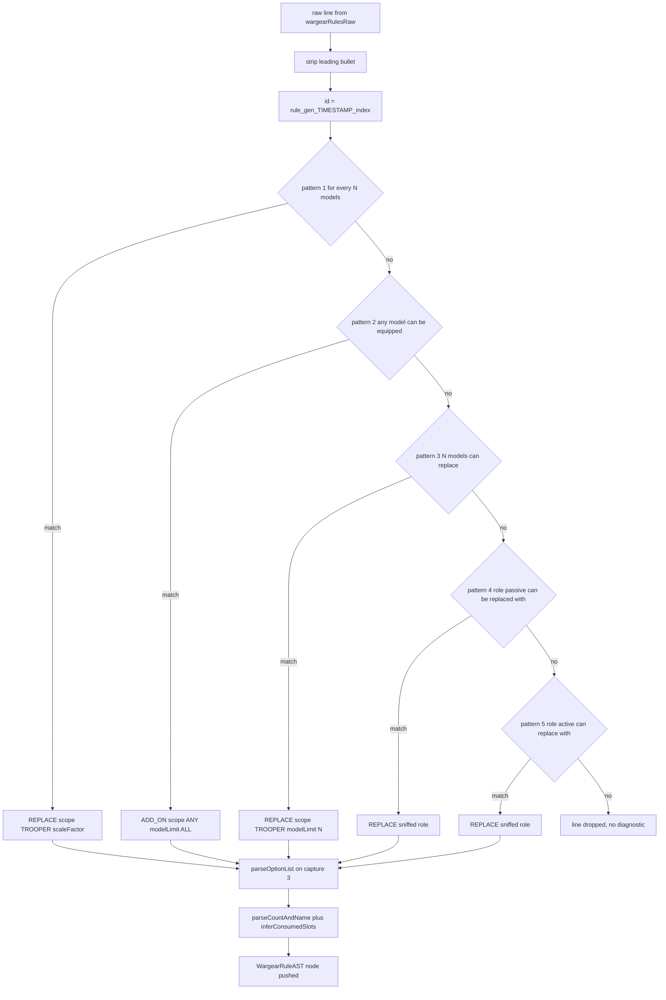
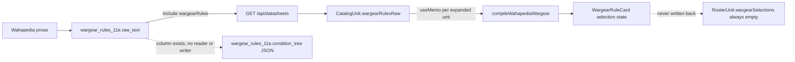

`packages/rules-engine-11e/src/wargear-parser.ts` (labelled §7.1 in the source header) is the
repository's only natural-language compiler: it turns the free prose a datasheet carries as
Wahapedia text — plain lines or raw HTML — into [`WargearRuleAST`](../../packages/types/src/index.ts#L128-L145)
nodes. It is a pure, single-pass, **line-oriented regex matcher**, not a grammar: one line of prose
in, at most one AST node out, and the whole rule model is whatever the five regexes happen to
capture. See [Rules Engine Overview](rules-engine-overview.md) for where this module sits among the
package's four, and [Data Model & Migrations](../data/data-model-and-migrations.md) for the catalog
tables the prose comes from.

## Entry point and input normalisation

`compileWahapediaWargear(rawTextOrHtml: string): WargearRuleAST[]` is exported from the package
barrel ([`src/index.ts`](../../packages/rules-engine-11e/src/index.ts#L2-L7)) and takes a single
string — no datasheet, no points table, no configuration. Its input is `CatalogUnit.wargearRulesRaw`,
which `RosterBuilder` builds by joining the `rawText` of every `wargearRules` row returned by
`GET /api/datasheets` with `\n`
([`RosterBuilder.tsx`](../../apps/web/src/components/RosterBuilder.tsx#L164-L186);
the rows come from `include: { wargearRules: true }` in
[`datasheets.ts`](../../apps/api/src/routes/datasheets.ts#L24-L38)), falling back to hard-coded demo
prose when the API returns nothing.

Before any matching happens the input is normalised
([`wargear-parser.ts#L74-L86`](../../packages/rules-engine-11e/src/wargear-parser.ts#L74-L86)):

1. ` ` and `</li>` become newlines; `<li ...>` becomes the literal bullet `• `;
2. every remaining tag is removed with `<[^>]+>` — attributes, entities and nested markup are simply
   deleted, so text inside a `` is concatenated with its neighbours on the same line;
3. the result is split on `\n`, each line trimmed, blank lines dropped;
4. per line, a leading `• ` is stripped again before matching.

Each surviving line is then tried against five patterns **in a fixed order**, and the first pattern
that matches wins (`return` inside the `forEach` callback). Rule ordering is therefore semantics:
a scale-factor line is tested before the numeric-count line, and the `ADD_ON` line is tested before
both role-targeted patterns, so a line that could plausibly satisfy two shapes always compiles to
the earlier one.

## The five recognised line patterns

| # | Pattern | Regex anchor | `ruleType` | `scope` | `constraint.maxSelections` |
| --- | --- | --- | --- | --- | --- |
| 1 | scale-factor replacement — "For every 5 models in this unit, 1 model can replace its boltgun with 1 Heavy Bolter" | `/(?:for every\|for each)\s+(\d+)\s+models.*?can\s+replace\s+(.*?)\s+with\s+(.*)/i` | `REPLACE` | `TROOPER`, `scaleFactor`, `modelLimit: 1` | the **string** `floor(unit.modelCount / N)` |
| 2 | add-on — "Any model can be equipped with 1 Combat Knife" | `/(?:any\|all\|each)\s+(?:model\|models?).*?(?:can\s+be\s+equipped\|may\s+take\|can\s+take)\s+(?:with\s+)?(.*)/i` | `ADD_ON` | `ANY`, `modelLimit: 'ALL'`, no `replaces` | `'ALL'` |
| 3 | numeric model count — "2 models can replace their boltgun with 1 Meltagun" | `/^(\d+)\s+models?\s+can\s+replace\s+(?:their\s+)?(.*?)\s+with\s+(.*)/i` | `REPLACE` | `TROOPER`, `modelLimit: N` | `N` (number) |
| 4 | role-targeted, passive — "The Sergeant's boltgun can be replaced with 1 Plasma Pistol" | `/^(?:the\s+)?([A-Za-z\s]+?)(?:'s)?\s+(.*?)\s+can\s+be\s+replaced\s+with\s+(.*)/i` | `REPLACE` | sniffed role + `rawRoleName`, `modelLimit: 1` | `1` |
| 5 | role-targeted, active — "The Champion can replace his bolt pistol with 1 Plasma Pistol" | `/^(?:the\s+)?([A-Za-z\s]+?)\s+can\s+replace\s+(?:their\|his\|her\|its)?\s*(.*?)\s+with\s+(.*)/i` | `REPLACE` | sniffed role + `rawRoleName`, `modelLimit: 1` | `1` |

Every pattern records the untouched original line as `rawText` (bullet and all), so the AST keeps a
pointer back to the prose it was inferred from. All regexes are case-insensitive and every capture
group is fed to the same three helpers, which is what makes the module small — and brittle.

*One prose line through HTML stripping, the ordered pattern chain, and the helper calls that build an AST node.*

## Helper semantics

- **`slugify(text)`** prefixes `wep_`, lowercases, collapses every non-alphanumeric run to `_`, and
  trims edge underscores: `Master-crafted Power Weapon` → `wep_master_crafted_power_weapon`. The
  slug becomes each option's `id`, so two option names differing only in punctuation collide.
- **`parseCountAndName(itemStr)`** trims, strips a leading `• `, and matches `^(\d+)\s+(.*)`; with no
  leading integer it returns `{ count: 1, name: <whole string> }`. It never singularises, so
  `"2 Storm Bolters"` keeps the plural name.
- **`parseOptionList(raw)`** first rewrites ` or ` / ` and/or ` into `, ` (case-insensitive), splits
  on commas, trims, drops empties **and any fragment starting with `1 of the following`**, then maps
  each fragment through `parseCountAndName` + `slugify`. It hard-codes `pointsDelta: 0` for every
  option. Plain ` and ` is *not* a separator, so the second line of the Terminator-squad fixture —
  `… with 1 Assault Cannon and 1 Power Fist or 1 Heavy Flamer and 1 Chainfist`
  ([`RosterBuilder.tsx#L60`](../../apps/web/src/components/RosterBuilder.tsx#L60-L60)) — yields two
  options named `Assault Cannon and 1 Power Fist` and `Heavy Flamer and 1 Chainfist` rather than
  four paired alternatives.
- **`detectTargetRole(roleName)`** is keyword sniffing over the captured subject noun, not a lookup:
  `sergeant|champion|leader|captain|aspiring` → `SERGEANT`, `chassis|hull|body` → `CHASSIS`,
  anything else → `TROOPER`. The unedited capture is still stored as `scope.rawRoleName`, which is
  what the UI prints. Because the subject group is lazy and `([A-Za-z\s]+?)` accepts spaces, the
  split lands on the *first* plausible whitespace: `The Sergeant's storm bolter can be replaced with
  1 Combi-weapon` yields `rawRoleName: 'Sergeant'` / `replaces: 'storm bolter'` (the `'s` is absorbed
  by the optional `(?:'s)?`), while `The Heavy Flamer can be replaced with 1 Onslaught Gatling
  Cannon` — a weapon, not a role — yields `rawRoleName: 'Heavy'` and a `replaces` name of just
  `Flamer`, scoped `TROOPER`.
- **`inferConsumedSlots(optionNames)`** scans option names against two keyword lists —
  `bolter|cannon|flamer|rifle|pistol|melta|plasma|las` for ranged and
  `sword|fist|hammer|axe|claw|blade|knife|maul` for melee — returning `['primary_ranged','melee']`
  when both hit, `['melee']` for melee only, and `['primary_ranged']` otherwise (including for an
  empty option list). Despite `ConsumedSlot` admitting `secondary_ranged` and `chassis_addon`
  ([`types/src/index.ts#L119`](../../packages/types/src/index.ts#L119-L119)), the compiler can only
  ever emit the other two — and nothing downstream reads the field at all.

## Invariants an editor must preserve

Three generated properties are load-bearing for consumers and are not enforced by types or tests:

- **`id` is `rule_gen_<Date.now()>_<lineIndex>`.** Structure is deterministic; identity is not.
  Recompiling the same text yields new ids, so any `wargearSelections` entry keyed by `ruleId` is
  invalidated by the next recompile. `RosterBuilder` already works around this by keying rule cards
  on `rule.id + '-' + idx` instead of the id alone
  ([`RosterBuilder.tsx#L623-L625`](../../apps/web/src/components/RosterBuilder.tsx#L623-L625)).
- **`pointsDelta` is always `0`.** Pricing is never derived from prose, which makes the "+Npts" badge
  in `WargearRuleCard` unreachable in practice and leaves `RosterUnit.pointsCost` pinned to
  `catalogUnit.basePoints` regardless of what is selected.
- **Unmatched lines are dropped silently.** There is no error, warning, log, or "unknown" node type;
  a line that matches none of the five patterns simply produces no AST entry, and fully unrecognised
  input compiles to `[]` (asserted by
  [`wargear-parser.test.ts#L108-L111`](../../packages/rules-engine-11e/src/__tests__/wargear-parser.test.ts#L108-L111)).
  The UI cannot distinguish "this unit has no options" from "this unit's options failed to parse" —
  both render as *No configurable wargear options for this unit*.

## Failure modes visible in the repository's own prose

The demo/fallback corpus in the web app already contains lines the compiler mishandles, which is the
clearest statement of the pattern set's reach:

| Line | Where | What the compiler does |
| --- | --- | --- |
| `For every 5 models, 1 model can replace with 1 Assault Cannon and 1 Power Fist` | [`catalog/page.tsx#L39`](../../apps/web/src/app/catalog/page.tsx#L39-L39) | **dropped.** Pattern 1 needs `replace <X> with <Y>` with a non-empty `<X>`, but here the single ` with ` follows `replace` immediately, so `(.*?)\s+with\s+` can never settle; patterns 3–5 cannot match the `For every …` prefix either. |
| `All models can replace 2 Assault Bolters with 2 Plasma Exterminators` | [`catalog/page.tsx#L99`](../../apps/web/src/app/catalog/page.tsx#L99-L99) | matches pattern 5 with subject `All models` → scoped `TROOPER` with `modelLimit: 1` and `maxSelections: 1`, losing the "all models" quantity. |
| `Any model can be equipped with 1 Multi-melta instead of 1 Melta Rifle` | [`RosterBuilder.tsx#L104`](../../apps/web/src/components/RosterBuilder.tsx#L104-L104) | matches pattern 2, but `instead of` is not a grammar the parser knows: the option name becomes `Multi-melta instead of 1 Melta Rifle` and `replaces` stays `undefined`. |
| `Can be equipped with 1 Storm Bolter, 1 Multi-melta, and 1 Hunter-killer Missile` | [`catalog/page.tsx#L111`](../../apps/web/src/app/catalog/page.tsx#L111-L111) | **dropped.** Pattern 2 requires an `any`/`all`/`each` + `model` subject, and no other pattern admits `can be equipped`. |

The general rule for anyone touching the parser: widen a pattern or add a new one *before* the
existing ones only if you have checked that no currently-matching corpus line is stolen by it, and
add the offending corpus line as a test — there is no diagnostic that would otherwise tell you a
datasheet's prose stopped compiling.

## Where the ASTs land

The compiler has exactly one production caller, and the AST never leaves the browser.

*Prose travels from Postgres `raw_text` to a freshly compiled AST at render time; the `conditionTree` JSON column is a dead end.*

- `RosterBuilder` recompiles on demand inside a `useMemo` keyed on the expanded unit instance
  ([`RosterBuilder.tsx#L272-L278`](../../apps/web/src/components/RosterBuilder.tsx#L272-L278));
  the result is render-only, one `WargearRuleCard` per node.
- `WargearRuleCard` keeps the chosen option in **local `useState`**
  ([`RosterBuilder.tsx#L657-L726`](../../apps/web/src/components/RosterBuilder.tsx#L657-L726)) and
  never calls back into the roster. `RosterUnit.wargearSelections` is initialised to `[]` when a unit
  is added and mutated nowhere, so the "client-side selection validation" the file header promises is
  a toggle highlight: `maxSelections` is displayed (numbers verbatim, anything else as `∞`, which is
  how both `'ALL'` and the scale-factor string `floor(unit.modelCount / N)` render), and
  `consumedSlots` / `isMutuallyExclusive` are never read by any consumer in the repository. Because
  the max is only printed and never enforced, no client code evaluates the scale expression either —
  it is a display string, not a constraint language.
- Nothing persists ASTs. `WargearRule.conditionTree Json` in
  [`schema.prisma#L164-L177`](../../packages/db-client/prisma/schema.prisma#L164-L177) is *named* as
  the AST home, but no application code reads or writes it; it exists only as part of the row JSON
  serialised out by `include: { wargearRules: true }`. The live shape is therefore
  "store prose, recompile at read time", and the AST and the column can drift apart with no test
  failing. Note also that `prisma/seed.ts` inserts no `wargear_rules_11e` rows, so against a freshly
  seeded database the live path yields an empty rule list and the demo prose takes over.
- The two selection shapes in the codebase disagree: `@forceorg/types` declares
  `WargearSelection { ruleId, selectedOptionId, count }`
  ([`types/src/index.ts#L177-L181`](../../packages/types/src/index.ts#L177-L181)) while
  `RosterBuilder`'s local `RosterUnit` uses `{ ruleId, optionId, count }`. Anything that eventually
  wires selections to persistence must pick one deliberately rather than casting between them.

## Test guardrails

[`__tests__/wargear-parser.test.ts`](../../packages/rules-engine-11e/src/__tests__/wargear-parser.test.ts)
(14 vitest cases, part of the suite the CI coverage gate runs — see
[CI/CD Pipelines](../operations/ci-cd-pipelines.md)) pins `slugify` output shape,
`parseCountAndName` count-defaulting and bullet stripping, `parseOptionList` comma/`or` splitting
with `1 of the following` filtering, each of the five prose patterns, multi-`<li>` HTML input, and
the empty-array case for unrecognised text. It asserts nothing about `consumedSlots` inference,
`pointsDelta`, or `rule_gen_` id instability, and the mis-parsing cases above are untested — so
those behaviours can change silently, while any change to the five patterns' captured
`scope`/`replaces`/`options`/`maxSelections` values will fail loudly.
