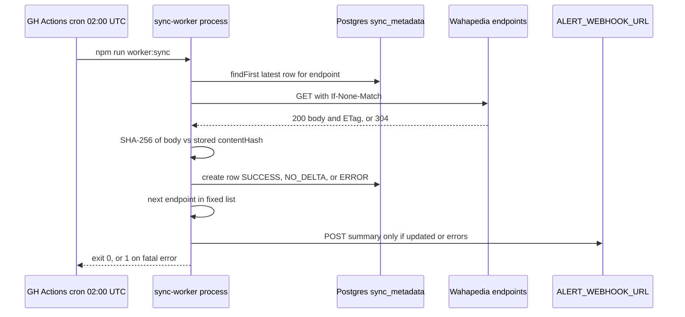
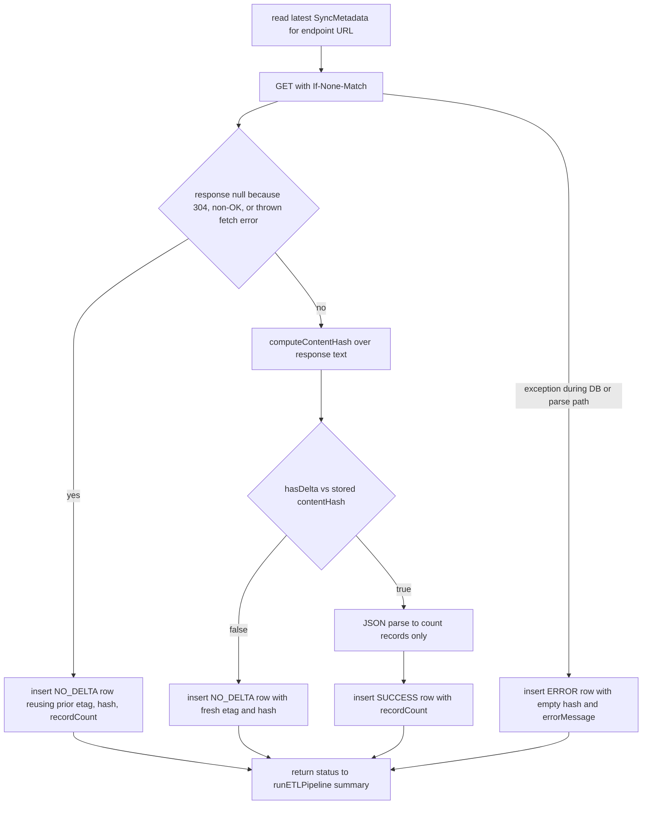
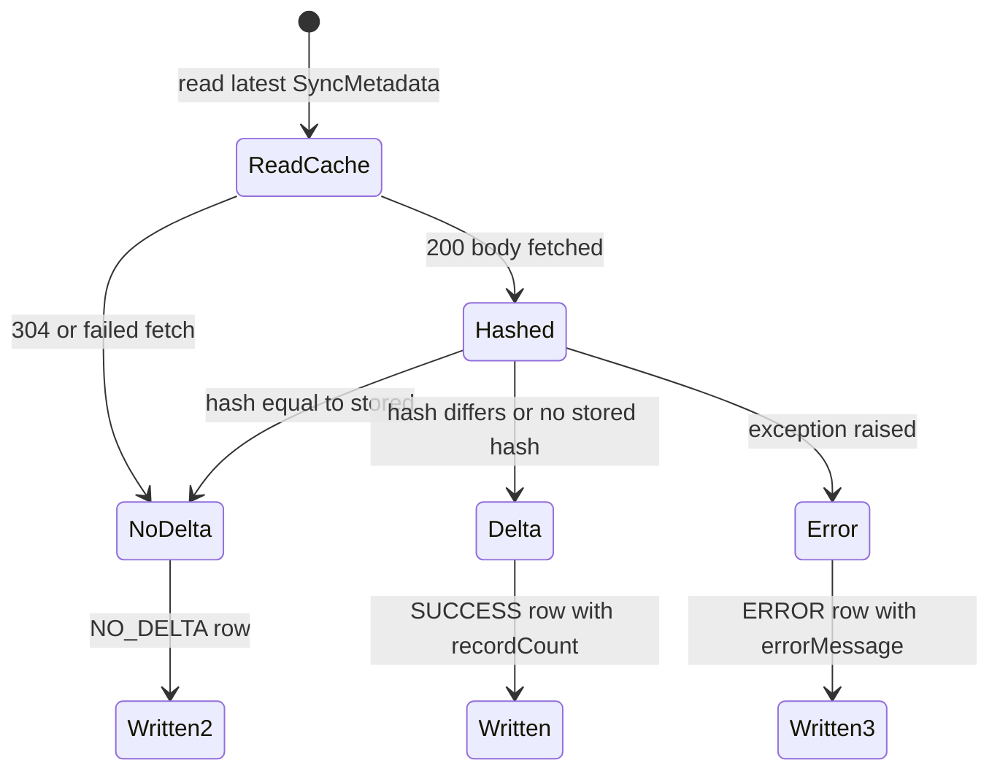

`apps/sync-worker` (`@forceorg/sync-worker`) is the repository's scheduled ingestion job for Wahapedia
Warhammer 40k 11th Edition data. It is a short-lived, one-shot process: start, walk a fixed list of endpoints,
record what changed, alert, exit. Everything it persists lives in the `sync_metadata` table.

The single most important thing to know before reading further: **the pipeline detects deltas and logs their
size, but it does not ingest the payload.** On a detected delta the body is parsed only to count records, the
`SyncMetadata` row is written with `status: 'SUCCESS'`, and the data is dropped. The rules tables (`Datasheet`,
`Weapon`, `Stratagem`, `Ability`) are never written by this worker, and `analyzeDiff()` /
`formatChangelogSummary()` — the code that would build a human-readable changelog — are imported but never
called. See [Current limitation: metadata only](#current-limitation-metadata-only).

## Entrypoints and invocation

`src/index.ts` is the only entrypoint. It calls `runETLPipeline()` and exits `0` on success, `1` after logging a
fatal error. There is no loop, timer, or signal handling — scheduling is entirely the host's job.

| Invocation | Command | Notes |
| --- | --- | --- |
| GitHub Actions | `npm run worker:sync --prefix apps/sync-worker` | `cron: '0 2 * * *'` (daily 02:00 UTC) plus `workflow_dispatch`; runs `tsx src/index.ts` against the workspace build of `types`, `db-client`, `rules-engine-11e` |
| Compose (dev) | `docker compose run --rm sync-worker` | builds `Dockerfile.sync-worker` from the checkout; service is under `profiles: ['tools']`, so it never starts with `docker compose up` |
| Compose (prod) | `docker compose -f docker-compose.prod.yml run --rm sync-worker` | pulls the published `ghcr.io/fatpat81/beerhammer/forceorg-sync-worker:${FORCEORG_TAG:-latest}` image — the prod composition declares no `build:`; also under `profiles: ['tools']` and gated on `postgres: condition: service_healthy` |
| Direct | `npm run worker:sync --workspace @forceorg/sync-worker` | needs `DATABASE_URL`/`DIRECT_URL` pointing at a real database |

The container image's `CMD` is `node apps/sync-worker/dist/index.js`, i.e. the compiled output, whereas the
workflow runs the TypeScript sources through `tsx` and never builds `apps/sync-worker/dist`. Both paths reach
the same `runETLPipeline()`.

The published image exists only on GHCR. `.github/workflows/deploy.yml` builds `Dockerfile.sync-worker` on
pushes to `main` and pushes `forceorg-sync-worker:latest` plus a commit-sha tag, which is what makes the
`FORCEORG_TAG` pin (and rollback to a previous sha) work in the pull-based prod composition. The GitLab CI
`build-images` stage builds and publishes only `Dockerfile.web` and `Dockerfile.api`, so a host sourcing its
images from GitLab has no sync-worker image to pull and must fall back to the source-build composition or to
the workflow.

Required configuration:

- `DATABASE_URL` and `DIRECT_URL` — the Prisma datasource for the `SyncMetadata` model
  (`url = env("DATABASE_URL")`, `directUrl = env("DIRECT_URL")`). Both compose files inject both variables
  explicitly and gate the service on `postgres` being healthy; the workflow supplies them from secrets. In the
  prod composition the worker's URLs are interpolated from the same public Postgres placeholders the API
  service uses (`${POSTGRES_USER:-postgres}`, `${POSTGRES_DB:-forceorg_dev}`), unlike the API service in the
  same file, which sets no `DIRECT_URL` and relies on its entrypoint default. One asymmetry is worth knowing:
  the worker's `DATABASE_URL` falls back to `${POSTGRES_PASSWORD:-postgrespassword}` while its `DIRECT_URL`
  falls back to `${POSTGRES_PASSWORD:-postgres}`, so with no environment overrides the two URLs carry
  different passwords. Runs still succeed because the worker only issues runtime queries over `DATABASE_URL`
  and never runs migrations, but the default `DIRECT_URL` is not a usable connection string.
- `ALERT_WEBHOOK_URL` — optional. Both compositions pass it through as `${ALERT_WEBHOOK_URL:-}`, i.e. an empty
  string when unset, and `sendAlert()` returns immediately on a falsy value, so an unset webhook means a
  completely silent run.



*Caption: one worker process walks the four endpoints sequentially, appending one metadata row each, then exits.*

## Endpoint list and ruleset version id

`WAHAPEDIA_ENDPOINTS` is a hard-coded array of four `{ key, url }` pairs — `datasheets`, `weapons`,
`stratagems`, `abilities` — under `https://wahapedia.ru/wh40k11e/*.json`. The source comments state these are
**placeholder URLs**, not live Wahapedia JSON paths, so a real run today would almost certainly record fetch
failures rather than data. Endpoints are processed strictly sequentially by `runETLPipeline()`, and each row is
keyed by the URL (`where: { endpoint: endpointConfig.url }`), so changing a URL orphans all prior history for
that feed.

Every row also carries a `rulesetVersionId` produced by `generateRulesetVersionId()`: `11.1.0-YYYY-QN-MFM`,
where the quarter is derived from the current month. It is recomputed per endpoint (and again for the summary),
so it reflects the wall clock of the run rather than anything read from Wahapedia; it is the value the API's
`GET /api/changelog` surfaces as `currentRulesetVersion`.

## Per-endpoint flow

`processEndpoint()` implements one deterministic pass:

1. Read the most recent `SyncMetadata` row for the endpoint URL, ordered by `syncedAt desc`. This row supplies
   the cached `etag`, `lastModified`, `contentHash`, and `recordCount`.
2. Issue a conditional `GET` with `User-Agent: ForceOrg-40k-SyncWorker/1.0` and, when a stored ETag exists,
   `If-None-Match`.
3. **A `304 Not Modified` response returns `null`**, which the caller records as `NO_DELTA`, carrying the
   previous `etag`/`lastModified`/`recordCount` forward and defaulting `contentHash` to `''` when there was none.
4. Otherwise compute `computeContentHash(data)` — a hex SHA-256 over the raw UTF-8 body — and extract `etag`
   and `last-modified` from the response headers with `extractCacheHeaders()`.
5. `hasDelta(incoming, stored)` compares the two hashes. With no stored hash it always reports a delta, so the
   first run for an endpoint is by definition an update.
6. Equal hashes → `NO_DELTA` row written with the *fresh* `etag`, `lastModified`, and `contentHash`, so the
   cache validators stay current even when the content did not change.
7. Different hashes → the body is `JSON.parse`d solely to derive `recordCount` (`parsed.length` for arrays,
   `Object.keys(parsed).length` for objects; a parse failure silently yields `0`), then a `SUCCESS` row is
   inserted with that count.
8. Any thrown error in steps 2–7 is caught and written as an `ERROR` row with `contentHash: ''` and the message
   in `errorMessage`; the endpoint returns status `ERROR` and the pipeline moves on.



*Caption: every branch terminates in exactly one `SyncMetadata` insert; only the hash-mismatch branch parses the payload.*

Cache-validator bookkeeping and hashing live in `src/checksum.ts`, which is pure and side-effect free
(`computeContentHash`, `hasDelta`, `extractCacheHeaders`). That makes it the natural extension point for adding
a new feed: extend the endpoint list and, if the shape differs, the record-counting logic.

Two failure-semantics details are easy to misread:

- `fetchEndpoint()` catches its own errors and returns `null` for both `304` and transport/HTTP failures
  (a non-OK status throws internally, is logged to the console, and is swallowed). Because the caller treats
  `null` as "no delta", **an upstream 500 or DNS failure is recorded as `NO_DELTA`, not `ERROR`** — the
  `ERROR` status only occurs for failures raised inside `processEndpoint()` itself.
- An `ERROR` row stores `contentHash: ''`, and `hasDelta()` treats an empty stored hash as "no previous
  record". A previously failed sync therefore guarantees the next run is counted as a delta even if the payload
  is byte-identical.

## Alerting

After the loop, `runETLPipeline()` builds a plain-text summary — counts of `Updated`/`No Delta`/`Errors`, the
ruleset id, and a completion timestamp — logs it, and calls `sendAlert()` **only when `updated > 0 || errors > 0`**.
`sendAlert()` POSTs `{ content: "```<summary>```" }` as JSON, a shape that works for both Discord and Slack
incoming webhooks. Missing `ALERT_WEBHOOK_URL` is an explicit no-op, and webhook delivery errors are logged and
swallowed, so alerting can never fail the job. The consequence is that an entirely quiet run (all `NO_DELTA`)
produces no notification at all.

## Persistence surface and downstream consumers

The worker's whole write path is `prisma.syncMetadata.create(...)` against the `sync_metadata` table
(`id`, `endpoint`, `lastModified`, `etag`, `contentHash` (64), `rulesetVersionId`, `status`, `recordCount`,
`errorMessage`, `syncedAt`), indexed on `(endpoint, syncedAt)`. Rows are append-only history; nothing is updated
or deleted, so the "current" state of a feed is always its latest row. The `status` union in
`@forceorg/types` (`SUCCESS | NO_DELTA | ERROR | PENDING`) is wider than what the worker writes — `PENDING` is
never emitted.

`GET /api/changelog` in the API reads the last ten rows ordered by `syncedAt desc` to report
`currentRulesetVersion`, `lastSyncedAt`, and per-endpoint sync records, so the metadata this worker writes is
the only real data behind that endpoint's status block. See
[Shared Contracts](../architecture/shared-contracts.md) for the `SyncMetadata` type and
[Data Model and Migrations](../data/data-model-and-migrations.md) for the table itself.

## Current limitation: metadata only

The pipeline's `UPDATED` result message says `Delta detected. N records ingested.`, but no ingestion happens.
The delta branch discards the parsed payload after counting it; there is no upsert into `Datasheet`, `Weapon`,
`Stratagem`, or `Ability`, and no transactional replacement of a ruleset. Any rules content in those tables was
placed there by migrations or seeding, not by this job.

`src/diff-analyzer.ts` is written and shaped as though it would close that gap but is **not invoked by
`runETLPipeline()`** — it is imported in `etl-pipeline.ts` and never called, and no test exercises it.
`analyzeDiff(incoming, existing)` keys records by `name` and returns a `SyncDelta` with `added`, `modified`,
`removed`, and `pointChanges`: a record is `modified` when `basePoints` differ or the `keywords` sets differ
(length mismatch or any missing keyword), and every point difference also produces a
`{ datasheetName, oldPoints, newPoints }` entry. `formatChangelogSummary(delta)` renders that structure into the
emoji-prefixed `=== ForceOrg-40k Wahapedia Sync Delta ===` text, including ↑/↓ arrows for point movement and an
"up to date" line when nothing changed. Wiring them in means, in the delta branch, parsing the payload into
`DatasheetRecord[]`, loading the existing rows, and feeding `formatChangelogSummary(...)` to `sendAlert()` in
place of the record-count summary — `sendAlert`'s transport is already reusable.



*Caption: the three terminal statuses the worker can record; note there is no state in which payload rows are written.*

## Related pages

- [CI/CD Pipelines](../operations/ci-cd-pipelines.md) — how the `wahapedia-sync.yml` job is built and which
  secrets it receives.
- [Shared Contracts](../architecture/shared-contracts.md) — the `@forceorg/types` package that owns
  `SyncMetadata` and `SyncDelta`.
- [Data Model and Migrations](../data/data-model-and-migrations.md) — the Prisma schema containing
  `sync_metadata`.
- [Deployment and Compose](../operations/deployment-and-compose.md) — the `tools` profile the service belongs to.
