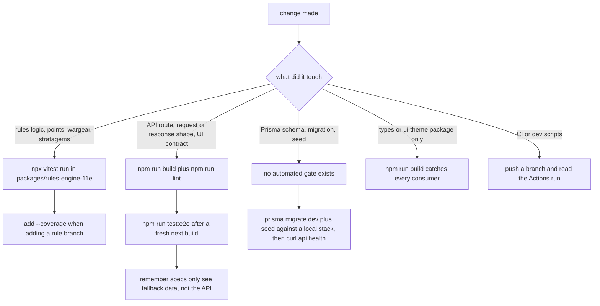

## Overview

Automated behavioural coverage in this monorepo sits in exactly two places: **pure-function unit tests in `packages/rules-engine-11e`** (Vitest) and a **five-test guest-journey browser suite in `apps/web`** (Playwright). Everything else — the Express API, the Prisma client and schema, the sync worker, the shared type/theme packages — is validated only by typechecking and a successful build, and schema changes are validated only by hand against a local stack. Picking a gate therefore means knowing which of those two suites can even observe the change you made.

| Area | Automated test? | What actually gates it today |
| --- | --- | --- |
| `packages/rules-engine-11e` | ✅ 4 Vitest suites, 53 tests | `vitest run` / `vitest run --coverage` |
| `apps/web` behaviour | ✅ 5 Playwright tests (guest journey) | `npx playwright test --project="Desktop Chrome"` against a production `next start` |
| `apps/web` components/logic | ❌ no unit/component tests | `next lint` + `next build` only |
| `apps/api` routes, auth, audit | ❌ no tests | `tsc --noEmit` + build; indirect browser checks only |
| `packages/db-client` schema, migrations, seed | ❌ no tests | manual `prisma migrate` + `seed` against a local database |
| `packages/types`, `packages/ui-theme` | ❌ no tests | `tsc --noEmit` + build |
| `apps/sync-worker` ETL | ❌ no tests | `tsc --noEmit`; the nightly workflow is the only runtime exerciser |

## Entry points

- Root [package.json](../../package.json#L10-L23): `test` → `turbo run test`, `test:coverage` → `turbo run test:coverage`, `test:e2e` → `npm run test:e2e --workspace=@forceorg/web`.
- [packages/rules-engine-11e/package.json](../../packages/rules-engine-11e/package.json#L7-L13): `test` → `vitest run`, `test:coverage` → `vitest run --coverage`. It is the **only** workspace that defines either script, so `turbo run test` fans out to a single package.
- [apps/web/package.json](../../apps/web/package.json#L5-L13): `test:e2e` → `playwright test`, `test:e2e:ui` → `playwright test --ui`. Note `apps/web` defines no `test` script, so the root `test` task never runs Playwright.
- Containerized equivalents in [scripts/dev-container.sh](../../scripts/dev-container.sh#L33-L62), reached through `./scripts/dev.sh`: `verify` = lint + build + unit tests, `test` = unit tests only, `e2e` = `npx next build` then `playwright test --project="Desktop Chrome"` (aborting unless Chromium exists in `PLAYWRIGHT_BROWSERS_PATH`, which `e2e-install` populates).

## The unit-test layer: `packages/rules-engine-11e`

<!-- openwiki: broken internal link [../../packages/rules-engine-11e/src/__tests__] file "../../packages/rules-engine-11e/src/__tests__" does not exist. Fix the href or restore the target, then delete this comment. -->
Four suites under [src/__tests__/](../../packages/rules-engine-11e/src/__tests__) contain 53 `it` cases, one suite per engine module, all pure functions over literal fixtures — no database, no network, no DOM:

- [detachment-validator.test.ts](../../packages/rules-engine-11e/src/__tests__/detachment-validator.test.ts) — points limit (`POINTS_EXCEEDED`, exact-limit is legal), detachment-point budget (`DP_EXCEEDED`), Rule of Three including the `BATTLELINE` and `DEDICATED_TRANSPORT` exemptions, orphan `attachedLeaderId` detection, and `validateRoster` aggregating several violations at once.
- [attachment-resolver.test.ts](../../packages/rules-engine-11e/src/__tests__/attachment-resolver.test.ts) — leader/bodyguard compatibility pairs, effective Toughness while bodyguards live, keyword merge/dedup/sort, wound allocation order including the `PRECISION` override, and unit-destroyed/alive-bodyguard counting.
- [stratagem-filter.test.ts](../../packages/rules-engine-11e/src/__tests__/stratagem-filter.test.ts) — keyword satisfaction (case-insensitive), phase activation (`ANY` always active), `filterStratagems` phase/keyword/detachment pruning, category grouping.
- [wargear-parser.test.ts](../../packages/rules-engine-11e/src/__tests__/wargear-parser.test.ts) — slug generation, `N Name` and option-list parsing, and `compileWahapediaWargear` producing `REPLACE`/`ADD_ON` AST nodes with scale factors, role targets, `maxSelections`, HTML input, and an empty array for unrecognized text.

[vitest.config.ts](../../packages/rules-engine-11e/vitest.config.ts#L3-L12) enables `globals: true` and v8 coverage (`text`, `json`, `html`) over `src/**/*.ts` with test files excluded. Coverage output is what [turbo.json](../../turbo.json#L19-L22) caches under `outputs: ["coverage/**"]`.

Because these are the only unit tests, they are also the only thing CI runs as a unit gate: [deploy.yml](../../.github/workflows/deploy.yml#L35-L38) executes `npm run lint` and `npm run test:coverage --prefix packages/rules-engine-11e` on every PR, and [`.gitlab-ci.yml`](../../.gitlab-ci.yml#L29-L32) runs `npx turbo run test build`, which reaches the same single package.

### Running one suite without the monorepo graph

`turbo run test` declares `dependsOn: ["^build"]` ([turbo.json](../../turbo.json#L16-L18)), so the root `npm test` first builds every upstream workspace (`@forceorg/types`, …) before Vitest starts. For a tight edit–run loop inside the engine, invoke Vitest directly in the package:

```bash
cd packages/rules-engine-11e
npx vitest run src/__tests__/detachment-validator.test.ts   # one file
npx vitest run -t "Rule of Three"                          # one describe block
npx vitest run --coverage                                   # the CI-equivalent gate

# or keep Turbo's caching but stay scoped to one package
npx turbo run test --filter=@forceorg/rules-engine-11e
```

## The browser layer: Playwright in `apps/web`

The whole E2E suite is one file, [apps/web/e2e/critical-flows.spec.ts](../../apps/web/e2e/critical-flows.spec.ts#L8-L90). `beforeEach` performs the guest "Instant Commander Access" login — fill a callsign, click *Enter ForceOrg* — which is satisfied entirely client-side ([AuthProvider.signInAsGuest](../../apps/web/src/components/AuthProvider.tsx#L131-L151) writes `forceorg_local_user` to `localStorage`), then the five tests cover:

1. Guest login reaches the Command Nexus dashboard.
2. `/catalog` search for *Terminator* → card visible → detail modal shows *Unit Composition* → close.
3. `/changelog` renders the *Active Ruleset:* badge and the *Points Reductions* MFM diff rows.
4. Tabletop Console opened from the dashboard's army card: the active unit `<h2>`, the *Stratagems* button, and the *Close Stratagems* overlay.
5. The Rules Compliance Audit modal (Battle-Ready / Advisory / Action-Required) and *Dismiss*.

### It runs against the offline / localStorage path, not the API

Neither [e2e.yml](../../.github/workflows/e2e.yml#L14-L49) nor the Playwright config starts the API, Postgres, or S3 — no `services:`, no compose step. Every `fetch` to `http://localhost:4000/api` therefore fails and each page falls through to its curated fallback: `FALLBACK_CATALOG_DATASHEETS` on the catalog ([catalog page](../../apps/web/src/app/catalog/page.tsx#L128-L156)), `FALLBACK_CHANGELOG` on `/changelog` ([changelog page](../../apps/web/src/app/changelog/page.tsx#L120-L143)), the localStorage starter roster and demo console units behind `fetchRosters`/`fetchRoster` ([lib/api.ts](../../apps/web/src/lib/api.ts#L121-L150)), and the client-side points-only audit in [auditRoster](../../apps/web/src/lib/api.ts#L390-L419). Two consequences for anyone touching the specs:

- **Assertions must stay satisfiable by fallback data.** A spec that needs real persistence passes locally against a full stack and fails — or silently asserts nothing — in CI.
- **Server-side behaviour is not covered by E2E at all.** `POST /api/rosters/:id/audit` runs `validateRoster` against live datasheets ([apps/api/src/routes/audit.ts](../../apps/api/src/routes/audit.ts#L25-L70)); under Playwright the client catch block returns a points-only result, so point-shift, DP, and Rule-of-Three compliance logic reaches production with no integration test anywhere.

Test 05 additionally wraps its body in `if (await auditBtn.isVisible())`, so if the Audit control ever disappears the test passes vacuously — unlike tests 01–04, it cannot fail on a missing feature.

### Server boot and CI/retry semantics

[apps/web/playwright.config.ts](../../apps/web/playwright.config.ts#L1-L40) pins `testDir: './e2e'`, 30s test / 5s expect timeouts, `fullyParallel: true`, `baseURL = PLAYWRIGHT_TEST_BASE_URL || 'http://localhost:3456'`, `trace: 'on-first-retry'`, `screenshot: 'only-on-failure'`, and two projects (`Desktop Chrome`, `Mobile Safari` mapped to iPhone 14). CI selects only `Desktop Chrome` and installs only Chromium, so WebKit coverage exists locally only. Under `CI`, `forbidOnly` fails a committed `test.only`, `retries: 2` and `workers: 1` apply — a green CI run may therefore have survived retries that a single local worker would have exposed.

The `webServer` block runs `npx next start -p 3456` with `timeout: 120s` and **`reuseExistingServer: false`**, deliberately never adopting a process already holding 3456 so the suite always exercises a server built from the current tree. It does **not** run a build: `next start` serves whatever is in `apps/web/.next`, so `npm run test:e2e` on a stale tree tests yesterday's UI, and on a never-built tree the server never becomes reachable. CI builds first with `NEXT_PUBLIC_API_URL: http://localhost:4000/api` ([e2e.yml](../../.github/workflows/e2e.yml#L32-L35)), and `dev-container.sh e2e` runs `npx next build` before Playwright ([dev-container.sh](../../scripts/dev-container.sh#L48-L55)) — that build-time inlining matters because `API_BASE` in `lib/api.ts` is read once from the bundle, not from the `webServer.env` value. The config also has no `webServer.when`, so overriding `PLAYWRIGHT_TEST_BASE_URL` points the browser elsewhere while a local :3456 server is still started.

## Gate matrix: pick the cheapest honest check



*Caption: mapping a change's kind to the minimum validation that can actually observe it, including the two places where no automated gate exists.*

| Kind of change | Minimal gate | Why that is the honest floor |
| --- | --- | --- |
| Rules engine (validation, wargear AST, stratagem filtering, attachments) | `cd packages/rules-engine-11e && npx vitest run` | The only layer with real assertions; add a case in the matching suite for new rule branches. |
| Web UI markup/labels that E2E asserts on | `npm run build` in `apps/web`, then `npx playwright test --project="Desktop Chrome"` | The specs match on literal strings (`Unit Composition`, `Close Stratagems`, `Points Reductions`); renaming UI text is an E2E-breaking change with no other signal. |
| API/UI contract change (new field, renamed route) | `npm run lint` (tsc + next lint) + `npm run build` + Playwright | There is no API test and no contract test; TypeScript catches shape drift, Playwright only catches regressions on the five guest journeys. |
| Prisma schema / migration / seed | `npm run db:migrate` + `npm run db:seed` (or `./scripts/dev.sh up`, whose `db-init` runs `prisma migrate deploy` then the idempotent seed), then smoke-test `GET /api/health` and one datasheet/roster route | Nothing automated — including E2E — ever connects to a database, so a broken migration is invisible to CI. |
| Shared `@forceorg/types` change | `npm run build` from the root | No tests consume it; the full Turbo build graph is the only consumer check. |
| Sync worker / ETL | `npm run lint --prefix apps/sync-worker` | Only its nightly scheduled workflow executes it, and it is not a validation gate. |

## Failures and gaps worth knowing before you rely on a green run

- **A green `npm test` proves almost nothing outside the engine.** Because only `packages/rules-engine-11e` has a `test` script, `turbo run test` succeeds with "1 package tested" even when the API changed completely.
- **`reuseExistingServer: false` turns a port conflict into a hard failure** rather than a silently-adopted server: if something already holds 3456 the webServer fails to start within 120s.
- **The suite is fallback-coupled.** Removing or editing the curated fallback datasets in `apps/web/src/lib/api.ts` or the page-level `FALLBACK_*` constants can break CI while the real, API-backed UI is fine — and vice versa.
- **CI retries (2) plus single-worker parallelism** hide flakes and ordering bugs that a local `fullyParallel` run would show.
- **No coverage thresholds are configured** in [vitest.config.ts](../../packages/rules-engine-11e/vitest.config.ts#L3-L12); `test:coverage` produces a report on `main` but no gate reads it.
- **Playwright artifacts are diagnostic only**: `actions/upload-artifact` uploads `apps/web/playwright-report/` for 14 days on every run, PR or `main` ([e2e.yml](../../.github/workflows/e2e.yml#L44-L49)).

**Extension points.** To give the API its first real gate, add a `test` script (e.g. Vitest + supertest against the Express `app`) to `apps/api` — `turbo run test`, `dev.sh verify`, and the GitLab test stage pick it up with no other wiring. To cover the fallback-vs-API divide instead of hiding it, run `dev.sh up` and set `PLAYWRIGHT_TEST_BASE_URL` plus a seed-backed roster, or add Playwright `dependencies` that start the compose stack. To gate schema changes, add a CI job that runs `prisma migrate deploy` and `prisma seed` against a service container — today that only happens inside the dev loop.

Related: [CI/CD Workflows](../operations/ci-cd-pipelines.md), [Development Environment & Scripts](../operations/dev-environment.md), [Rules Engine Overview](../rules-engine/rules-engine-overview.md), [Roster Validation](../rules-engine/roster-validation.md).
