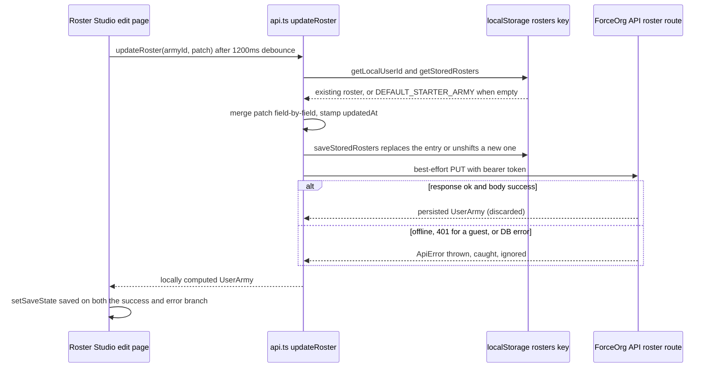

## Responsibility

[`apps/web/src/lib/api.ts`](../../apps/web/src/lib/api.ts) is the single place in `apps/web` that talks to the
backend. Pages and components never call `fetch` themselves (only the photo-upload path inside the same module
does, see [Miniature photos](#miniature-photos-bypass-apifetch)); they import typed functions —
`fetchDatasheets`, `fetchStratagems`, `fetchRosters`, `fetchRoster`, `createRoster`, `updateRoster`,
`deleteRoster`, `auditRoster`, `uploadMiniaturePhoto`, `deleteMiniaturePhoto`, `fetchChangelog`, `checkHealth`.

Two properties dominate the whole file and must be assumed by every caller:

1. **Nothing in the app can distinguish "offline", "misconfigured", and "not signed in".** `apiFetch` throws
   `ApiError` for any non-OK or `success: false` response, and almost every wrapper swallows that error with an
   empty `catch`. A guest session without a token receives `401 UNAUTHORIZED` from the API's
   `requireAuth` middleware ([`apps/api/src/middleware/auth.ts#L19-L49`](../../apps/api/src/middleware/auth.ts))
   and takes exactly the same code path as a dead network.
2. **localStorage is the authoritative store for rosters; the server is a best-effort mirror.** Reads write into
   localStorage after a successful remote fetch, writes land in localStorage *before* the remote request and
   survive its failure. Divergence is therefore expected and never repaired.

## apiFetch: base URL, token injection, error contract

`API_BASE` is read once at module scope from `NEXT_PUBLIC_API_URL`, defaulting to `http://localhost:4000/api`.
Because Next.js inlines `NEXT_PUBLIC_*` values at build time, the published image's value comes from the builder
stage of [`Dockerfile.web#L33`](../../Dockerfile.web), not from container env — see
[Configuration & Env Vars](../operations/configuration-and-env-vars.md).

For each request `apiFetch` builds `Content-Type: application/json` plus caller headers, then calls
`getAuthToken()`, which constructs a Supabase browser client ([`apps/web/src/lib/supabase.ts`](../../apps/web/src/lib/supabase.ts)
falls back to `https://placeholder.supabase.co` / `placeholder-anon-key` when the env vars are absent), reads
`getSession()`, and returns `access_token ?? null`. Its own `try/catch` collapses *any* auth failure into `null`,
so a missing token is never an error: the `Authorization: Bearer …` header is simply omitted.

The response is always parsed as JSON and treated as an `ApiResponse<T>` envelope
([`packages/types/src/index.ts#L307-L319`](../../packages/types/src/index.ts#L307-L319)). If
`!response.ok || !body.success`, `apiFetch` throws `ApiError(body.error?.code || 'UNKNOWN',
body.error?.message || 'An unexpected error occurred.', response.status)`; otherwise it resolves with `body.data`.
`ApiError` carries `code` and `status` and is exported for callers that want to branch on them — in practice no
caller in `apps/web` imports it today.

Note the ordering consequence: `await response.json()` runs before the OK check, so a plain-text or empty error
body (a proxy 502, a rate limiter HTML page) makes `apiFetch` reject with a `SyntaxError` instead of an
`ApiError`. Wrappers that swallow everything cannot tell the difference.

## localStorage mirror: keys, seeding, SSR guards

| Key | Owner | Read | Write |
| --- | --- | --- | --- |
| `forceorg_local_user` | `AuthProvider` (`signInAsGuest` / `signOut`) | `getLocalUserId()` reads `.id` | `AuthProvider.tsx#L146-L161` |
| `forceorg_rosters_<userId>` | `api.ts` only | `getStoredRosters()` | `saveStoredRosters()` |

`getLocalUserId()` returns the sentinel `'commander'` during SSR, when the key is absent, and when the stored JSON
is corrupt — the same default is used for reads and writes, so guest data written before a callsign was chosen
stays reachable. `getStoredRosters()` returns `[DEFAULT_STARTER_ARMY]` on the server, on an absent key, on a
non-array, and on an **empty** array; `saveStoredRosters()` is a no-op on the server and swallows write failures
(private-mode / quota) silently.

`DEFAULT_STARTER_ARMY` (`api.ts#L76-L119`) is not a placeholder shape: it is a fully typed `UserArmy` —
`starter-ultramarines-roster`, `userId: 'local-commander'`, ruleset `11.1.0-2026-Q3`, 2000-point limit, three
Astartes units totalling 355 points — so it flows through rendering and auditing as if it were persisted data.

## Degradation catalog

| Function | Remote call | On error |
| --- | --- | --- |
| `fetchDatasheets` | `GET /datasheets?factionId=&role=` | returns three hardcoded Ultramarines datasheets (`factionId` only affects the echoed `factionId` field) |
| `fetchDatasheet` | `GET /datasheets/:id` | re-runs `fetchDatasheets()` and returns the id match **or `list[0]`** — an unknown id silently yields the Captain |
| `fetchStratagems` | `GET /stratagems?…` | returns `[]`; `StratagemPanel` substitutes `CORE_STRATAGEMS` |
| `fetchRosters` | `GET /rosters` | mirrors a **non-empty** array to localStorage and returns it; otherwise falls through to `getStoredRosters()` |
| `fetchRoster` | `GET /rosters/:id` | upserts the remote roster into storage on success; otherwise returns the stored match, else a clone of `DEFAULT_STARTER_ARMY` carrying the *requested* id and local user |
| `createRoster` | `POST /rosters` | synthesizes `army_<Date.now()>_<rand>` with an empty payload; the synthesized army is always `unshift`ed into storage |
| `updateRoster` | `PUT /rosters/:id` | none — local merge is saved **before** the request, and the returned object is the locally computed one |
| `deleteRoster` | `DELETE /rosters/:id` | storage is filtered and saved first; always resolves `{ deleted: true }` |
| `auditRoster` | `POST /rosters/:id/audit` | computes a points-only audit from `fetchRoster(id)` |
| `uploadMiniaturePhoto` | raw `fetch` `POST …/media` | **throws** `ApiError` (default `UPLOAD_FAILED`); the modal keeps the local object-URL preview |
| `deleteMiniaturePhoto` | `DELETE …/media` | **throws**; caller logs and clears the UI anyway |
| `fetchChangelog`, `checkHealth` | `GET /changelog`, `GET /health` | **throws** — the two read exports with no fixture inside the client |

`fetchChangelog` is the instructive contrast: because the client does *not* degrade, the changelog page owns its
fallback (`FALLBACK_CHANGELOG`, `changelog/page.tsx#L128-L143`). Fallback ownership is therefore inconsistent
across the app, and any new read must decide explicitly which side holds the fixture.

## updateRoster: read-mirror plus write-through

*Caption: `updateRoster` writes localStorage before the network and returns local state regardless of the PUT outcome.*

Three consequences follow from that ordering:

- The value the caller receives is the **client's merge**, not the server row; `updatedAt` reflects the browser
  clock, and `rulesetVersionId`/`factionId` are inherited from whatever was stored (or from the starter army).
- A successful PUT response is discarded, so server-side normalisation never propagates back into the mirror
  until the next `fetchRosters`/`fetchRoster`.
- The Roster Studio's "Saved" indicator is really "saved to localStorage": `performSave` sets
  `saveState = 'saved'` in its `catch` as well (`edit/page.tsx#L86-L108`).

## Divergence and failure semantics

Because both write directions are fire-and-forget, local and server state can drift in three distinct ways, and
the client has **no dirty flag, sync queue, conflict detection, or retry**:

- **Local-ahead**: a guest edits while unauthenticated or offline; storage holds the edits, the server has no row
  at all (roster ids synthesized by `createRoster` were never `POST`ed, so the later `PUT /rosters/:id` returns
  `404 NOT_FOUND` and is swallowed).
- **Server-ahead**: the next successful `fetchRosters` mirrors a non-empty remote array straight over
  `forceorg_rosters_<userId>`, silently discarding unsynced local edits.
- **Ghost deletes**: `deleteRoster` removes the local copy and resolves success even when the `DELETE` failed, so
  the roster persists server-side and reappears on the next successful read.

`fetchRosters` also conflates "server says you own nothing" with "server unreachable": the `remote.length > 0`
guard means an empty remote list falls through to `getStoredRosters()`, which itself substitutes the starter army
for an empty array. A signed-in user with zero rosters can never see an empty list from this layer.

Offline auditing is degraded twice over, and the second layer is unreachable. `auditRoster`'s fallback emits only
one possible discrepancy (`army-total`, `RED`, `POINTS_SHIFT`) and never checks detachment points, quotas, loadouts
or Rule of Three — checks the server route does perform by calling `validateRoster`
([`apps/api/src/routes/audit.ts#L77-L103`](../../apps/api/src/routes/audit.ts#L77-L103), see
[Roster Validation](../rules-engine/roster-validation.md)). `ComplianceDashboard` also has a `catch` that would
add a `DP_VIOLATION` row, but since `auditRoster` swallows its own errors and never rejects, that branch is dead in
practice — an offline audit reports points-limit breaches only.

## Miniature photos bypass apiFetch

`uploadMiniaturePhoto` is the one raw `fetch`: it builds `FormData` (`miniature_photo` **and** `image` under the
same file, plus `rosterId`/`unitInstanceId`), sets only `Authorization` — deliberately no `Content-Type`, so the
browser can add the multipart boundary — and re-implements the envelope check with `UPLOAD_FAILED` as the default
code. It then unwraps `body.data.media` when present, tolerating both response shapes the API exposes
(see [Media Upload & Object Storage](../api/media-upload-and-object-storage.md)). It does **not** fall back: the
graceful path lives in `PhotoUploadModal.tsx#L70-L98`, which on error keeps the `URL.createObjectURL` preview as
if the upload had succeeded. The preview is a blob URL, so the "successful" photo disappears on reload.

## Fixture duplication

The same three Astartes units (Captain in Terminator Armour 95 pts, Terminator Squad 185 pts, Intercessor Squad
75 pts) are hardcoded independently in `api.ts` (`fetchDatasheets` fallback), `RosterBuilder.tsx#L40-L107`
(`DEMO_CATALOG`), `army/[id]/page.tsx#L24-L103` (`DEMO_FALLBACK_UNITS`), and `catalog/page.tsx#L17`
(`FALLBACK_CATALOG_DATASHEETS`), while the dashboard and changelog carry their own `STARTER_DEMO_ARMY` /
`FALLBACK_CHANGELOG`. Adding a datasheet or changing a canonical `ds-*` id requires coordinated edits in all of
them, and `RosterBuilder` explicitly joins live API rows back to `DEMO_CATALOG` **by name** to recover wargear
text the API omits (`RosterBuilder.tsx#L176-L186`).

A second, subtler consequence: the console page substitutes `DEMO_FALLBACK_UNITS` whenever
`rosterPayload.units` is empty (`army/[id]/page.tsx#L196-L200`), so a freshly created roster renders the demo
Ultramarines force rather than an empty list — the behaviour Playwright test 04 relies on when it asserts the
"Captain in Terminator Armour" heading after entering a guest session
([`apps/web/e2e/critical-flows.spec.ts#L56-L64`](../../apps/web/e2e/critical-flows.spec.ts#L56-L64)). E2E suites
that run against the real API therefore cannot distinguish fixture rendering from server rendering; see
[Testing Strategy](../testing/testing-strategy.md).

## Extension guidance

- Keep the "never throws for rosters, may throw for reads you did not give a fixture" split deliberate. If a new
  function must be able to fail loudly, say so in its name or return type; otherwise callers will assume the
  silent-degradation contract.
- Do not add a new localStorage key without a matching userId derivation — `getLocalUserId()` is shared with the
  guest session written by `AuthProvider`, and the `'commander'` sentinel is what keeps pre-signup data visible.
- Any change that makes a fallback reject instead of returning fixtures will surface previously dead `catch`
  branches (e.g. `ComplianceDashboard`, `DeleteArmyModal`, `CreateArmyModal`, `RosterEditPage`), each of which
  synthesizes its **own** fallback object that duplicates the logic already in `api.ts`.

## Related

- [API Server & Middleware](../api/api-server-and-middleware.md) — the envelope, rate limit and 404/500 handlers this client decodes.
- [Authentication & Ownership](../api/authentication-and-ownership.md) — why an unauthenticated client gets `401` on every roster route.
- [Media Upload & Object Storage](../api/media-upload-and-object-storage.md) — the multipart contract `uploadMiniaturePhoto` hand-rolls.
- [Shared Contracts](../architecture/shared-contracts.md) — `ApiResponse`, `UserArmy`, `AuditResult` in `@forceorg/types`.
- [Roster Validation](../rules-engine/roster-validation.md) — the server-side checks the offline audit omits.
- [Configuration & Env Vars](../operations/configuration-and-env-vars.md) — build-time inlining of `NEXT_PUBLIC_API_URL`.
