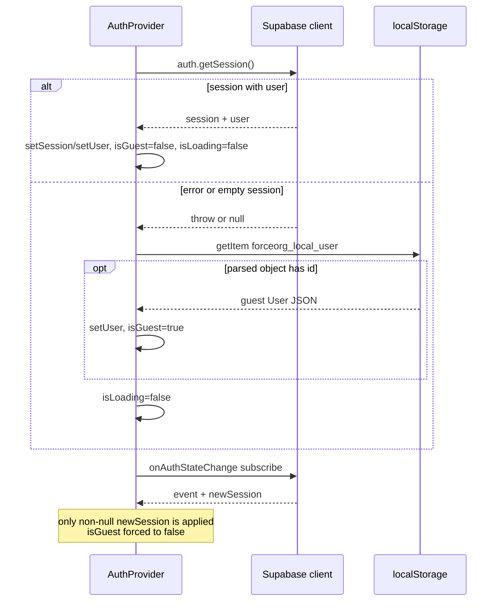

## Responsibility

`apps/web` is a Next.js 14 App Router SPA-style frontend (`next` ^14.2, React 18) that owns
everything the player touches: the dashboard, catalog, changelog, tabletop console and roster
studio. This page covers the shell that hosts those screens and the guest identity that makes
them work with no server at all. Data access from inside the shell is covered by
[API Client & Fallback Layer](./api-client-fallback-layer.md); the server-side counterpart of
the identity is [Authentication & Ownership](../api/authentication-and-ownership.md).

The defining design decision is **guest-first**: a visitor types a callsign and is immediately
productive. Supabase (email/password and Google OAuth) is a legacy, optional "cloud sync" path
that is expected to be unconfigured; every call into it is wrapped so that failure is silent and
the UI keeps working offline.

## Root shell: layout, error boundary, auth provider

`apps/web/src/app/layout.tsx` is the only Server Component in the route tree. It carries the
`metadata`/`viewport` exports (title, `/manifest.json`, theme colour `#0B3056`, `userScalable:
false`) and renders `
` around `<ErrorBoundary><AuthProvider>{children}`,
so **every route is inside both providers** and pages never mount their own auth wrapper.

- `ErrorBoundary` is a class component (`getDerivedStateFromError` + `componentDidCatch`) that
  logs `[ErrorBoundary] <error> <componentStack>` and swaps in a fallback UI with a "Try Again"
  button that only resets local state (`setState({ error: null })`) — it does not remount the
  route or reload. An optional `fallback` prop overrides the default UI; the same module also
  exports a non-boundary `InlineError` used inside pages.
- `AuthProvider` is a client component (`'use client'`) exporting `useAuth()`, which throws
  `useAuth must be used within an <AuthProvider>` when used outside the provider — the
  guarantee that any consumer of auth state lives under the root layout.
- Theming is *not* in the shell: each page mounts its own `ThemeProvider` from `@forceorg/ui-theme`
  around its content, driven by local `activeTheme` state and the `FactionSelector`.

## Route table

All six pages are `'use client'` modules; there is no `middleware.ts`, no route group, no
loading/error/not-found boundary file, and no server rendering of page content beyond the layout.

| Route | Module | Auth behaviour |
| --- | --- | --- |
| `/` | `src/app/page.tsx` (My Armies dashboard) | Gated: skeleton while `isLoading`, renders `<LoginPage />` inline when `!user` |
| `/login` | `src/app/login/page.tsx` | Redirects to `/` with `router.replace` once `!isLoading && user`; renders `null` while the redirect is pending |
| `/catalog` | `src/app/catalog/page.tsx` | Ungated — reachable with no session |
| `/changelog` | `src/app/changelog/page.tsx` | Ungated |
| `/army/[id]` | `src/app/army/[id]/page.tsx` (Tabletop Console, view mode) | Ungated; reads `useParams().id` and loads the roster |
| `/army/[id]/edit` | `src/app/army/[id]/edit/page.tsx` (Roster Studio, edit mode) | Ungated; debounced auto-save |

Because gating lives in the dashboard component rather than in the router, `/catalog`,
`/changelog`, `/army/*` render fully for anonymous visitors and rely on the API client's
localStorage fallbacks to have data. The dashboard's army cards are the only navigation into
the console (`href={/army/${army.id}}`) and studio (`href={/army/${army.id}/edit}`).

## Guest identity: signInAsGuest

`signInAsGuest(callsign?)` is synchronous and returns `void` — there is no await and no error
channel. Given an optional callsign it:

1. Normalises: `cleanCallsign = (callsign || 'Commander').trim() || 'Commander'`. The
   `LoginPage` Quick Launch form supplies `'Battle-Brother'` for an empty input, and the
   "Enter as Guest Commander instead" escape hatch inside an error banner supplies
   `'Commander'`.
2. Fabricates an object cast to Supabase's `User`: `app_metadata.provider = 'guest'`,
   `role/aud = 'authenticated'`, `user_metadata.callsign = cleanCallsign`, and
   `id = guest_<slug>_<suffix>` where the slug is the lowercased callsign with every
   non-`[a-z0-9]` character replaced by `_`, and the suffix is four characters of
   `Math.random().toString(36)` (base36, `slice(2, 6)`).
3. Sets `user`, `isGuest = true`, and writes the whole object to
   `localStorage['forceorg_local_user']`, swallowing write failures (private mode / quota).

Two consequences matter for persistence. The **email is deterministic** —
`<slug>@forceorg.local`, with no random part — while the **id is randomised on every call**, and
`api.ts` keys its roster mirror as `forceorg_rosters_<userId>`. So signing out and launching a
new guest session with the same callsign produces a different storage key and the previous
guest's rosters become unreachable (`getStoredRosters()` then re-seeds `DEFAULT_STARTER_ARMY`).
Guest sessions also never populate `session`; only `user` is set, so `getAuthToken()` still
returns `null` and API calls go out unauthenticated.

`signOut()` clears everything the guest path touched: `user`/`session`/`isGuest` state reset,
`localStorage.removeItem('forceorg_local_user')`, then `await supabase.auth.signOut()` inside its
own `try/catch`. It clears the identity only — the `forceorg_rosters_<userId>` payload stays on
disk under the old guest id.

## Session initialisation and lifecycle

On mount `AuthProvider` memoises one Supabase browser client (`useMemo(..., [])`) and runs
`initSession()`, then subscribes to `onAuthStateChange` and unsubscribes on cleanup:

Caption: Session bootstrap in `AuthProvider` — Supabase first, localStorage guest fallback, then the live listener.

Notable semantics and failure modes:

- `isLoading` starts `true` and only clears after the awaited `getSession()` resolves or throws,
  so the shell skeleton can be held open by a slow/unreachable Supabase host; there is no
  timeout. The localStorage read is guarded by `typeof window !== 'undefined'` plus
  try/catch, so SSR and blocked storage both degrade to "signed out".
- Stored JSON is trusted only if it parses **and** carries an `id`; otherwise the guest branch is
  skipped and the app starts signed out.
- The `onAuthStateChange` handler acts only when `newSession` is truthy. A Supabase `SIGNED_OUT`
  or `TOKEN_REFRESHED`-to-null event therefore leaves the previous `user` — including a restored
  guest — in place; explicit `signOut()` is the only way to clear it. Any real Supabase session
  also forces `isGuest = false`.
- `isGuest` is thus "this user object came from localStorage", not "no token": it is set by
  `signInAsGuest` and by a restored stored user, and cleared by `signOut` or by any Supabase
  session event. Nothing in `apps/web/src` currently reads `isGuest` — it is exposed on the
  context for consumers.

## Supabase as a legacy optional path

`src/lib/supabase.ts` is a four-line factory around `createBrowserClient` from `@supabase/ssr`,
reading `NEXT_PUBLIC_SUPABASE_URL || 'https://placeholder.supabase.co'` and
`NEXT_PUBLIC_SUPABASE_ANON_KEY || 'placeholder-anon-key'`. With no env configured the app is
still fully functional: the module header calls itself a "Legacy Auth Client" and the placeholder
host guarantees `getSession()` yields nothing usable rather than crashing at import time.

`AuthProvider` additionally wraps `getSession()` in try/catch and `signOut()` in try/catch, and
`api.ts` builds **its own** client per request inside `getAuthToken()`, collapsing any failure to
`null`. Every auth call site swallows, so "offline", "misconfigured" and "not signed in" are
indistinguishable to callers. `LoginPage` reflects the assumption in copy: cloud errors append
"Tip: You can also use Quick Launch below to start immediately," and a thrown exception becomes
"Cloud authentication server offline or unconfigured…".

## Build and PWA surface

`next.config.js` sets `reactStrictMode: true` (effects double-invoke in dev), transpiles the
workspace packages `@forceorg/types`, `@forceorg/ui-theme`, `@forceorg/rules-engine-11e` (matching
the `@forceorg/*` path aliases in `apps/web/tsconfig.json`), allows remote images from
`**.amazonaws.com` and `**.r2.cloudflarestorage.com`, and attaches headers to `/sw.js`:
`Cache-Control: no-cache, no-store, must-revalidate` and `Service-Worker-Allowed: /` so a
registered worker could control the whole origin.

The PWA assets exist — `public/manifest.json` (`start_url: /`, `display: standalone`) and a
12 KB `public/sw.js` that precaches `/`, `/catalog`, `/changelog` and opens an
`forceorg-offline` IndexedDB with `rosters`/`datasheets`/`stratagems`/`weapons` stores — but
**no code in `apps/web/src` registers it**: there is no `navigator.serviceWorker.register` or
`sw.js` reference anywhere in the app source. Offline behaviour in practice comes from the
localStorage mirror and per-page fallback fixtures, not the worker. The console page does use a
device API directly: it requests a screen `wakeLock` on mount and releases it on unmount so the
display stays awake during tournament play.

`Dockerfile.web` builds the workspace packages then `@forceorg/web` with
`ENV NEXT_PUBLIC_API_URL=http://localhost:4000/api` baked at build time and runs
`npm run start --workspace=@forceorg/web` on port 3000 as the `nextjs` user.

## Focused tests

`apps/web/e2e/critical-flows.spec.ts` (Playwright, `test:e2e`) drives the guest path as its
`beforeEach` for every journey: load `/`, expect "Instant Commander Access", fill
`input[placeholder*="Callsign"]`, click "Enter ForceOrg", then assert the dashboard header. Test
01 asserts the guest dashboard, tests 02–03 hit `/catalog` and `/changelog`, and test 04 follows a
Console link to `/army/<id>`. The config (`playwright.config.ts`) runs against
`npx next start -p 3456` with `reuseExistingServer: false` and `NEXT_PUBLIC_API_URL` defaulting to
`http://localhost:4000/api`, so the suite exercises the **fallback** behaviour (no Supabase env is
provided at all) rather than cloud auth.

## Extension notes

- Adding a route means adding a `'use client'` page under `src/app`; auth state is already
  available via `useAuth()`, but access control must be added per page since nothing in the
  router enforces it.
- Changing the guest identity shape touches three consumers at once: `AuthProvider`
  (writer), `api.ts#getLocalUserId()` (reads `.id` for storage keys), and the dashboard header
  (renders `user.user_metadata?.callsign ?? user.email?.split('@')[0]`). Changing how the id is
  generated orphans previously stored `forceorg_rosters_<userId>` data.
- Re-enabling real auth requires setting `NEXT_PUBLIC_SUPABASE_URL` / `NEXT_PUBLIC_SUPABASE_ANON_KEY`
  at **build** time (Next inlines `NEXT_PUBLIC_*`); see
  [Configuration & Env Vars](../operations/configuration-and-env-vars.md).
