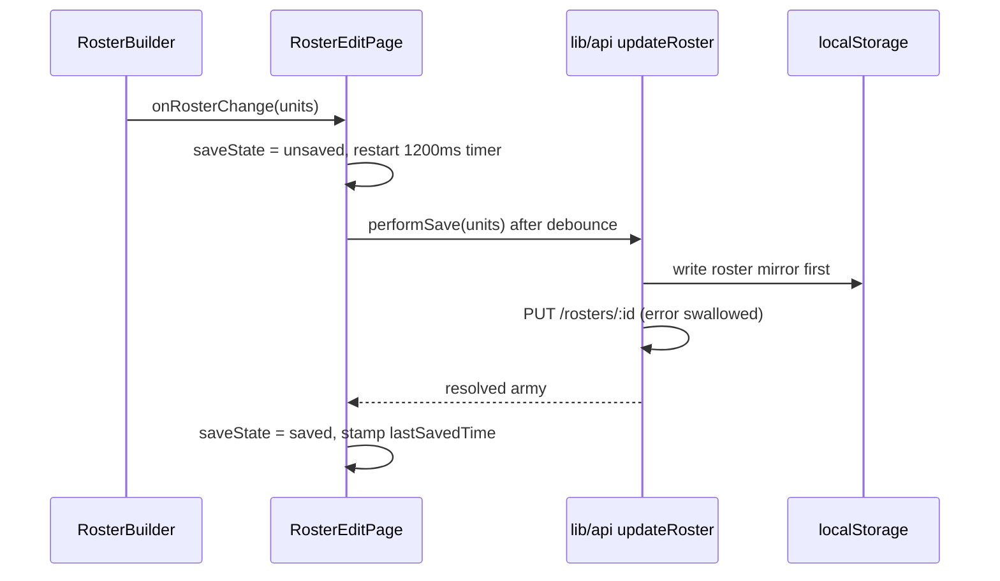
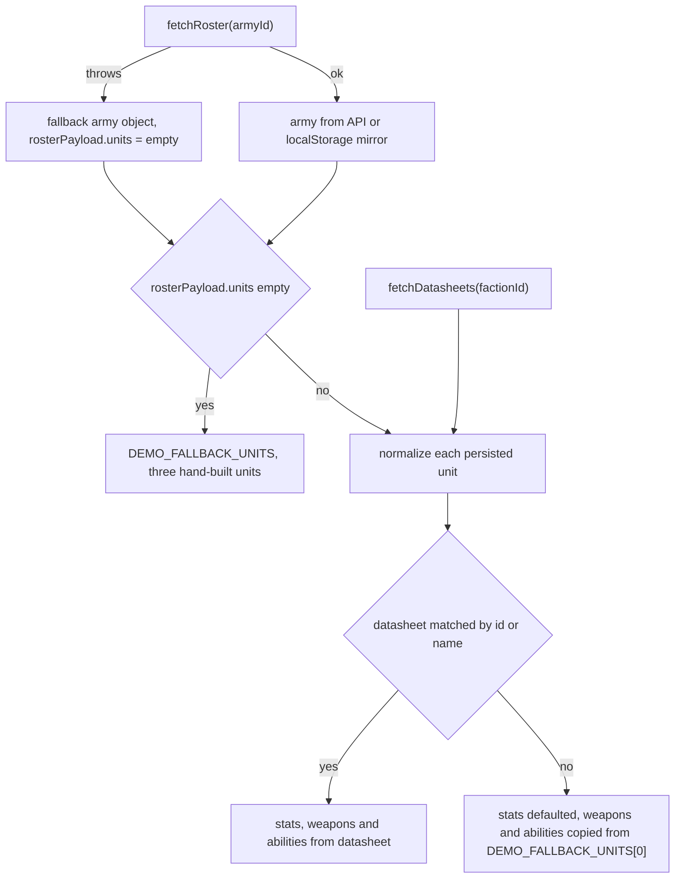

`apps/web` splits force construction and force play into two sibling client routes that share
components but never share state: `/army/[id]/edit` (the **Roster Studio**, edit mode) and
`/army/[id]` (the **Tabletop Console**, view mode). Both mount their own `ThemeProvider` and
`FactionSelector`, both mount a `ComplianceDashboard` modal, and both lean on hard-coded demo
fixtures so that a missing API, an empty roster or an unmapped datasheet still renders a
"working" screen. That last property is the single most important thing to know before changing
anything here: **several components cannot distinguish real data from fixture data at the UI
level**, and only two of them (RosterBuilder's catalog and StratagemPanel) admit it in the
interface at all.

Routing and the guest session that makes these pages reachable anonymously are covered by
[Web App Shell, Routing & Guest Session](./app-shell-and-guest-session.md); every fetch these
components perform goes through [`apps/web/src/lib/api.ts`](../../apps/web/src/lib/api.ts),
whose swallow-everything fallbacks are documented in
[API Client & Fallback Layer](./api-client-fallback-layer.md). The canonical rules these
components imitate (leader attachment, wound allocation, stratagem gating, wargear parsing)
live in `@forceorg/rules-engine-11e` — see
[Composite Units & Stratagem Filtering](../rules-engine/composite-units-and-stratagems.md),
[Wargear AST Compiler](../rules-engine/wargear-ast-compiler.md) and
[Roster Validation](../rules-engine/roster-validation.md).

## Component map

| Component | Hosted by | Owns | Data source of truth |
| --- | --- | --- | --- |
| `RosterBuilder` | `/army/[id]/edit` | roster unit list, catalog drawer, client-side validation, wargear AST preview | local `DEMO_CATALOG` unless `fetchDatasheets` returns rows |
| `ComplianceDashboard` | `/`, `/army/[id]`, `/army/[id]/edit` | rules-audit modal, verdict banner, discrepancy filtering | `auditRoster` result, else arithmetic over props |
| `CompositeUnitCard` | `/army/[id]` (twice) | datasheet display, wound-allocation matrix, miniature photo | `initialModels` / props only; nothing persists |
| `StratagemPanel` | `/army/[id]` (twice) | phase-filtered stratagem directory | `fetchStratagems`, else built-in `CORE_STRATAGEMS` |
| `PhotoUploadModal` | inside `CompositeUnitCard` | camera/file capture, upload, revert | `uploadMiniaturePhoto` / `deleteMiniaturePhoto` |
| `FactionSelector` | every page header | heraldry palette switch | `ALL_FACTION_PALETTES` (static) |
| `CreateArmyModal` | `/` | faction/detachment/name/size form → `createRoster` | hard-coded `FACTIONS` list |
| `Skeleton`, `ErrorBoundary`/`InlineError` | app-wide | loading and render-failure presentation | n/a |

The two pages also define the shapes that flow between them: `CatalogUnit` / `RosterUnit` are
exported from [`RosterBuilder.tsx`](../../apps/web/src/components/RosterBuilder.tsx#L17-L36)
and imported by the console for typing, so the builder's payload shape is effectively the
roster persistence contract even though `lib/api.ts` also accepts a leaner offline shape.

## Edit mode: the Roster Studio route

[`apps/web/src/app/army/[id]/edit/page.tsx`](../../apps/web/src/app/army/[id]/edit/page.tsx)
is the only writer of roster payloads. It renders `FullPageSkeleton` while `fetchRoster` is in
flight, and if that call rejects it **synthesises a complete Ultramarines army object**
("Ultramarines Strike Force", Gladius Task Force, 2000 pts) rather than showing an error
([#L53-L72](../../apps/web/src/app/army/[id]/edit/page.tsx#L53-L72)).

The save loop is debounce-based:

The edit route's debounced auto-save, including the branch where a failed PUT is still
reported as saved. Caption: `performSave` is also invoked directly by the "Save Now" button and
by `handleThemeChange`.

`performSave` recomputes `totalPoints` from `pointsCost` and `detachmentPointsUsed` from
`catalogUnit.dpCost`, then calls `updateRoster`
([#L86-L109](../../apps/web/src/app/army/[id]/edit/page.tsx#L86-L109)). Because
[`updateRoster`](../../apps/web/src/lib/api.ts#L327-L370) writes localStorage *before* the PUT
and swallows the PUT failure, and the page's own `catch` also sets `saveState = 'saved'`,
**the "✓ Saved" pill can be shown while the server never accepted the roster**. The header pill
and the "Save Now" button are therefore progress indicators, not durability guarantees.

Two details matter when editing this page:

- `currentUnitsRef` mirrors the latest unit array so manual save and theme-save can reach it,
  but the `ComplianceDashboard` is handed
  `currentPoints={currentUnitsRef.current.reduce(...)}`
  ([#L289](../../apps/web/src/app/army/[id]/edit/page.tsx#L289)). Reading a ref during render is
  not reactive, so the audit's point total can lag the editor by one render.
- `FactionSelector` here is the only place in the app where a heraldry choice is persisted:
  `handleThemeChange` calls `performSave`, which sends `factionThemeOverride`. The console,
  catalog and dashboard treat the same control as ephemeral local state, so their theme choice
  is lost on navigation.

The edit route's `<main>` uses `className="layout-edit"`, which has no rule in
[`globals.css`](../../apps/web/src/app/globals.css#L318-L333); the full-width single-column look
comes from the inner `gridColumn: '1 / -1'` section, not from that class.

## RosterBuilder: catalog, validation, wargear preview

[`RosterBuilder.tsx`](../../apps/web/src/components/RosterBuilder.tsx) is a single component plus
a private `WargearRuleCard`.

**Catalog is local first.** `catalog` initialises to `DEMO_CATALOG`, six Adeptus Astartes entries
with hand-written Wahapedia-style `wargearRulesRaw` prose
([#L40-L107](../../apps/web/src/components/RosterBuilder.tsx#L40-L107)), and `catalogSource`
starts as `'demo'`. `loadCatalog` calls `fetchDatasheets(factionId)` and only replaces the list
when the call returns a non-empty array; the mapping joins `wargearRules[].rawText` into a single
raw string and **falls back to the demo entry's prose, matched by name, whenever the API rows
carry none** ([#L158-L206](../../apps/web/src/components/RosterBuilder.tsx#L158-L206)). The
"● Live API Data" vs "○ Standby Catalog" badge
([#L389-L399](../../apps/web/src/components/RosterBuilder.tsx#L389-L399)) plus an `InlineError`
with a Retry button are the only degraded-data indicators of this kind in the app. While a
refresh is in flight the drawer renders six `Skeleton` rows instead of an empty grid.

**RosterBuilder is the only frontend consumer of the rules engine.** It imports
`compileWahapediaWargear` from `@forceorg/rules-engine-11e` and runs it over the *currently
expanded* unit's `catalogUnit.wargearRulesRaw`
([#L273-L278](../../apps/web/src/components/RosterBuilder.tsx#L273-L278)). Because the compiler is
pure and the memo keys on `expandedUnit`, ASTs are transient view state — nothing compiled is
persisted, and the compile happens against whatever prose the catalog happens to hold (API text
or demo text). The rules engine has no other frontend consumer:
[Composite Units & Stratagem Filtering](../rules-engine/composite-units-and-stratagems.md) and
[Roster Validation](../rules-engine/roster-validation.md) execute server-side only.

**Wargear choices are decorative.** `WargearRuleCard` keeps `selectedOption` in its own state and
toggles it on click ([#L657-L726](../../apps/web/src/components/RosterBuilder.tsx#L657-L726)).
Nothing writes back to `RosterUnit.wargearSelections`, `pointsCost`, or `validationErrors`, and
the card unmounts as soon as the row is collapsed, so a selection:

- never changes the displayed or saved point cost (`pointsCost` stays at `catalogUnit.basePoints`,
  set once in `addUnit`, [#L246-L260](../../apps/web/src/components/RosterBuilder.tsx#L246-L260)),
- is never included in the PUT body even though `RosterUnit` declares the field,
- is silently discarded on collapse or re-render.

**Validation is advisory.** The builder computes three conditions — points over limit, DP over
limit, and a Rule-of-Three check that flags more than three copies of any unit whose role is
neither `BATTLELINE` nor `DEDICATED_TRANSPORT`
([#L228-L243](../../apps/web/src/components/RosterBuilder.tsx#L228-L243)) — and renders them as a
red warning block that blocks nothing ([#L356-L372](../../apps/web/src/components/RosterBuilder.tsx#L356-L372)).
Adding, saving and navigating remain possible at any point total. Server-side validation is a
separate, stricter path ([Roster Validation](../rules-engine/roster-validation.md)).

`initialUnits` is re-seeded into local state through an effect keyed on the prop
([#L146-L150](../../apps/web/src/components/RosterBuilder.tsx#L146-L150)). The edit page supplies
`(army?.rosterPayload as any)?.units || []`, so any roster whose payload lacks a `units` array
hands the builder a fresh array identity on every render and the effect overwrites in-component
edits back to that empty list.

## The catalog browser

[`apps/web/src/app/catalog/page.tsx`](../../apps/web/src/app/catalog/page.tsx) repeats the same
pattern one level up: it renders immediately from `FALLBACK_CATALOG_DATASHEETS` (eight curated
datasheets, [#L17-L114](../../apps/web/src/app/catalog/page.tsx#L17-L114)) and only swaps in
server rows when `fetchDatasheets` returns a non-empty array, falling back again on throw
([#L137-L152](../../apps/web/src/app/catalog/page.tsx#L137-L152)). Note
[`fetchDatasheets` itself](../../apps/web/src/lib/api.ts#L162-L210) already returns a
three-datasheet fixture on failure, so the page's own fallback is normally reached only for an
empty success, and the "Standby Catalog"-style disclosure does not exist here at all — the demo
cards are indistinguishable from real ones.

Two structural limits are visible in the source and shape user expectations:

- `selectedFaction` is hard-coded to `'adeptus_astartes'`
  ([#L134](../../apps/web/src/app/catalog/page.tsx#L134)) and nothing ever calls its setter; the
  `FactionSelector` in the header changes the *theme* only. The catalog therefore always queries
  Astartes datasheets regardless of the heraldry chosen.
- The detail modal's primary action is a `<Link href="/">` labelled "Add to Army via Studio"
  ([#L546-L552](../../apps/web/src/app/catalog/page.tsx#L546-L552)) — the catalog cannot add a
  unit to a roster; unit acquisition happens only inside `RosterBuilder`.

## View mode: the Tabletop Console route

[`apps/web/src/app/army/[id]/page.tsx`](../../apps/web/src/app/army/[id]/page.tsx) resolves a
display list from three possible sources, with fixtures winning whenever real data is absent:

The console's data-resolution cascade, showing both places demo fixtures mask missing data.
Caption: `DEMO_FALLBACK_UNITS` supplies complete stats, models, weapons and abilities
([#L24-L103](../../apps/web/src/app/army/[id]/page.tsx#L24-L103)).

The two fixture entry points are:

1. **Empty payload ⇒ demo army.** `unitsList` returns `DEMO_FALLBACK_UNITS` whenever
   `rosterPayload.units` has length 0
   ([#L196-L200](../../apps/web/src/app/army/[id]/page.tsx#L196-L200)) — which is exactly what the
   route's own fetch-failure branch produces (a hard-coded army with `units: []` and
   `totalPoints: 355`, [#L164-L183](../../apps/web/src/app/army/[id]/page.tsx#L164-L183)). A real
   army that a user has emptied shows a Captain, a Terminator Squad and an Intercessor Squad.
2. **Unmatched datasheet ⇒ demo weapon and ability tables.** In the normalisation map, a unit
   with no matching datasheet keeps `weapons` and `abilities` from
   `DEMO_FALLBACK_UNITS[0]` ([#L263-L279](../../apps/web/src/app/army/[id]/page.tsx#L263-L279)),
   so an arbitrary unit renders the Captain's Relic Weapon and *Rites of Battle*.

Normalisation itself accepts both persisted unit shapes — the rich `catalogUnit` written by
`RosterBuilder` and the lean `{datasheetId, datasheetName, modelCount}` shape written by
`lib/api.ts` in guest mode — and derives `ModelHealth` from the composition
([#L219-L262](../../apps/web/src/app/army/[id]/page.tsx#L219-L262)). Two heuristics there are
load-bearing and wrong for many datasheets: `isLeader` is a substring test for
"sergeant"/"captain"/"leader" in the model name, and `maxWounds` is
`(dsStats.wounds || dsStats.toughness || 4) > 5 ? 3 : 2`, so a 12-wound vehicle is tracked as a
3-wound model. Wound allocation in play is specified canonically in
[Composite Units & Stratagem Filtering](../rules-engine/composite-units-and-stratagems.md); the
console does not use that code.

The console also requests a **screen wake lock** on mount and releases it on unmount, with a
header toggle; a denied or unsupported request is ignored
([#L119-L144](../../apps/web/src/app/army/[id]/page.tsx#L119-L144)).

Finally, the console renders exactly two layout containers, `layout-desktop` and `layout-mobile`,
while [`globals.css`](../../apps/web/src/app/globals.css#L318-L333) hides `.layout-desktop` below
1280px **and** hides `.layout-mobile` in the 768–1279px band (where `.layout-tablet` is the
visible class). The route never renders a `.layout-tablet` element, so on tablet-width
viewports the console's main content is `display: none`.

## CompositeUnitCard: wounds, abilities, photos

[`CompositeUnitCard.tsx`](../../apps/web/src/components/CompositeUnitCard.tsx) is presentation
plus local gameplay state.

**Wound tracking.** The card is seeded from `initialModels: ModelHealth[]`
([#L35-L41](../../apps/web/src/components/CompositeUnitCard.tsx#L35-L41)) into `useState`
([#L87](../../apps/web/src/components/CompositeUnitCard.tsx#L87)) with **no sync effect**, so
recomputing the list upstream (changing unit selection, refetching datasheets) will not reset an
already-mounted card. `handleWoundDelta` clamps each model to `0..maxWounds`, disables the `−`
button at 0 and the `+` button at max, renders a destroyed row as `DESTROYED` instead of a bar,
and colours the bar by remaining fraction (>50% glow, >25% amber, else red)
([#L102-L113](../../apps/web/src/components/CompositeUnitCard.tsx#L102-L113),
[#L217-L269](../../apps/web/src/components/CompositeUnitCard.tsx#L217-L269)). Leader models are
distinguished only by the `isLeader` flag (star glyph plus a CSS variant), not by separate logic.
Haptics come from `navigator.vibrate` — a 12 ms pulse for a wound, a `[25, 40, 25]` pattern when a
model reaches 0 — and both the haptic call and the `onModelWoundChange` callback fire *inside the
`setModels` updater*, so they run as part of state computation and can double-fire under
double-invoked renders.

**Nothing is persisted.** The console does not pass `onModelWoundChange`, and it mounts the card
twice (desktop and mobile containers), each with independent state
([#L494-L507](../../apps/web/src/app/army/[id]/page.tsx#L494-L507),
[#L543-L582](../../apps/web/src/app/army/[id]/page.tsx#L543-L582)). Wound state is therefore
per-copy, per-visit: switching unit, resizing the viewport or navigating away discards it, and
damage applied in one layout copy is invisible in the other. The footer's stratagem count is a
literal `availableStratagemsCount={6}` at both call sites, not a computed value.

**Two photo paths exist; only one is wired.** The rendered flow is lightbox →
`PhotoUploadModal` → `uploadMiniaturePhoto`/`deleteMiniaturePhoto` from `lib/api`
([#L354-L412](../../apps/web/src/components/CompositeUnitCard.tsx#L354-L412)); the media endpoint
and storage side are described in
[Media Upload & Object Storage](../api/media-upload-and-object-storage.md). The component also
contains an unused `handleCustomPhotoUpload` / `handleRevertToDefault` pair that `fetch`es the
relative path `/api/rosters/:id/units/:instanceId/media`
([#L115-L140](../../apps/web/src/components/CompositeUnitCard.tsx#L115-L140)) — a URL that
bypasses `API_BASE` and would hit the Next.js origin, where no such route handler exists. Its
`fileInputRef` is never attached to a rendered input, confirming it is dead code; do not treat it
as the integration point.

The card's `canonicalImageUrl` at both console call sites is
`/assets/models/default_placeholder.webp`, and `apps/web/public/` contains no such asset, so the
`` renders a broken frame — the `ChapterIcon` placeholder branch is only reached when the
prop is empty, and the `onError` handler clears `customImage`, which is already null.

[`PhotoUploadModal.tsx`](../../apps/web/src/components/PhotoUploadModal.tsx) validates client-side
(`image/*` MIME prefix and a 10 MB ceiling, [#L45-L59](../../apps/web/src/components/PhotoUploadModal.tsx#L45-L59)),
supports drag-and-drop, a gallery picker and a `capture="environment"` camera input. On upload
failure it does not surface the error: it keeps the `URL.createObjectURL` preview, shows the
success banner and calls `onPhotoUpdated(previewUrl)`
([#L70-L98](../../apps/web/src/components/PhotoUploadModal.tsx#L70-L98)). The card then displays a
blob URL that cannot survive a reload, while the console's `onCustomPhotoChange` records it only
in local `army` state (mobile copy only). The revert path is more honest —
`deleteMiniaturePhoto` failures are logged, and the UI resets regardless
([#L100-L112](../../apps/web/src/components/PhotoUploadModal.tsx#L100-L112)).

## StratagemPanel: phase tabs and the CORE fallback

[`StratagemPanel.tsx`](../../apps/web/src/components/StratagemPanel.tsx) begins with a **duplicated
`'use client'` directive** (lines 6 and 8) — harmless but a real artifact of the file, and a hint
that the module was pasted rather than derived.

It renders a phase dock of `ANY / COMMAND / MOVEMENT / SHOOTING / CHARGE / FIGHT`
([#L16-L23](../../apps/web/src/components/StratagemPanel.tsx#L16-L23)) and loads only when
`isOpen` flips true ([#L96-L100](../../apps/web/src/components/StratagemPanel.tsx#L96-L100));
the console passes `isOpen={true}` unconditionally, so each mounted panel fetches on mount.
Loading renders four `Skeleton` rows.

The fallback ladder is the important part:

- `loadStratagems` calls `fetchStratagems({ detachmentId })`; a non-empty array becomes
  `source = 'api'`, anything else installs `CORE_STRATAGEMS` (seven hard-coded core stratagems,
  [#L36-L44](../../apps/web/src/components/StratagemPanel.tsx#L36-L44)) with `source = 'default'`
  ([#L65-L94](../../apps/web/src/components/StratagemPanel.tsx#L65-L94)).
- [`fetchStratagems` in `lib/api.ts`](../../apps/web/src/lib/api.ts#L224-L239) already catches its
  own errors and returns `[]`, so an unreachable API normally lands in the *empty-array* branch —
  the demo set is installed with no `error` set, and the `InlineError` notice (rendered only when
  `error && source === 'default'`) rarely appears. The visible signal that you are reading built-in
  data is the amber "○ Core Rules" badge.
- Filtering: a stratagem passes the phase test if `activePhase === 'ANY'` or its phase is `ANY` or
  matches; a stratagem with `requiredKeywords` passes only if the unit carries **at least one** of
  them, case-insensitively
  ([#L110-L125](../../apps/web/src/components/StratagemPanel.tsx#L110-L125)). Detachment
  stratagems supplied via `detachmentStratagems` are appended with id-based de-duplication
  ([#L102-L108](../../apps/web/src/components/StratagemPanel.tsx#L102-L108)) — but no caller in
  `apps/web` passes that prop, so detachment stratagems can only arrive through the API, and the
  desktop panel and the mobile overlay each maintain their own copy of everything.

The server-side phase/keyword/detachment gate that this UI approximates lives in
`stratagem-filter.ts` ([Composite Units & Stratagem Filtering](../rules-engine/composite-units-and-stratagems.md)).

## ComplianceDashboard: server audit first, arithmetic second

[`ComplianceDashboard.tsx`](../../apps/web/src/components/ComplianceDashboard.tsx) owns the
"Rules Audit" modal mounted by the dashboard, the console and the studio.

`runAudit` fires whenever `isOpen` becomes true and on every Re-Audit click. It calls
`auditRoster(rosterId)`; only if that **throws** does it compute a client-side audit from props,
emitting a `POINTS_SHIFT` RED discrepancy when `currentPoints > pointsLimit` and a `DP_VIOLATION`
RED discrepancy when `currentDp > dpLimit`, stamped with a hard-coded
`rulesetVersionCompared: '11.1.0-2026-Q3-MFM'`
([#L41-L86](../../apps/web/src/components/ComplianceDashboard.tsx#L41-L86)). In practice this
fallback is rarely reached for the same reason as the stratagems:
[`auditRoster`](../../apps/web/src/lib/api.ts#L390-L419) catches its own failure and returns a
synthesised result computed from the localStorage roster, so the component normally displays
*some* verdict even with no server at all — and the ruleset label it shows then comes from the
API client's fixture, not from a comparison the component performed.

Presentation logic:

- `isFullyCompliant = discrepancies.length === 0`; `isBattleLegal = redViolations.length === 0`.
  Three banners follow — "Battle-Ready (100% Compliant)", "Legal With Advisory Warnings",
  "Illegal Roster — Action Required" — driven by `RED` vs `AMBER` severity
  ([#L160-L226](../../apps/web/src/components/ComplianceDashboard.tsx#L160-L226)). Only the
  component's own fallback produces RED; advisory AMBER items can only come from the server.
- Summary tiles (Violations, Advisories, Points Limit, DP Quota) and category tabs
  `ALL / POINTS_SHIFT / DP_VIOLATION / INVALID_LOADOUT`
  ([#L256-L283](../../apps/web/src/components/ComplianceDashboard.tsx#L256-L283)) filter locally.
- The "⚡ Sync Active Points (1-Click)" action renders only when there is at least one
  `POINTS_SHIFT` discrepancy **and** `onAutoFixPoints` is supplied
  ([#L369-L381](../../apps/web/src/components/ComplianceDashboard.tsx#L369-L381)). No call site in
  the app passes that prop, so the fix button is unreachable today, `handleApplyFix` never runs,
  and the `updateRoster` import at the top of the file
  ([#L9](../../apps/web/src/components/ComplianceDashboard.tsx#L9)) is unused.
- Callers differ in what they feed it: the dashboard passes payload totals
  (`totalPoints`, `detachmentPointsUsed`), the console passes its computed `totalPoints` and omits
  DP entirely (so `currentDp` defaults to 0 and the DP tile shows `0 / 3`), and the studio passes
  a ref-derived total.

## Loading and failure conventions

The app has no route-level `loading.tsx`/`error.tsx`/`not-found.tsx` files
([Web App Shell](./app-shell-and-guest-session.md)); the convention is component-local:

- [`Skeleton.tsx`](../../apps/web/src/components/Skeleton.tsx) exports the primitive plus three
  presets. `FullPageSkeleton` is the route-level loading state used by the dashboard (during auth),
  the studio and the console; RosterBuilder and StratagemPanel instead render grids/lists of the
  primitive sized to their real rows. `UnitCardSkeleton` and `RosterListSkeleton` are exported but
  have no call sites.
- [`ErrorBoundary.tsx`](../../apps/web/src/components/ErrorBoundary.tsx) is mounted once in the
  root layout; its "Try Again" button only clears the stored error, and it catches render errors,
  not fetch errors. `InlineError` is the fetch-degradation primitive and is used in exactly two
  places: RosterBuilder's catalog notice and StratagemPanel's core-rules notice — both alongside a
  working fallback, never instead of it.
- Consequently **no page in this surface has a failure state**: every fetch failure is converted
  into fixture data plus a `console.warn`, which is why the Playwright suite can assert on Captain
  in Terminator Armour and a "Battle-Ready"-class audit verdict with the API offline
  ([`e2e/critical-flows.spec.ts#L56-L89`](../../apps/web/e2e/critical-flows.spec.ts#L56-L89)).

## Force creation entry point

[`CreateArmyModal.tsx`](../../apps/web/src/components/CreateArmyModal.tsx) is the only writer of
roster metadata before the studio exists. Its `FACTIONS` constant
([#L28-L108](../../apps/web/src/components/CreateArmyModal.tsx#L28-L108)) hard-codes four
factions with their detachment lists and subfaction theme keys — none of it is fetched — and
changing faction resets the subfaction, detachment and generated army name
([#L128-L142](../../apps/web/src/components/CreateArmyModal.tsx#L128-L142)). Submission always
sends `detachmentPointsLimit: 3` and one of 1000/2000/3000 points; if `createRoster` throws (it
rarely can — it synthesises a local army itself), the modal builds its own `army_<timestamp>`
object and navigates to `/army/<id>/edit` anyway
([#L144-L190](../../apps/web/src/components/CreateArmyModal.tsx#L144-L190)). The result is that a
"created" army may exist only in one browser's localStorage while the UI behaves as if it is a
server resource; the studio and console then load it through the same localStorage path.

## Working rules for changes here

- Treat `DEMO_CATALOG`, `FALLBACK_CATALOG_DATASHEETS`, `DEMO_FALLBACK_UNITS`, `CORE_STRATAGEMS`,
  `FACTIONS` and the fixtures inside `lib/api.ts` as **six separate sources of the same facts**.
  Any change to points, stats or wargear prose must be made in all of them or the UI will show
  contradictory values with no error.
- To make wargear selections real, `WargearRuleCard` must lift state into `RosterUnit` and reprice
  `pointsCost` — the AST it renders is already correct
  ([Wargear AST Compiler](../rules-engine/wargear-ast-compiler.md)).
- To make wound tracking real, the console must own the model list, pass `onModelWoundChange`,
  derive `maxWounds` from the datasheet's actual `wounds`, and mount one card instead of two.
- To make the audit fix actionable, pass `onAutoFixPoints` from each host page; the component is
  otherwise a read-only report with an unused import.
