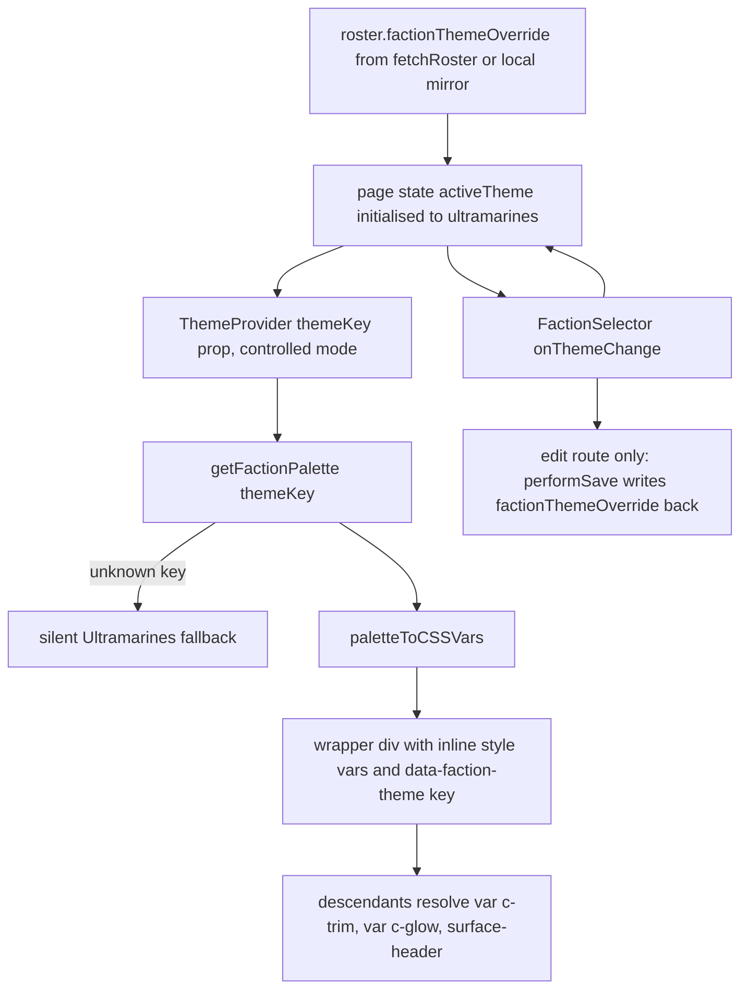
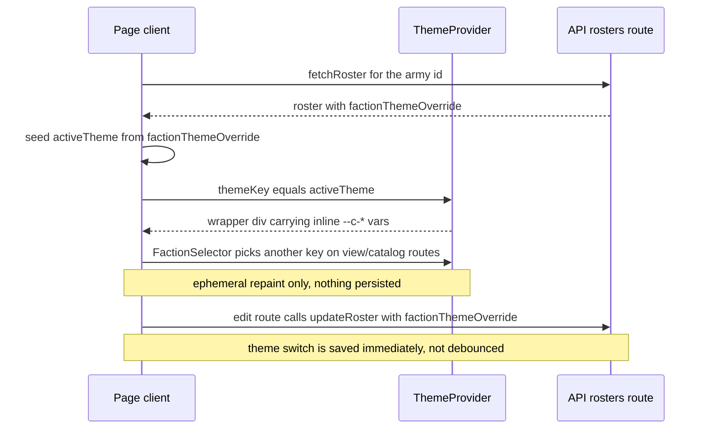

`@forceorg/ui-theme` (`packages/ui-theme`) is the single place in ForceOrg-40k that knows what a faction
*looks* like. It owns three things and nothing else: a registry of ~56 five-channel colour palettes, a
registry of 13 Space Marine chapter vector insignia, and one React component (`ThemeProvider`) that maps a
theme **key** onto CSS custom properties so that the rest of the app can be written entirely against
`var(--c-*)` and never mention a faction again. It is the only shared UI package in the monorepo, and
`apps/web` is its only consumer.

Contract-level definitions live in `@forceorg/types` — see
[Shared Contracts: Types, Envelope, Ruleset Versions](../architecture/shared-contracts.md). How the roster
payload that carries the theme key is persisted is covered in
[Data Model & Migrations](../data/data-model-and-migrations.md); the components that consume this package on
screen are inventoried in
[Roster Builder, Composite Unit Card & Console Components](./console-and-builder-components.md).

## Public API

[`packages/ui-theme/src/index.ts`](../../packages/ui-theme/src/index.ts) is a flat barrel — there are no
subpath exports, and consumers import everything from the package root:

| Export | Kind | Purpose |
| --- | --- | --- |
| `ThemeProvider`, `useTheme`, `ThemeProviderProps`, `ThemeContextValue` | React | key → CSS custom-property injection |
| `getFactionPalette`, `paletteToCSSVars` | pure functions | key → palette, palette → var map |
| `SPACE_MARINE_PALETTES`, `CHAOS_PALETTES`, `XENOS_PALETTES`, `ALL_FACTION_PALETTES` | data | palette registry |
| `ChapterIcon`, `ChapterIconProps`, `ChapterKey` | React | chapter insignia |
| `CHAPTER_PATHS` | data | heraldry registry |

The package declares `main`/`types` as `./src/index.ts`, not `dist/`, and its only runtime dependency is
`@forceorg/types` with `react`/`react-dom` as **peer** dependencies. `apps/web` consumes it source-first: its
`tsconfig.json` maps `@forceorg/ui-theme` to `../../packages/ui-theme/src` and `next.config.js` lists the
package in `transpilePackages`. Consequence: editing palette or icon data takes effect on the next web build
without running the package's own `tsc` build; `dist/` exists only for the `build`/`lint` scripts.

`ThemeProvider.tsx` carries a `'use client'` directive, so the package is React-coupled and cannot be imported
from `apps/api` or `apps/sync-worker`. `ChapterIcon.tsx` has no directive of its own and is only ever rendered
from client components in practice.

## The `FactionPalette` contract

Defined in [`packages/types/src/index.ts#L239-L247`](../../packages/types/src/index.ts#L239-L247):

```ts
export interface FactionPalette {
  key: string;        // theme key == roster.factionThemeOverride
  name: string;       // human label used by FactionSelector
  primary: string;    // channel 1 — armour / hero colour
  secondary: string;  // channel 2 — trim-adjacent dark field
  trim: string;       // channel 3 — edging, headings, borders
  detail: string;     // channel 4 — small accents
  glow: string;       // channel 5 — focus rings, progress, hover glow
}
```

`key` is the only load-bearing field: it is simultaneously the registry lookup key, the value stored on the
army row, and the `themeKey` passed to `ThemeProvider`. `name` is display-only. Colours are plain CSS hex
strings — nothing validates their format, and there is no contrast or accessibility check. The source comments
call this the "Dawn of War 4-channel" system (§8.1) even though the interface carries five colour fields.
The `detail` channel is the odd one out: `--c-detail` is injected and declared but never read through `var()`
by any stylesheet, and reaches the screen only as a literal swatch stripe in `FactionSelector`
([`FactionSelector.tsx#L155-L159`](../../apps/web/src/components/FactionSelector.tsx#L155-L159)).

The registry in
[`palettes/factions.ts`](../../packages/ui-theme/src/palettes/factions.ts) is three hand-maintained arrays —
13 Adeptus Astartes chapters, 14 Chaos factions (including the four Chaos Daemon engines, keyed
`chaos_daemons_*`), and 29 Xenos subfactions whose keys carry an alphanumeric namespace prefix
(`necrons_szarekhan`, `tau_tau_sept`, `aeldari_ulthwe`, `orks_goffs`, `gsc_four_armed`, `votann_gtl`) —
spread into `ALL_FACTION_PALETTES`. Xenos/Chaos keys are prefixed precisely because a subfaction, not a
faction, selects a palette: `CreateArmyModal`'s hard-coded `FACTIONS` list re-declares those same keys as
`subfactions[].key` and `defaultTheme`
([`CreateArmyModal.tsx#L28-L108`](../../apps/web/src/components/CreateArmyModal.tsx#L28-L108)).

`getFactionPalette(key)` never throws: an unknown key silently returns `SPACE_MARINE_PALETTES[0]`, i.e.
Ultramarines. A typo in the database therefore degrades to the house palette rather than surfacing an error.

## `paletteToCSSVars`: what actually gets themed

[`paletteToCSSVars`](../../packages/ui-theme/src/palettes/factions.ts#L105-L118) emits ten custom properties
per palette:

- `--c-primary`, `--c-secondary`, `--c-trim`, `--c-detail`, `--c-glow` — the five channels verbatim.
- `--surface-header` — a derived `linear-gradient(135deg, primary 0%, secondary 100%)`.
- `--surface-card` — the `secondary` channel reused as a flat surface.
- `--surface-border` — `trim` with a hard-coded `33` hex-alpha suffix appended, i.e. 20 % trim.
- `--text-primary` `#F8FAFC` and `--text-secondary` `#94A3B8` — **fixed**, not palette-derived.

Two consequences matter when changing this function. First, text colour is deliberately palette-independent,
so no faction can break legibility but no palette can be light-on-dark either; there is no dark/light mode in
this system at all, only faction hue. Second, `--surface-header` is re-derived here even though
`globals.css` also defines it, because `:root`'s definition is `var(--c-primary)`-based and would otherwise
keep its Ultramarines substitution for descendants — overriding `--c-primary` deeper in the tree does not
rewrite an already-substituted inherited custom property.

Consumers read those vars rather than the palette object. `globals.css` styles headings, borders, focus
outline and progress bars via `var(--c-trim)` / `var(--c-glow)`
([`globals.css#L96-L151`](../../apps/web/src/app/globals.css#L96-L151)), and
`CompositeUnitCard.module.css` uses fallback-bearing references such as `var(--c-trim, #c89d3c)` and
`var(--surface-header, linear-gradient(...))`
([`CompositeUnitCard.module.css#L41-L61`](../../apps/web/src/components/CompositeUnitCard.module.css#L41-L61)),
so the card still renders in Ultramarines when mounted outside a provider.

## `ThemeProvider`: control flow and the wrapper div



*Caption: the theme key's round trip from persisted roster field to CSS custom properties, and back on the edit route.*

[`ThemeProvider.tsx`](../../packages/ui-theme/src/ThemeProvider.tsx) supports both control modes:

```tsx
const [internalThemeKey, setInternalThemeKey] = useState(controlledThemeKey ?? defaultTheme);
const themeKey = controlledThemeKey ?? internalThemeKey;
```

An uncontrolled provider takes `defaultTheme` (default `'ultramarines'`) and can be switched through the
context's `setTheme`. A provider given `themeKey` is fully controlled and **`setTheme` becomes inert** —
`setInternalThemeKey` still runs, but the derived `themeKey` keeps ignoring internal state. Every route in
`apps/web` uses controlled mode (`<ThemeProvider themeKey={activeTheme}>` in `/`, `/army/[id]`,
`/army/[id]/edit`, `/catalog`, `/changelog`), so the authoritative theme owner is each page's own
`useState('ultramarines')`, and `setTheme` is only a no-op-shaped extension point for future uncontrolled
hosts.

`useTheme()` throws `'useTheme must be used within a <ThemeProvider>'` when called outside a provider — the
package's only hard failure. Notably it has **zero call sites in `apps/web`**: pages never read the palette
through React context, they read it through CSS. `palette`/`cssVars` on the context value are exported for
consumers who need literal colour strings, and `FactionSelector` bypasses the context entirely by importing
`ALL_FACTION_PALETTES` directly.

The provider renders a plain `<div data-faction-theme={themeKey} style={cssVars}>` around its children. Two
things follow:

1. **The real theming mechanism is CSS custom-property inheritance from an inline style.** The wrapper is a
   block element that introduces no class or layout constraint; everything inside it resolves `var(--c-*)`
   against the palette, and everything outside falls back to `:root`.
2. **`data-faction-theme` is currently a debugging/inspection hook, not a styling hook.** A repo-wide search
   finds it emitted in exactly one place and selected nowhere — no stylesheet in the monorepo keys off
   `[data-faction-theme]` or per-faction attribute selectors. Any future faction-specific *layout* rules
   would be the first consumer of that attribute.

Because `globals.css` is imported by the root layout and its `:root` block hard-codes the same Ultramarines
values the provider would inject (`--c-primary: #0B3056`, `--c-trim: #C89D3C`, …), markup rendered outside any
provider is visually identical to an Ultramarines-themed subtree. That is why pages also render correctly
before the roster fetch resolves.

## Chapter heraldry

[`chapters/paths.ts`](../../packages/ui-theme/src/chapters/paths.ts) declares
`CHAPTER_PATHS: Record<string, ChapterPathDefinition>` with exactly the 13 Adeptus Astartes chapters that
also have palettes. The type comes from `@forceorg/types`
([`index.ts#L249-L253`](../../packages/types/src/index.ts#L249-L253)):

```ts
export interface ChapterPathDefinition {
  name: string;                                   // used for aria-label
  viewBox: string;                                // every badge is '0 0 100 100'
  paths: { d: string; fill?: string; opacity?: number }[];
}
```

Multi-subpath badges (Blood Angels, Dark Angels, Deathwatch, Grey Knights, Blood Ravens) are separate
`paths[]` entries rather than one compound `d`; per-path `fill`/`opacity` allow two-tone heraldry but no
entry in the registry currently sets them, so every path inherits the component `color`.

`ChapterIcon` renders an accessible `<svg role="img" aria-label="{name} Chapter Insignia">` with class
`chapter-icon chapter-icon--{chapter}`, `width`/`height` from `size` (default `24`), and `fill={color}`
(default `currentColor`). Behaviour worth knowing before you use it:

- **`chapterKey` wins over `chapter`** when both are passed (`chapterKey || chapter`), and the value is
  looked up as-is with no normalisation.
- **An unknown key renders `null`**, not a placeholder badge and not a console warning. Because the registry
  covers only the 13 chapters, every Chaos and Xenos theme key — the majority of `ALL_FACTION_PALETTES` —
  produces no icon at all. `FactionSelector` guards explicitly with `palette.key in CHAPTER_PATHS` before
  rendering an icon ([`FactionSelector.tsx#L124-L164`](../../apps/web/src/components/FactionSelector.tsx#L124-L164));
  pages that pass `chapterKey={activeTheme}` straight into a header do not, so a Chaos roster simply loses
  its header badge.
- **`ChapterKey` provides no type safety.** It is `keyof typeof CHAPTER_PATHS`, and since the record is
  annotated `Record<string, ChapterPathDefinition>`, `ChapterKey` collapses to `string`. Passing a
  nonexistent key compiles everywhere and fails only as a silent `null`.
- **`isWatermark` switches to parent-relative sizing**: `width`/`height` are dropped and the icon is
  absolutely positioned at `right: -5% / bottom: -10%`, sized `70% × 70%`, `z-index: 0`,
  `pointer-events: none`, and `opacity: var(--badge-watermark-opacity, 0.06)`. `CompositeUnitCard` uses
  exactly this to bleed the chapter badge behind each unit card
  ([`CompositeUnitCard.tsx#L146-L151`](../../apps/web/src/components/CompositeUnitCard.tsx#L146-L151)),
  relying on the card's own `position: relative` and `.cardContent { z-index: 1 }`. That opacity token is
  defined in `globals.css` (`:root { --badge-watermark-opacity: 0.06 }`), so the watermark is a consumer of
  the same CSS-var channel as colours — and, like `size`, is overridden per-instance by `style`.

## Persistence: `factionThemeOverride` is the selection

The theme a given force displays is `roster.factionThemeOverride`, a nullable `VarChar(50)` on `UserArmy`
([`schema.prisma#L262`](../../packages/db-client/prisma/schema.prisma#L262)) mirrored as
`factionThemeOverride?: string | null` on the `UserArmy` type. There is no theme table and no foreign key:
the column is a free-text palette key, and `POST /api/rosters` / `PUT /api/rosters/:id` forward
`req.body.factionThemeOverride` to Prisma without validating it against `ALL_FACTION_PALETTES`
([`rosters.ts#L56-L123`](../../apps/api/src/routes/rosters.ts#L56-L123)). Validation exists nowhere in the
stack; `getFactionPalette`'s fallback is the only safety net.



*Caption: load, local switching and the edit route's immediate write-back of the theme key.*

The write-back asymmetry is deliberate and easy to break. `/army/[id]/edit` calls
`handleThemeChange`, which sets state **and** fires `performSave` with the current units, so
`factionThemeOverride: activeTheme` is persisted on the next tick rather than waiting for the 1200 ms roster
debounce ([`edit/page.tsx#L86-L133`](../../apps/web/src/app/army/[id]/edit/page.tsx#L86-L133)). The console,
catalog, changelog and dashboard routes pass `setActiveTheme` straight to `FactionSelector` and persist
nothing: on those pages a palette switch is a personal, per-session preference, and the offline/guest
armies in `lib/api.ts` keep `factionThemeOverride: null` unless a create call supplied one
([`lib/api.ts#L292-L350`](../../apps/web/src/lib/api.ts#L292-L350)). The dashboard additionally falls back
per-card with `army.factionThemeOverride || activeTheme`, so unthemed armies inherit the page theme for their
badge while the page itself is themed by whatever was last selected
([`page.tsx#L277-L291`](../../apps/web/src/app/page.tsx#L277-L291)).

## Extension points and dead parallel styles

**Adding or retuning a faction** means editing `palettes/factions.ts` (and `chapters/paths.ts` if the faction
should get a badge). Nothing else needs to change for `FactionSelector`, the swatch preview and every themed
page to pick it up, since all of them enumerate `ALL_FACTION_PALETTES`. `CreateArmyModal`'s `FACTIONS` list is
the exception: its `subfactions[].key` / `defaultTheme` strings must match palette keys by hand, so a palette
added there alone is never selectable at creation time.

**Unused duplicate stylesheets.** `packages/ui-theme/src/styles/tokens.css` and
`src/styles/composite-unit-card.css` are complete, coherent stylesheets in the same visual language as the
app, but neither is exported from `index.ts` nor imported anywhere in the monorepo. The app's real token
source is `apps/web/src/app/globals.css`, and the real card styling is
`CompositeUnitCard.module.css`, both of which closely (and now separately) restate the same tokens. Editing
`tokens.css` has no effect on any screen — a trap for anyone assuming the package owns global tokens.

**Practical invariants to preserve:**

- Keep `FactionPalette.key`, the value written to `factionThemeOverride`, and the `themeKey` prop in one
  namespace, and keep DB-side strings within the `VarChar(50)` budget; over-long keys are a persistence
  failure, not a theme miss.
- Keep `paletteToCSSVars` emitting *all* derived `--surface-*` properties it derives; any new
  `:root` custom property built from `var(--c-*)` needs a palette-derived twin, or nested theming will not
  reach it.
- Prefer guarded icon usage (`key in CHAPTER_PATHS`) over trusting `ChapterKey`; treat the unknown-key `null`
  return as the designed failure mode.
- If you mount themed content that must also work unthemed, use the module-CSS fallback idiom
  `var(--c-trim, <ultramarines hex>)`.
