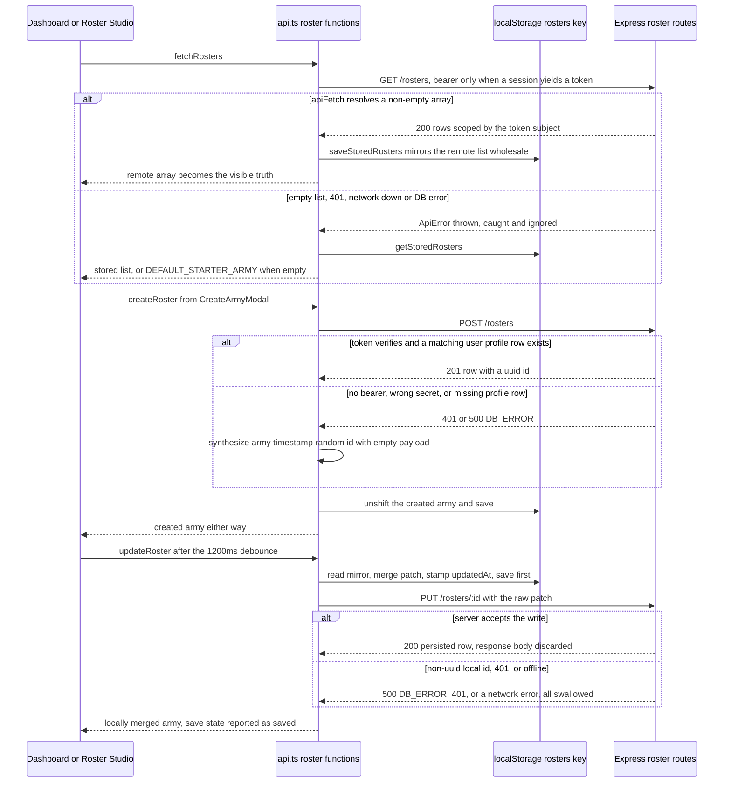

A roster lives in two places at once, and only one of them is guaranteed to be
written. [`apps/web/src/lib/api.ts`](../../apps/web/src/lib/api.ts) treats the
browser key `forceorg_rosters_<userId>` as the authoritative store and every
`/api/rosters` call as a best-effort mirror: reads write the server response
into storage, writes land in storage *before* the network and survive its
failure. `apps/api/src/routes/rosters.ts` owns the Postgres side
(`user_armies`), scoped by the `userId` stamped from the verified JWT. This page
traces the control flow across those three layers; the per-function fallback
catalog lives in [API Client Fallback Layer](../webapp/api-client-fallback-layer.md),
the middleware contract in [Authentication & Ownership](../api/authentication-and-ownership.md),
and the schema in [Data Model & Migrations](../data/data-model-and-migrations.md).

## Participants and boundaries

| Layer | Owner | Durable state |
| --- | --- | --- |
| Roster Studio / dashboard | `apps/web/src/app/army/[id]/edit/page.tsx`, `apps/web/src/app/page.tsx` | in-memory `army` state, debounce timer, save pill |
| Client sync layer | `api.ts` → `fetchRosters`, `fetchRoster`, `createRoster`, `updateRoster`, `deleteRoster` | `forceorg_rosters_<userId>` in `localStorage` |
| Token source | `api.ts` → `getAuthToken()` via `apps/web/src/lib/supabase.ts` | Supabase browser session (`access_token`) or `null` |
| API | `apps/api/src/routes/rosters.ts` behind `requireAuth` | none — request/response only |
| Database | Prisma `userArmy` → `user_armies` (JSONB `roster_payload`) | the only server-side copy |

The single most important boundary is that nothing above the database is
transactional. Each layer independently decides what to do when the layer below
it fails, and every decision is "keep going".

## The read path: `fetchRosters` and `fetchRoster`

`fetchRosters()` resolves a local user id (`getLocalUserId()` reads
`forceorg_local_user`, the guest record written by
[`AuthProvider.signInAsGuest`](../../apps/web/src/components/AuthProvider.tsx),
and falls back to the `'commander'` sentinel on the server, when the key is
absent, and when its JSON is corrupt), then attempts `GET /rosters`. Only a
**non-empty** remote array is accepted: it is mirrored into storage with
`saveStoredRosters()` and returned, so on a successful authenticated read the
server row becomes the visible truth and the browser mirror is overwritten
whole. Everything else — an empty remote array, a thrown `ApiError`, a
non-JSON body — falls through to `getStoredRosters()`, which itself substitutes
`DEFAULT_STARTER_ARMY` for an absent, non-array or empty value. A signed-in user
who legitimately owns zero rosters therefore sees the starter Ultramarines force,
and "server says you own nothing" is indistinguishable from "server is down".

`fetchRoster(id)` upserts the remote row into the mirror on success; otherwise it
returns the stored match, and failing that a clone of `DEFAULT_STARTER_ARMY`
carrying the *requested* id. The Roster Studio relies on this never rejecting:
its `loadArmy` `catch` block (which builds yet another fallback army) is
unreachable in practice.

## The guest path

1. There is no Supabase session, so `getAuthToken()` returns `null` — its own
   `try/catch` collapses any auth failure into `null`, never into an error.
2. `apiFetch` therefore sends no `Authorization` header.
3. `requireAuth` short-circuits on the missing / non-`Bearer` header with
   `401 { code: 'UNAUTHORIZED' }`
   ([`apps/api/src/middleware/auth.ts#L19-L49`](../../apps/api/src/middleware/auth.ts)).
4. `apiFetch` throws `ApiError('UNAUTHORIZED', …, 401)`; the roster wrapper's
   `catch {}` swallows it.
5. All state changes are applied to `localStorage` only, and the returned object
   is the client-computed one.

The consequence is the intended product behaviour — the UI is fully usable with
the API stopped, misconfigured, or rejecting the token — and its corollary: an
unauthenticated session performs **no server writes at all**, so nothing it
creates will ever exist in Postgres unless it is recreated while authenticated.
`apps/web/e2e/critical-flows.spec.ts` exercises exactly this path: the guest
"Instant Commander Access" login is satisfied entirely client-side.

The authenticated path additionally depends on who minted the bearer token.
`getAuthToken()` returns the Supabase `access_token`, which is signed by the
Supabase project's JWT secret, not the instance's `JWT_SECRET`, so `jwt.verify`
rejects it with `401 TOKEN_INVALID` and the client degrades to the same local
path. Browser storage and server-side ownership are only brought into alignment
when the token is minted with the instance's own secret (an operator-supplied
JWT); there is no token-minting endpoint in `apps/api` at all.

## The write path: create, update, delete

**Create** (`createRoster`) tries `POST /rosters` first. On success the server row
(uuid primary key, server-assigned `userId`, hard-coded
`rulesetVersionId: '11.1.0-2026-Q3'`) is used; on *any* failure the client
synthesizes an army locally with
`army_<Date.now()>_<4-char base36>` and an empty payload. Either way the object
is `unshift`ed into storage and returned, so `CreateArmyModal` navigates to
`/army/<id>/edit` without ever learning whether persistence happened. The modal's
own `catch` block, which builds a second `army_…` fallback with
`userId: 'local-user'`, is dead code because `createRoster` never rejects — and
it disagrees with `api.ts` on the user id anyway.

**Update** (`updateRoster`) is a read-mirror plus write-through with the local
write first: it reads the mirror, merges the patch field-by-field onto the
existing entry (or onto `DEFAULT_STARTER_ARMY` when there is none), stamps
`updatedAt` from the browser clock, saves storage, and only then issues the
`PUT`. The server's response body is discarded — server-side normalisation never
propagates back into the mirror until the next `fetchRosters`/`fetchRoster` — and
the caller receives the locally merged object. The Studio's "Saved" pill is
therefore really "saved to localStorage": `performSave` sets
`saveState = 'saved'` in its `catch` branch too. Auto-save is debounced 1200 ms
per roster change; manual save and theme change call `performSave` immediately.

**Delete** (`deleteRoster`) filters the id out of the mirror, saves, then fires
the `DELETE` best-effort and always resolves `{ deleted: true }`. A failed
`DELETE` leaves the server row alive — a ghost delete that reappears on the next
successful read — and `DeleteArmyModal`'s `catch` (which closes the modal anyway)
never runs.

## Identifier divergence: why local rosters never reconcile

Offline-created armies carry ids like `army_1762300000000_a3f9`.
`UserArmy.id` is `String @id @default(uuid()) @db.Uuid`, and the migration
declares `"id" UUID NOT NULL`
([`migration.sql#L154-L171`](../../packages/db-client/prisma/migrations/20261005170232_init/migration.sql)).
So the later `PUT /api/rosters/<army_…>` or `DELETE /api/rosters/<army_…>`
never reaches a row: the id fails UUID validation in the Prisma/Postgres layer
before any ownership lookup can return `404`, the route's `catch` converts it to
`500 { code: 'DB_ERROR' }`, and `updateRoster`/`deleteRoster` swallow that
silently. There is no deferred-creation queue and no retry, so the roster stays
local-only forever even after the user signs in with a working token — the only
route that could have created a server row (`POST /rosters`) is never replayed.
The mirror can therefore hold rows that are structurally unrepresentable in the
database, and a signing-in user's old work is not migrated; it is simply shadowed
when the next successful `fetchRosters` overwrites the whole key.

The same class of mismatch exists on the tenant key: `requireAuth` performs no
UUID validation on `sub`, so a non-UUID subject reaches Postgres and surfaces as
`500 DB_ERROR` rather than `400`.

*Caption: The three roster operations with their API-offline alternates. Storage is written on every branch; the server is written on at most one.*

## Server-side ownership and what actually reaches Postgres

Every roster handler is mounted behind `requireAuth` and re-states the ownership
filter inline; there is no shared helper and no database backstop (RLS policies
exist in `packages/db-client/prisma/rls-policies.sql` but are never applied — see
[Authentication & Ownership](../api/authentication-and-ownership.md)).

- `GET /rosters` — `findMany({ where: { userId } })`, ordered `updatedAt` desc.
- `GET /rosters/:id` — `findFirst({ id, userId })` with `include: { unitMedia: true }`.
- `POST /rosters` — ownership is *assigned* (`userId: req.userId!`), never taken
  from the body; `rulesetVersionId` is server-controlled; `rosterPayload`
  defaults to `{ units: [], totalPoints: 0, detachmentPointsUsed: 0 }`.
- `PUT /rosters/:id` and `DELETE /rosters/:id` — `findFirst({ id, userId })` as a
  guard, then `update`/`delete` by `id` alone. A foreign or unknown id answers
  `404 NOT_FOUND`, never `403`.
- The `PUT` data object is asymmetric: `name`, `detachmentPrimary`, `pointsLimit`
  and `rosterPayload` fall back to the guard's snapshot (`?? existing`), while
  `detachmentSecondary` and `factionThemeOverride` are forwarded straight from the
  body. Because Prisma treats `undefined` as "leave the column alone", a client
  that simply omits those keys preserves them, but a client that sends them
  explicitly as `null` clears them — there is no merge or partial-payload path.
  The Studio's debounced auto-save sends only `rosterPayload` and
  `factionThemeOverride`.
- `roster_payload` is a single JSONB column: the client always replaces it whole,
  so unit-level merge semantics do not exist anywhere in the stack.

Server writes can also fail for a reason no client special-cases:
`user_armies.user_id` has an `ON DELETE CASCADE` foreign key to `user_profiles`,
and no code path creates `user_profiles` rows. A valid token whose subject has no
profile row produces `500 DB_ERROR` on `POST`/`PUT` — and the client reports
success.

## Concurrency model: last write wins

There is no optimistic concurrency token, revision counter, `ETag`,
`If-Match` header or `updatedAt` precondition on either side. The `PUT` handler
reads the row for its ownership guard and merge defaults, then updates
unconditionally, so two writers each clobber the other's whole `rosterPayload`.
Within one browser tab the 1200 ms debounce collapses bursts, and
`handleManualSave` clears the pending timer before forcing a save, but two tabs
or devices editing the same roster simply last-write-win at the granularity of
the entire payload. The client-side mirror has the same property:
`saveStoredRosters()` serialises the full array over the key, so a
`fetchRosters` that succeeds after local edits discards those edits without
warning — the mirror is replaced wholesale, not merged.

## Failure semantics summary

| Situation | Client observable | Server state |
| --- | --- | --- |
| No session / guest | UI works, storage only | nothing written |
| Supabase-issued bearer, wrong `JWT_SECRET` | UI works, `401 TOKEN_INVALID` swallowed | nothing written |
| Valid token, no matching `user_profiles` row | create falls back to a local `army_…` id, UI reports success | `500 DB_ERROR` from the FK violation |
| Non-UUID local id on `PUT`/`DELETE` | reported as saved / deleted | `500 DB_ERROR`, row untouched |
| Successful `fetchRosters` after offline edits | list changes under the user | unsynced local edits dropped |
| Failed `DELETE` | roster disappears from UI | roster persists (ghost delete) |
| Non-JSON error body (a proxy 502 page) | `apiFetch` rejects with `SyntaxError`, still caught | unchanged |
| Rate limiter trips before auth | `ApiError('RATE_LIMIT_EXCEEDED', 429)` swallowed, same local path | `429 RATE_LIMIT_EXCEEDED` |

## Practical implications and extension points

- Treat the localStorage key as the source of truth for any feature built on
  rosters, and treat the API as an at-most-once mirror. If a feature needs
  durability, it must add a real sync queue with retry and a per-roster dirty
  flag — none exists today.
- Reconciling local and server state requires a client change to *both* the id
  format and the create path: a UUID minted locally (or a deferred `POST` when a
  token first becomes available) plus replay of pending writes. Changing only the
  id format is not enough because the create request is never re-issued.
- `PUT` callers must be deliberate about `detachmentSecondary` and
  `factionThemeOverride`: omitting them leaves the columns untouched, while
  sending them as `null` clears them, because the handler forwards those two
  fields to Prisma without an `?? existing` default.
- Only `apps/web`'s Playwright guest suite covers this flow end to end
  ([critical-flows](../../apps/web/e2e/critical-flows.spec.ts)); `apps/api` has
  no tests (its `lint` is `tsc --noEmit`), so nothing asserts that a roster
  actually reaches Postgres. See [Testing Strategy](../testing/testing-strategy.md).

## Related

- [API Client Fallback Layer](../webapp/api-client-fallback-layer.md) — per-function degradation catalog.
- [Authentication & Ownership](../api/authentication-and-ownership.md) — `requireAuth` outcomes and the `userId` scoping invariant.
- [API Server & Middleware](../api/api-server-and-middleware.md) — envelope, rate limit and error handlers on the path.
- [Data Model & Migrations](../data/data-model-and-migrations.md) — `user_armies`, JSONB `roster_payload`, cascade keys.
- [App Shell & Guest Session](../webapp/app-shell-and-guest-session.md) — who writes `forceorg_local_user`.
