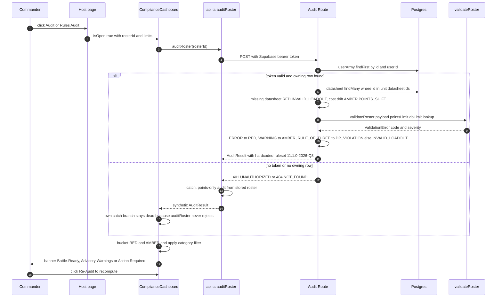

The rules compliance audit is a **stateless, on-demand round trip**. Nothing about
an audit is stored: the route computes a `RosterDiscrepancy[]` from the persisted
roster plus the live `datasheets_11e` rows, returns it, and forgets it. What the
modal then shows is recomputed entirely in the browser from the returned list, and
the modal itself writes nothing back. A change anywhere in this flow therefore has
four independent surfaces to keep consistent: `apps/api/src/routes/audit.ts`,
`packages/rules-engine-11e/src/detachment-validator.ts`,
`apps/web/src/components/ComplianceDashboard.tsx`, and the two client fallbacks in
`apps/web/src/lib/api.ts`.

The validator's own semantics live in
[Roster Validation](../rules-engine/roster-validation.md); the envelope/token
contract in [API Server & Middleware](../api/api-server-and-middleware.md) and
[Authentication & Ownership](../api/authentication-and-ownership.md); the general
fallback taxonomy in
[API Client Fallback Layer](../webapp/api-client-fallback-layer.md). This page
covers only the audit path end to end.

## Entrypoints

Three hosts mount `<ComplianceDashboard>` and each keeps its own open flag:

| Host | Trigger | Props passed |
| --- | --- | --- |
| `apps/web/src/app/page.tsx` (dashboard army card) | `⚖️ Audit` button → `setAuditingArmy(army)` | `rosterId`, `armyName`, `pointsLimit`, `currentPoints`, `dpLimit`, `currentDp` — the only host that supplies the DP pair |
| `apps/web/src/app/army/[id]/page.tsx` (Tabletop Console) | `⚖️ Rules Audit` button → `setIsComplianceOpen(true)` | no `dpLimit`/`currentDp`, so they default to `3` / `0` |
| `apps/web/src/app/army/[id]/edit/page.tsx` (Roster Studio) | `⚖️ Rules Audit` button → `setIsComplianceOpen(true)` | `currentPoints` derived from the in-memory `currentUnitsRef` |

None of them passes `onAutoFixPoints`. The component returns `null` while closed but
stays mounted, and `useEffect` fires `runAudit()` whenever `isOpen` flips true — or
whenever the `runAudit` identity changes, which happens when `currentPoints`,
`currentDp` or either limit prop changes while the modal is open.

## The server contract

`POST /api/rosters/:id/audit` is mounted on `/api` behind
[`requireAuth`](../../apps/api/src/middleware/auth.ts#L19-L49) and creates its own
`PrismaClient`
([`apps/api/src/routes/audit.ts#L12-L25`](../../apps/api/src/routes/audit.ts#L12-L25),
[`apps/api/src/index.ts#L55-L60`](../../apps/api/src/index.ts#L55-L60)). The first
query is an ownership check, not a lookup:
`userArmy.findFirst({ where: { id, userId: req.userId! } })`, and a miss answers
`404 { code: 'NOT_FOUND' }`. Because `userId` comes only from a verified JWT, a
guest (no Supabase session → `getAuthToken()` returns `null` → no `Authorization`
header) gets `401 UNAUTHORIZED`, and a locally synthesized roster id — one minted
by `createRoster` while offline, never `POST`ed — gets `404` even from a signed-in
user. **Server-side auditing is structurally unavailable for guest and local-only
rosters**; every such audit is the client fallback described below.

*Caption: the audit round trip, with the ownership/auth failure that routes the request into the client-side fallback.*

## Detection and the severity/category mapping

Two producers feed one flat discrepancy list.

**Point-shift detection** is unique to the route
([`audit.ts#L39-L75`](../../apps/api/src/routes/audit.ts#L39-L75)). It collects
`rosterPayload.units[].datasheetId`, does a **single batched**
`datasheet.findMany({ where: { id: { in: ids } } })`, and builds a `Map` used both
for comparison and as the lookup handed to the engine. Per unit: no map entry means
the datasheet has left the active ruleset → `RED` / `INVALID_LOADOUT`; a stored
`unit.pointsCost` that differs from the live `currentDs.basePoints` → `AMBER` /
`POINTS_SHIFT` carrying `oldValue`/`newValue`, which is the only case that renders
the struck-through old value in the list. The comparison is against whatever
`datasheets_11e` holds right now — the roster snapshot is never rewritten to match
it, so the same drift reappears on every subsequent audit.

**Structural validation** calls
[`validateRoster(rosterPayload, army.pointsLimit, army.detachmentPointsLimit, datasheetLookup)`](../../packages/rules-engine-11e/src/detachment-validator.ts#L124-L136)
— points limit, DP budget, Rule of Three, orphan attachments — and translates each
`ValidationError` in a two-line mapping
([`audit.ts#L77-L93`](../../apps/api/src/routes/audit.ts#L77-L93)):

| Engine output | `severity` | `category` |
| --- | --- | --- |
| `severity: 'ERROR'` | `RED` | — |
| `severity: 'WARNING'` (or anything else) | `AMBER` | — |
| `code: 'RULE_OF_THREE'` | — | `DP_VIOLATION` |
| any other code (`POINTS_EXCEEDED`, `DP_EXCEEDED`, `ORPHAN_ATTACHMENT`) | — | `INVALID_LOADOUT` |

Read the category column as UI navigation, not rules semantics: only Rule of Three
lands in the **Detachment Points** tab, while an actual DP-budget overrun
(`DP_EXCEEDED`) and an army over the points limit both land in **Loadouts & Rules**,
and `POINTS_SHIFT` is populated exclusively by the route's own cost-drift check.
Translated rows also drop unit attribution — `unitInstanceId: err.unitInstanceId || ''`
and `unitName: ''` — so the list falls back to showing the category name as the row
title. Engine checks additionally `continue` on datasheets the route already flagged
as missing, so a retired unit is reported once.

The envelope is `AuditResult { rosterId, rulesetVersionCompared, discrepancies, isCompliant, auditedAt }`
([`packages/types/src/index.ts#L215-L235`](../../packages/types/src/index.ts#L215-L235)).
`isCompliant` is "no `RED` rows" and `auditedAt` is the server clock, but
`rulesetVersionCompared` is a **literal `'11.1.0-2026-Q3'`**, not the roster's
`rulesetVersionId` — auditing a roster stamped with another version still reports the
hardcoded one, and the modal's header fallback string is `'11.1.0-2026-Q3-MFM'`, a
third variant. Any unexpected throw is collapsed to
`500 { code: 'AUDIT_ERROR' }`.

## Degraded client audits

`auditRoster` in [`api.ts#L390-L419`](../../apps/web/src/lib/api.ts#L390-L419)
never rejects: on any `ApiError` it falls back to `fetchRoster(id)` (localStorage
mirror, or the starter army) and emits **at most one** discrepancy — an `army-total`
`RED` / `POINTS_SHIFT` row when `totalPoints > pointsLimit`. Detachment points,
quotas, loadouts, Rule of Three and cost drift are simply absent, so an offline audit
is a points-limit check wearing an audit's clothes.

`ComplianceDashboard`'s own `catch`
([`ComplianceDashboard.tsx#L47-L82`](../../apps/web/src/components/ComplianceDashboard.tsx#L47-L82))
would build a second, slightly wider client audit from props — army total over the
match limit **and** `currentDp > dpLimit` as a `RED` / `DP_VIOLATION` row. It is
effectively dead: `auditRoster` swallows its errors internally, so the modal almost
never sees a rejection. This is the practical reason the dashboard is the only host
that bothers passing `dpLimit`/`currentDp` — those props matter for the summary tiles
and the dead branch, not for the reported result.

## Result rendering

The modal recomputes everything from `auditResult.discrepancies`
([`ComplianceDashboard.tsx#L96-L107`](../../apps/web/src/components/ComplianceDashboard.tsx#L96-L107)):
`redViolations` and `amberWarnings` by severity, `pointShiftDiscrepancies` by
category, and `filteredDiscrepancies` by the selected tab (`ALL`, `POINTS_SHIFT`,
`DP_VIOLATION`, `INVALID_LOADOUT`). The three-state banner — green "Battle-Ready
(100% Compliant)" when the list is empty, yellow "Legal With Advisory Warnings" when
there are no `RED` rows, red "Illegal Roster — Action Required" otherwise — is
derived there too, so the server's `isCompliant` field is never consulted and can
disagree with the banner only in name. `RosterDiscrepancy` also permits
`KEYWORD_CHANGE`, which nothing produces and which has no tab, so such a row would
be counted in the `All Issues` total and then filtered out of every other view. The
Violations / Advisories / Points Limit / DP Quota tiles and the `↻ Re-Audit` button
all read the same recomputed values, and `Re-Audit` just calls `runAudit` again.

## The auto-fix path is inert

The footer's `⚡ Sync Active Points (1-Click)` button renders only when
`pointShiftDiscrepancies.length > 0 && onAutoFixPoints`
([`ComplianceDashboard.tsx#L369-L381`](../../apps/web/src/components/ComplianceDashboard.tsx#L369-L381)),
and `handleApplyFix` does nothing but invoke the optional callback, show a success
banner, and re-run the audit after 500 ms
([`ComplianceDashboard.tsx#L109-L123`](../../apps/web/src/components/ComplianceDashboard.tsx#L109-L123)).
No host passes `onAutoFixPoints`, so the button never appears and the callback never
runs; `updateRoster` is imported by the component but never called. There is
therefore **no write-back from the audit UI at all** today: point corrections reach
storage only through the Roster Studio's debounced `performSave` → `updateRoster`
([`edit/page.tsx#L86-L123`](../../apps/web/src/app/army/[id]/edit/page.tsx#L86-L123)),
which recomputes unit costs from the builder's own catalog rather than from the
audit's `newValue`. A change that wires `onAutoFixPoints` up must decide where the
corrected costs come from, and must not assume the audit already applied them.

## Persistence and its consequences

The route performs no Prisma write, and
[`schema.prisma`](../../packages/db-client/prisma/schema.prisma#L252-L273) has no
audit, discrepancy or last-checked model. Consequences worth designing around:

- There is no audit history, badge, or dirty state to invalidate — compliance is a
  function of (roster payload, live datasheets, engine code), so a rules sync silently
  changes the answer for every roster at once.
- Repeated audits are cheap in storage but not free: each one is two queries under the
  300-requests-per-15-minutes limiter on `/api`
  ([`index.ts#L26-L41`](../../apps/api/src/index.ts#L26-L41)), and the modal re-audits
  on prop churn while open.
- Any "last audited" affordance needs a new table; nothing in this flow can be
  reconstructed later.

## Validating a change here

Playwright test `05: Rules Audit Modal checks 11th Edition compliance` in
[`apps/web/e2e/critical-flows.spec.ts#L76-L89`](../../apps/web/e2e/critical-flows.spec.ts#L76-L89)
is the only automated coverage: after the guest Quick Launch it clicks the
`Audit` / `Rules Audit` control, asserts the `Rules Compliance Audit` heading and one
of the three banner strings, then clicks `Dismiss`. Two caveats when you rely on it:
the whole body is wrapped in `if (await auditBtn.isVisible())`, so a removed or
renamed trigger turns the test green without asserting anything; and the suite runs
against `next start` on port 3456 with `NEXT_PUBLIC_API_URL` pointed at
`http://localhost:4000/api`
([`playwright.config.ts#L29-L39`](../../apps/web/playwright.config.ts#L29-L39)) with no
authenticated session, so it exercises the **401 → client fallback** path, not the
route. `apps/api` has no tests of its own
([Testing Strategy](../testing/testing-strategy.md)) — validating the server side of
this flow means exercising the route against a seeded stack, or unit-testing
`validateRoster` in `packages/rules-engine-11e` and hand-checking the mapping.

## Related

- [Roster Validation](../rules-engine/roster-validation.md) — the four engine checks and their codes.
- [API Client Fallback Layer](../webapp/api-client-fallback-layer.md) — `apiFetch`, `auditRoster`, `updateRoster` and the localStorage mirror.
- [Workflow: Roster Persistence & Offline Sync](roster-persistence-and-offline-sync.md) — why local roster ids have no server row to audit.
- [API Server & Middleware](../api/api-server-and-middleware.md) — mounts, envelope, rate limiting.
- [Console & Builder Components](../webapp/console-and-builder-components.md) — the pages that host the modal.
