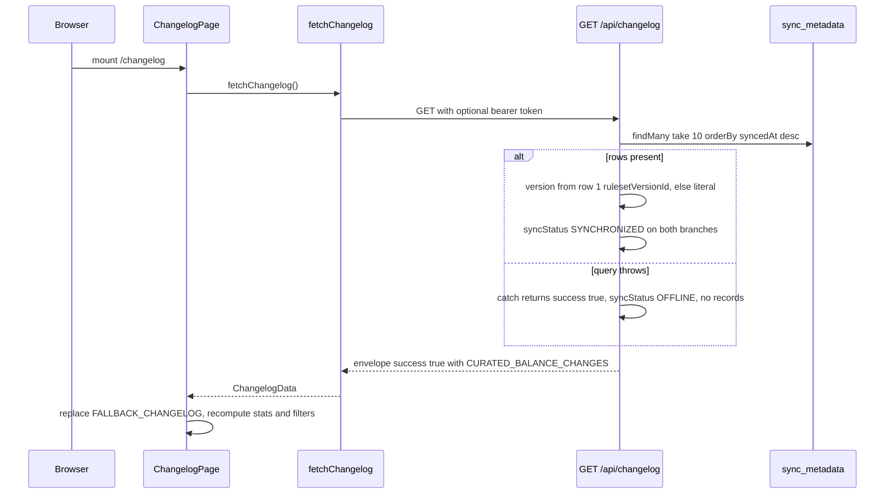
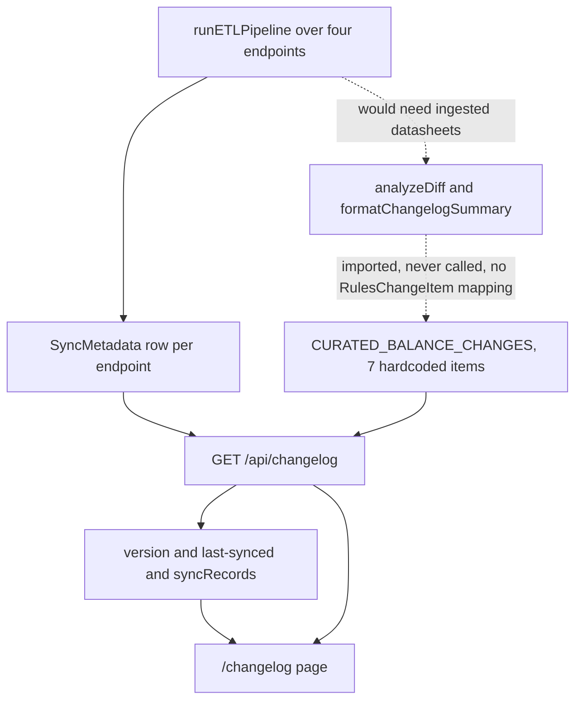

The rules changelog is the read side of the Wahapedia ETL job, and only half of it is
actually wired. `GET /api/changelog` reads real state — the ten newest `SyncMetadata`
rows — to derive the ruleset version and last-synced timestamp, then pastes a
**compile-time constant array of seven MFM balance items** in as the change feed. The
ETL worker never produces those items: the diff code that would (`analyzeDiff`,
`formatChangelogSummary`) is imported into the pipeline and never called, and the
worker writes nothing but sync metadata. So the changelog tells the truth about *when*
the pipeline last ran and fabricates *what changed*.

Scope here is the surface path only. The producer side — endpoint list, ETag/`If-None-Match`
conditional fetches, SHA-256 delta detection, per-endpoint metadata rows, webhook alerts —
is documented in [Wahapedia ETL Sync Worker](../sync/wahapedia-etl-sync-worker.md);
middleware, envelope and limiter behavior in
[API Server & Middleware](../api/api-server-and-middleware.md); the general client
fallback taxonomy in
[API Client Fallback Layer](../webapp/api-client-fallback-layer.md); the `sync_metadata`
table in [Data Model & Migrations](../data/data-model-and-migrations.md).

## Participants

| Layer | Owner | State it contributes |
| --- | --- | --- |
| Scheduled producer | `apps/sync-worker/src/etl-pipeline.ts` | appends one `SyncMetadata` row per endpoint per run |
| Database | Prisma `SyncMetadata` → `sync_metadata` | the only real input to the endpoint |
| API | `apps/api/src/routes/changelog.ts`, `GET /changelog` mounted flat on `/api` | derived version/timestamp + `CURATED_BALANCE_CHANGES` |
| Client | `apps/web/src/lib/api.ts` → `fetchChangelog()` | none — a straight `apiFetch` with no catch |
| Page | `apps/web/src/app/changelog/page.tsx` | `FALLBACK_CHANGELOG` constant, filters, derived stats |

`changelogRoutes` is mounted last of the five routers
([`apps/api/src/index.ts#L55-L60`](../../apps/api/src/index.ts#L55-L60)) and, like the
datasheet router, mounts **no auth middleware**: the changelog is a public read. It is
still inside the `/api` limiter, so it consumes the shared 300-requests-per-15-minutes
IP budget.

*Caption: the browser-facing read path, including the two server-side branches. The change feed enters at the same point in both.*

## What `GET /changelog` actually composes

The handler runs exactly one query — `syncMetadata.findMany({ take: 10, orderBy: {
syncedAt: 'desc' } })` selecting `endpoint`, `status`, `recordCount`, `syncedAt`,
`rulesetVersionId` ([`changelog.ts#L121-L133`](../../apps/api/src/routes/changelog.ts#L121-L133))
— and derives everything else from `syncLogs[0]`
([`changelog.ts#L135-L151`](../../apps/api/src/routes/changelog.ts#L135-L151)):

- **`currentRulesetVersion`** = the newest row's `rulesetVersionId`, else the literal
  `'11.1.0-2026-Q3-MFM'`. That column is written by the worker's
  `generateRulesetVersionId()` as `11.1.0-YYYY-QN-MFM` from the **wall clock of the run**
  ([`etl-pipeline.ts#L24-L28`](../../apps/sync-worker/src/etl-pipeline.ts#L24-L28)), not
  from anything Wahapedia reported, so the "Active Ruleset" headline is a date stamp.
- **`lastSyncedAt`** = the newest row's `syncedAt`, or `new Date()` when there are no rows.
  A database with no sync history therefore reports *just now* as the last successful
  synchronization rather than "never".
- **`syncRecords`** = the ten rows mapped down to `{ endpoint, status, recordCount, syncedAt }`,
  so the sync log panel can show at most ten entries and cannot distinguish a 20-endpoint
  history from a 10-endpoint one.
- **`totalChanges` / `recentChanges`** = `CURATED_BALANCE_CHANGES.length` and
  `CURATED_BALANCE_CHANGES` itself
  ([`changelog.ts#L38-L115`](../../apps/api/src/routes/changelog.ts#L38-L115)):
  seven hardcoded `RulesChangeItem`s — five Space Marines, one Necrons, one Tyranids, all
  `effectiveDate: '2026-09-15'`. No table is queried for them. They are the entire "balance
  changes" feature, and editing them is a source change, not an operational one.

**The `syncStatus` quirk.** The success path is written
`syncLogs.length > 0 ? 'SYNCHRONIZED' : 'SYNCHRONIZED'`
([`changelog.ts#L142`](../../apps/api/src/routes/changelog.ts#L142)) — both ternary
branches return the same string. Combined with the catch handler, the reachable set is
`'SYNCHRONIZED'` (any successful query, **including one that returns zero rows**) and
`'OFFLINE'` (only when Prisma throws). `'PENDING'`, which the `ChangelogResponse` type
permits ([`changelog.ts#L27`](../../apps/api/src/routes/changelog.ts#L27)), is never
produced by any code path. A consumer cannot use `syncStatus` to detect staleness or an
unrun pipeline.

**The catch handler answers 200 with `success: true`.** On a query failure the route logs
and returns the same curated array with `syncStatus: 'OFFLINE'`, `syncRecords: []` and a
fresh `lastSyncedAt` ([`changelog.ts#L154-L168`](../../apps/api/src/routes/changelog.ts#L154-L168)).
It never emits `success: false`, so the changelog endpoint cannot put the client's
`apiFetch` into its error branch on database failure — a broken database is
indistinguishable from a healthy one except through the `syncStatus` field the page
ignores (below).

## The client call has no fallback of its own

`fetchChangelog()` is a one-line `apiFetch<ChangelogData>('/changelog')`
([`lib/api.ts#L490-L494`](../../apps/web/src/lib/api.ts#L490-L494)) with **no `try/catch`**
— unlike `fetchDatasheets`, which swallows failures and returns a fixture catalog
([`lib/api.ts#L154-L211`](../../apps/web/src/lib/api.ts#L154-L211)), and the roster helpers,
which fall through to `localStorage`. Any failure propagates to the caller: `ApiError` for
a non-OK or `success: false` envelope, a network `TypeError` when the API host is
unreachable, a parse error on a non-JSON body.

Fallback ownership is therefore *inverted* relative to the rest of the app: it lives in
the page. `FALLBACK_CHANGELOG` is a second hardcoded copy of the same seven items plus
three synthetic sync records
([`changelog/page.tsx#L16-L118`](../../apps/web/src/app/changelog/page.tsx#L16-L118)), and
the mount effect only replaces state when the fetch succeeds and returns `recentChanges`;
on rejection it logs `console.warn('[Changelog] Using fallback dataset:', err)` and keeps
the fallback ([`changelog/page.tsx#L128-L143`](../../apps/web/src/app/changelog/page.tsx#L128-L143)).
Consequences worth knowing before changing any of this:

- The same balance data is maintained in **three** places — the API array, the page
  fallback, and the Playwright assertions — and a change to one silently diverges from the others.
- `RulesChangeItem`/`ChangelogData` are declared **twice**, in the route
  ([`changelog.ts#L12-L36`](../../apps/api/src/routes/changelog.ts#L12-L36)) and in the
  client ([`lib/api.ts#L421-L445`](../../apps/web/src/lib/api.ts#L421-L445)), with neither
  in `@forceorg/types`. Nothing fails if the two drift.
- Because the initial state *is* the fallback, the page renders fully populated before the
  network settles, and `isLoading` is set but never read in the render
  ([`changelog/page.tsx#L123`](../../apps/web/src/app/changelog/page.tsx#L123)) — there is
  no loading or error affordance, so a total API outage looks identical to a populated sync.
- The E2E job builds the web app but starts no API or Postgres, so test 03
  ("Can navigate to Rules Changelog and view MFM points diffs") always passes against the
  fallback dataset — it asserts curated content, never the endpoint
  ([`critical-flows.spec.ts#L46-L54`](../../apps/web/e2e/critical-flows.spec.ts#L46-L54)).
  See [Testing Strategy](../testing/testing-strategy.md).
- `/changelog` is in the service worker's precache list
  ([`sw.js#L10-L18`](../../apps/web/public/sw.js#L10-L18)), reinforcing that the route is
  expected to render with no network at all.

## How the page renders it

Everything on screen is derived client-side from `recentChanges`; the response's own
`totalChanges`, `syncStatus` and each record's `status` are read by nobody:

- The hero banner prints `Active Ruleset: {currentRulesetVersion}` and
  `Last synchronized ... at {lastSyncedAt}`, next to a **statically rendered**
  `● Synchronized` pill whose color and label are not derived from `syncStatus`
  ([`changelog/page.tsx#L253-L299`](../../apps/web/src/app/changelog/page.tsx#L253-L299)).
  Even the server's `OFFLINE` answer displays as synchronized.
- The four stat tiles (`Total Balance Shifts`, `Points Reductions`, `Points Increases`,
  `Errata & Keywords`) are `useMemo` counts over `recentChanges`, with `ERRATA` and
  `KEYWORD_UPDATE` folded into one bucket
  ([`changelog/page.tsx#L166-L177`](../../apps/web/src/app/changelog/page.tsx#L166-L177)) —
  they ignore `totalChanges` and therefore stay correct if the array is edited by hand.
- Search (target/summary/faction text), the faction dropdown (built from the factions
  present in the current changes) and the five category pills all filter the same in-memory
  list ([`changelog/page.tsx#L148-L177`](../../apps/web/src/app/changelog/page.tsx#L148-L177));
  there is no pagination because the payload is capped at seven curated items.
- Cards color-code by category: `POINTS_CUT` green with a 📉, `POINTS_HIKE` red with a 📈,
  `ERRATA`/`KEYWORD_UPDATE` blue with a 📜, and strike through `previousValue` above
  `currentValue` when present. `NEW_DATASHEET` exists in the union type but appears in no
  curated item, pill, stat bucket, or color branch.
- The **Wahapedia ETL Daily Sync Log** panel maps `syncRecords` to one row each, showing
  `endpoint.split('/').pop()`, `recordCount`, and `syncedAt`'s time
  ([`changelog/page.tsx#L552-L576`](../../apps/web/src/app/changelog/page.tsx#L552-L576)).
  The green `✓` is rendered unconditionally — `sync.status` is never read — so an
  `ERROR` or `NO_DELTA` row appears identically to a `SUCCESS` row. The panel's subtitle
  ("Synchronized via automated cron at 02:00 UTC using HTTP 304 conditional cache headers
  and content hashing") is prose baked into JSX, matching the `cron: '0 2 * * *'` schedule
  in [`.github/workflows/wahapedia-sync.yml`](../../.github/workflows/wahapedia-sync.yml#L8-L11)
  only by convention.

## The intended-but-missing link

The pipeline already contains the machinery that should populate `recentChanges`, and
`etl-pipeline.ts` imports it at
([`etl-pipeline.ts#L8`](../../apps/sync-worker/src/etl-pipeline.ts#L8)):

- `analyzeDiff(incoming, existing)` maps records **by `name`** and returns a `SyncDelta`
  of `added` / `modified` / `removed` names plus `pointChanges` for differing `basePoints`
  ([`diff-analyzer.ts#L18-L64`](../../apps/sync-worker/src/diff-analyzer.ts#L18-L64)).
- `formatChangelogSummary(delta)` renders that delta as a human-readable block, including
  `oldPoints → newPoints` arrows
  ([`diff-analyzer.ts#L69-L104`](../../apps/sync-worker/src/diff-analyzer.ts#L69-L104)).

Neither is called anywhere in the repository. The gap is structural, not a missing call:
`processEndpoint` parses the fetched body only to count records and then drops it
([`etl-pipeline.ts#L122-L148`](../../apps/sync-worker/src/etl-pipeline.ts#L122-L148)), and
the worker never writes the `Datasheet` rows `analyzeDiff` needs as its `existing`
argument. `SyncDelta` is likewise defined in `@forceorg/types`
([`index.ts#L294-L303`](../../packages/types/src/index.ts#L294-L303)) with no producer or
consumer.

*Caption: solid arrows are the implemented flow; the dotted path is the designed-but-absent producer for real change items.*

Closing the loop is a three-part change, and any of the three alone leaves the page
looking unchanged: ingest fetched payloads into the rules tables, call `analyzeDiff` and
persist its output as `RulesChangeItem`s in a place the route reads, and replace the two
hardcoded arrays (or at minimum make the route prefer stored items and fall back to the
curated set). Until then, `syncRecords` is the only honest field in the response, and its
`status` is discarded by the renderer.
